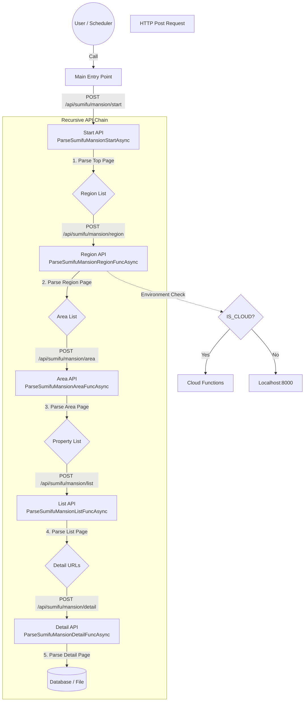

# クローラー API 構造ドキュメント

このプロジェクトのクローラーは、単一のプロセスが全てを実行するのではなく、各階層が次の階層のAPI（クローラー）を呼び出す**連鎖的な（再帰的な）分散アーキテクチャ**を採用しています。

## 概要

エントリーポイント（`Start`）がキックされると、そこから詳細ページの取得まで、APIが次のAPIをHTTPリクエスト経由で呼び出すことで処理が進行します。
これにより、各階層の処理をCloud Functions等のサーバーレス環境に分散させることが容易な構造になっています。

## 処理フロー (Mermaid)

以下は `Sumifu` (住友不動産販売) のマンション検索を例にした処理フローです。

## クラス構造との対応

| API Endpoint | Route Function | Async Class (Logic) | 役割 |
|---|---|---|---|
| `/api/.../start` | `sumifuMansionStart` | `ParseSumifuMansionStartAsync` | クロール開始。全地域へのURL生成。 |
| `/api/.../region` | `sumifuMansionRegion` | `ParseSumifuMansionRegionFuncAsync` | 地域ページ（関東、関西など）解析。エリアURL生成。 |
| `/api/.../area` | `sumifuMansionArea` | `ParseSumifuMansionAreaFuncAsync` | エリアページ（東京都、神奈川県など）解析。一覧URL生成。 |
| `/api/.../list` | `sumifuMansionPropertyList` | `ParseSumifuMansionListFuncAsync` | 物件一覧ページ解析。詳細URL生成。 |
| `/api/.../detail` | `sumifuMansionPropertyDetail` | `ParseSumifuMansionDetailFuncAsync` | 物件詳細ページ解析。データ保存。 |

## 実装の詳細

*   **共通基底クラス**: `ApiAsyncProcBase` (in `package/api/api.py`) が非同期通信の基本機能を提供します。
*   **非同期通信エンジン**: `aiohttp` を使用。ブラウザレンダリングを介さないため、高速かつ低リソースでの実行が可能です。
*   **環境切り替え**: `os.getenv('IS_CLOUD')` により、次のAPI呼び出し先をローカルサーバーかCloud Functionsか切り替えます。
