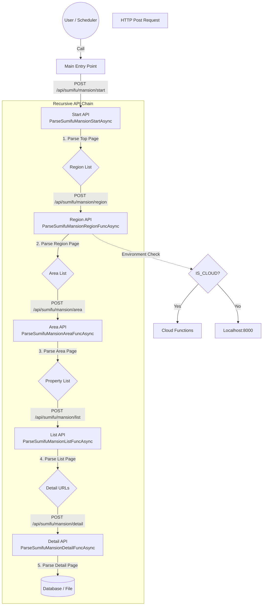

# クローラー API 構造ドキュメント

このプロジェクトのクローラーは、単一のプロセスが全てを実行するのではなく、各階層が次の階層のAPI（クローラー）を呼び出す**連鎖的な（再帰的な）分散アーキテクチャ**を採用しています。

## 1. 概要

エントリーポイント（`Start`）がキックされると、そこから詳細ページの取得まで、APIが次のAPIをHTTPリクエスト経由で呼び出すことで処理が進行します。
これにより、各階層の処理をCloud Functions等のサーバーレス環境に分散させることが容易な構造になっています。

## 2. 処理フロー (Mermaid)

以下は `Sumifu` (住友不動産販売) のマンション検索を例にした処理フローです。

## 3. 実装パラメータ

非同期通信および並列実行に関する主要な設定値です（`package/api/api.py` にて定義）。

| パラメータ名 | 設定値 | 説明 |
| :--- | :--- | :--- |
| `FIRE_AND_FORGET_TIMEOUT` | 3.0 秒 | 次の API をトリガーする際のタイムアウト。接続確立で成功。 |
| `DEFAULT_PARARELL_LIMIT` | 2 | 通常の API 呼び出しにおける並列数制限。 |
| `DETAIL_PARARELL_LIMIT` | 6 | 物件詳細 (`DetailFunc`) 取得時の並列数制限。 |
| `TCP_CONNECTOR_LIMIT` | 100 | TCP コネクタの最大同時接続数。 |

## 4. 環境切り替え

システムは実行環境を自動判定し、API 呼び出し先を切り替えます。
- **ローカル環境**: `localhost:8000` へリクエストを送ります。
- **クラウド環境**: `os.getenv('IS_CLOUD')` が真の場合、Cloud Functions 等のクラウドエンドポイントへリクエストを送ります。

## 5. 通信エンジン

`aiohttp` を使用した非同期 HTTP 通信を採用しています。ブラウザレンダリング（Playwright 等）を介さないため、リソース消費が極めて少なく、高速なクロールが可能です。
