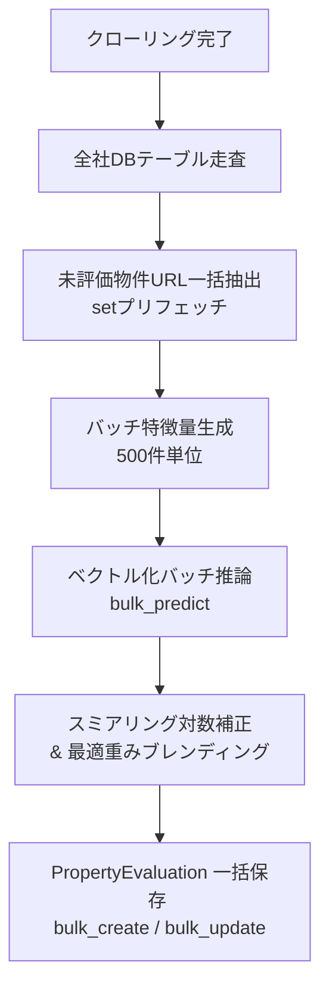
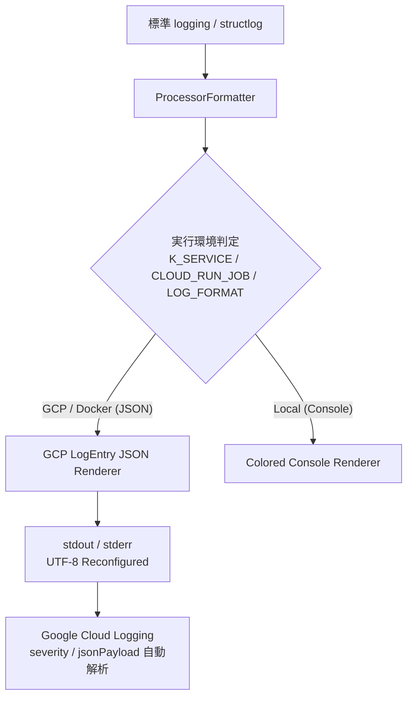
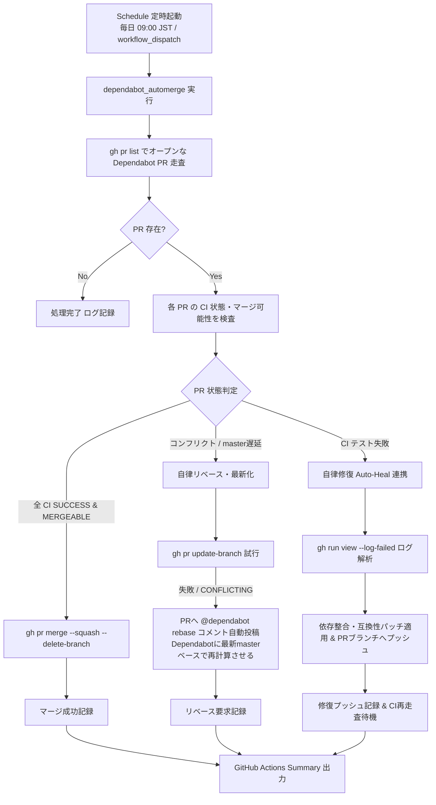
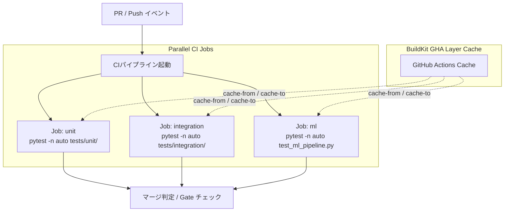
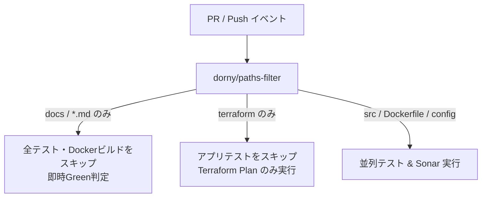
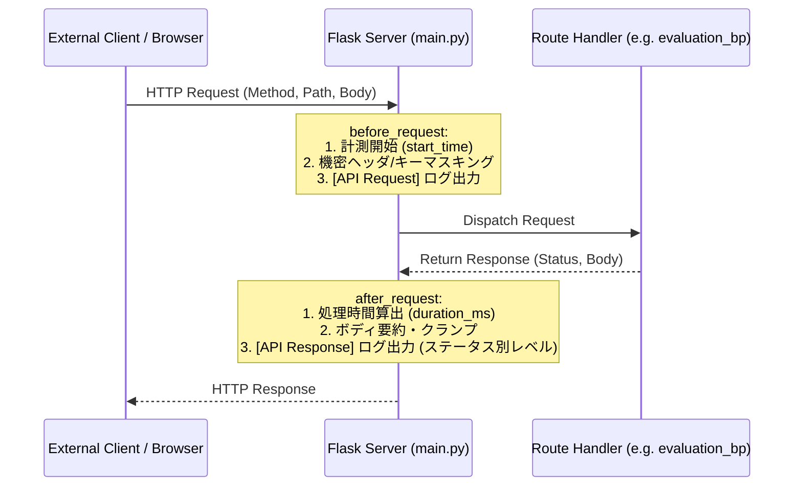
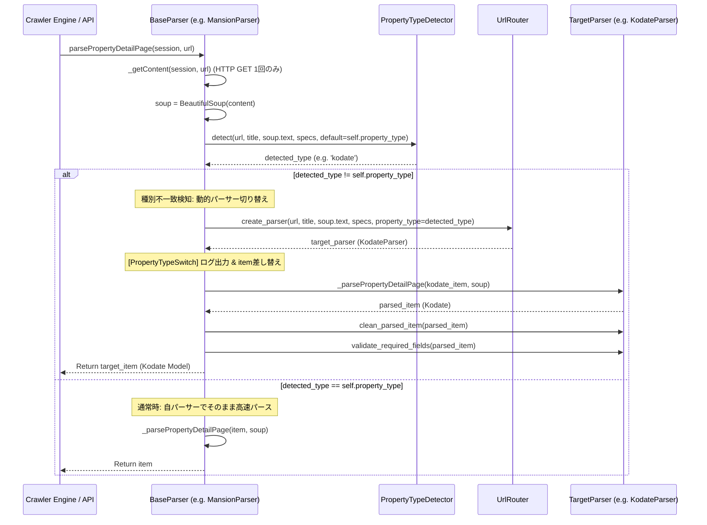
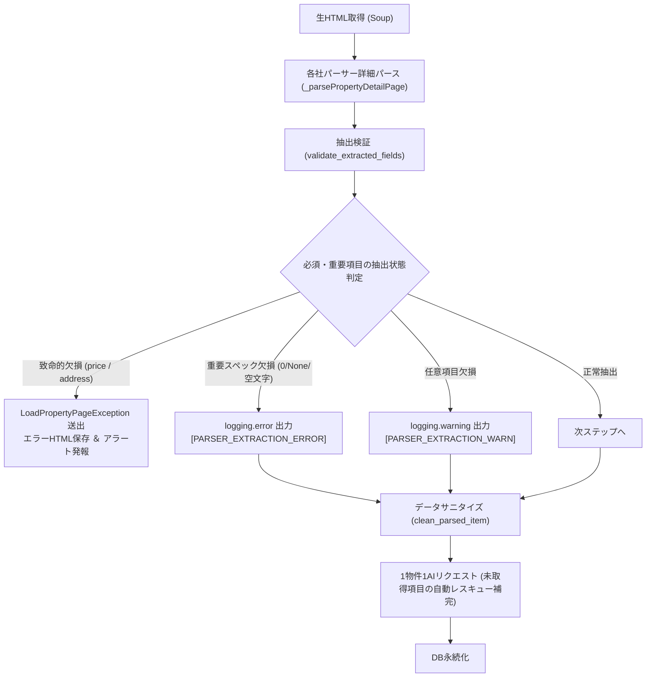

# クローラー仕様書 (Crawler Specification)

本プロジェクトのクローラーにおけるアーキテクチャ、処理フロー、および技術的な詳細仕様について記載します。

## 1. システム構成要素 (Core Components)

主要なクラスおよびファイルの役割と配置です。

| コンポーネント | ファイルパス | 役割 |
| :--- | :--- | :--- |
| `ApiRegistry` | `src/crawler/package/api/api_list.py` | 全ての API エンドポイントと実行クラスのマッピング管理 |
| `ApiAsyncProcBase` | `src/crawler/package/api/api.py` | 非同期 HTTP リクエスト、並列制御、リトライ、Fire-and-Forget の基底ロジック |
| `Parse{Site}{Type}StartAsync` | 各社ディレクトリ (e.g. `mitsui/start.py`) | サイトごとのクロール開始地点（初手）のロジック |
| 各社共通パーサー | 各社ディレクトリ (e.g. `mitsui/mitsui_base.py`) | HTML 解析の共通ユーティリティ、タグ抽出、正規化 |
| `evaluation_bp` | `src/crawler/routes/evaluation_routes.py` | 学習済みモデル（CatBoost/LightGBM）を用いたリアルタイム価格推定推論API |
| `swagger_bp` | `src/crawler/routes/swagger_routes.py` | OpenAPI 3.0 仕様書配信および Swagger UI (`/docs`) エンドポイント |

## 2. 主要概念 (Key Concepts)

### Fire-and-Forget Chain Pattern

再帰的な非同期API呼び出しにより、各ステップが独立して実行される設計パターン。

**特徴:**
- 各APIは即座にHTTP 200を返却（処理完了を待たない）
- 次のステップをHTTP POSTで起動
- タイムアウト（3秒）は成功とみなす
- サーバーレス環境での分散実行が可能

**実装詳細:**
- 基底クラス: `ApiAsyncProcBase` (`src/crawler/package/api/api.py`)
- タイムアウト設定: `FIRE_AND_FORGET_TIMEOUT = 3.0`

### Dual Storage Pattern

数値データを文字列と数値の両方で保持するパターン。

**目的:**
- 元の表記を保持（表示用）
- 数値化してクエリ・集計を可能に

**対象フィールド:**
- 価格: `priceStr` (例: "5,480万円") + `price` (例: 54800000)
- 面積: `senyuMensekiStr` (例: "81.65㎡") + `senyuMenseki` (例: 81.65)
- 管理費: `kanrihiStr` + `kanrihi`
- 修繕積立金: `syuzenTsumitateStr` + `syuzenTsumitate`
- 徒歩分数: `railwayWalkMinute{N}Str` + `railwayWalkMinute{N}`

### Transportation Fields Pattern

最大5路線までのアクセス情報を保持。

**構造:**
- 5路線 × 8フィールド = 40フィールド
- 各路線のフィールド（N=1~5）:
  1. `transfer{N}`: 乗り換え情報
  2. `railway{N}`: 沿線名
  3. `station{N}`: 駅名
  4. `railwayWalkMinute{N}Str`: 徒歩分数（文字列）
  5. `railwayWalkMinute{N}`: 徒歩分数（数値）
  6. `busStation{N}`: バス停名
  7. `busWalkMinute{N}Str`: バス徒歩分数（文字列）
  8. `busWalkMinute{N}`: バス徒歩分数（数値）

**例:**
```
railway1 = "JR山手線"
station1 = "東京"
railwayWalkMinute1Str = "5分"
railwayWalkMinute1 = 5
```

### Macroeconomic & Temporal Feature Architecture

過去年度（2019〜2024）から最新（2026年）に至る市場環境の変化（インフレ、不動産価格高騰、金利変動等）を価格推定モデルで説明可能にする設計。

**主要要素:**
1. **時系列マクロ統計マスタ (`MacroEconomicIndex`)**:
   - 物件掲載年月 (`inputDate` の YYYY-MM) をキーとして国交省不動産価格指数、新発10年国債利回り、日経平均株価、東証REIT指数、建設物価指数を自動結合。
2. **時間減衰学習重み (Time-Decay Sample Weight)**:
   - 経過日数に基づく指数減衰重みを学習時に適用し、最新の相場感（価格水準）を優先しつつ過去データの豊富な属性関係（立地・間取り・築年数の係数）を最大限活用。
3. **欠損値防御 (Defensive Imputation & Missing Indicators)**:
   - 過去データに存在しない新設属性（構造詳細・設備等）の NULL / 空文字を安全にフォールバックし、欠損インジケータとしてモデルに学習させる。

### Computed and Derived Fields

パース時に計算される派生フィールド。

**主な計算フィールド:**

1. **kyutaishin（旧耐震判定）**
   - 築年月が1982年1月1日より前の場合に1
   - 新耐震基準導入前の物件を特定

2. **per-square-meter fees（平米単価）**
   - `kanrihi_p_heibei = kanrihi / senyuMenseki`
   - `syuzenTsumitate_p_heibei = syuzenTsumitate / senyuMenseki`
   - 管理費・修繕積立金の平米あたりコスト

3. **floor decomposition（階数情報の分解）**
   - `floorType_kai`: 所在階
   - `floorType_chijo`: 地上階数
   - `floorType_chika`: 地下階数
   - 例: "2階/地上10階/地下1階" → kai=2, chijo=10, chika=1

4. **railwayCount（路線数）**
   - 利用可能な路線の数（1~5）

5. **busUse1（バス利用の有無）**
   - バスを利用する場合は1、そうでない場合は0

### Differential Crawling Pattern (差分クロールパターン)

一覧ページ（Middle Page）から詳細ページ（Detail Page）への遷移時、全件フェッチによるサーバー負荷と帯域消費を防ぐため、DB突合による差分フィルタリングを行うパターン。

**フロー:**
1. 一覧ページから抽出されたアイテム群（URLおよびオプションの価格情報）を受領。
2. 対象モデルのDBテーブルに対して `pageUrl IN (...)` で一括検索し、既存レコードの `price`、`updateDateTime`、`inputDateTime` を取得。
3. 判定ロジック:
   - **NEW**: DBに存在しないURL ➔ 詳細フェッチ対象
   - **UPDATED**: DBに存在するが価格が変動している ➔ 詳細フェッチ対象（最新化＆価格履歴記録へ）
   - **EXPIRED**: DBに存在するが前回収集からTTL日数（デフォルト7日）経過 ➔ 詳細フェッチ対象
   - **CACHED ACTIVE**: 価格変更なし・TTL内 ➔ 詳細フェッチをスキップし、`model.objects.filter(pageUrl__in=skipped).update(updateDateTime=now)` で生存確認を記録
4. フィルタリング後の `urls_to_fetch` のみに対して `_callApi()` を発行。

### Price History Pattern (価格改定履歴パターン)

物件マスタテーブルの「1物件1レコード（常に最新情報）」の原則を維持しつつ、価格の値下げ・改定推移を時系列で保存するパターン。

**仕様:**
- **物件マスタテーブル**: 同一 `pageUrl` の物件が存在する場合、既存レコードを上書き更新（`UPDATE`）する。初回登録日時 `inputDateTime` は不変とし、`updateDateTime` のみ現在時刻に更新する。
- **価格改定テーブル (`PropertyPriceHistory`)**: 既存価格と新価格に差分（`existing.price != item.price`）がある場合のみ、改定レコードを1行挿入する。
  - `property_url`: 物件URL
  - `company`: 不動産会社コード
  - `property_type`: 種別
  - `old_price`: 改定前価格
  - `new_price`: 改定後価格
  - `price_diff`: 価格差（`new_price - old_price`、値下げ時はマイナス）
  - `recorded_at`: 改定検知日時

### Migration & Deduplication Architecture (既存重複移行・正規化設計)

過去クロールによって蓄積された同一URLの重複レコードを解消し、過去価格変動を履歴テーブルへ移行するアーキテクチャ。

**処理手順:**
1. 同一 `pageUrl` の複数レコードを `(inputDateTime ASC, id ASC)` 順で取得。
2. 時系列に価格差分（`old_price != new_price`）を判定し、`PropertyPriceHistory` へ一括投入。
3. 最新レコードを生存マスタとして保持し、`inputDateTime` に最古日時、`updateDateTime` に最新日時を復元。
4. 外部参照（`PropertyEvaluation.property_id`）を残す最新レコードの `id` に再リンク更新。
5. 最新レコード以外の過去重複行をバッチ削除。

---

## 3. アーキテクチャ詳細 (Architecture Details)

### 対応種別
本クローラーは、以下の不動産種別に対応しています。
*   **投資用不動産** (investment)
    *   一棟マンション（RC造・鉄骨造などの集合住宅一棟）
    *   一棟アパート（木造・軽量鉄骨造などの集合住宅一棟）
    *   投資用戸建て（賃貸収入目的の一戸建て）
    *   ※区分マンション、ビル、店舗/事務所などは収集対象外
*   **マンション** (mansion)
*   **土地** (tochi)
*   **戸建** (kodate)

### Fire-and-Forget 方式
本クローラーは、Google Cloud Functions などのサーバーレス環境での実行も想定し、「Fire-and-Forget」方式の非同期API呼び出しを採用しています。

*   **再帰的呼び出し**: `Start` -> `Area` -> `List` -> `Detail` の各ステップは、次のステップのAPIエンドポイントをHTTPリクエストで呼び出すことで連鎖します。
*   **即時レスポンス**: 呼び出し元の関数は、リクエストを送信した後、処理の完了を待たずに即座にレスポンス（ステータス 200）を返します。
*   **タイムアウト設定**: 次の処理をトリガーする際のリクエストタイムアウトは **3.0秒** に設定されており、接続が確立された時点で成功とみなします（実際の処理完了を待ちません）。

### 構成
本システムは `python:3.11-slim` イメージを使用し、不要なブラウザエンジン（Playwright）を排除した最小構成です。
すべてのサイトが `aiohttp` による HTTP リクエストと `BeautifulSoup4` による HTML 解析で完結するよう設計されています。

### 並列処理設定 (Concurrent Processing Configuration)

#### パラメータ一覧

| パラメータ | 値 | 説明 | 定義場所 |
|-----------|-----|------|---------|
| `FIRE_AND_FORGET_TIMEOUT` | 3.0秒 | 次ステップ起動時のHTTPタイムアウト | `api.py` |
| `DEFAULT_PARARELL_LIMIT` | 2 | デフォルトの並列リクエスト数 | `api.py` |
| `DETAIL_PARARELL_LIMIT` | 6 | 詳細ページ取得時の並列数 | `api.py` |
| `TCP_CONNECTOR_LIMIT` | 100 | aiohttpのTCP接続プール上限 | `api.py` |

#### 並列処理の動作

**Region/List API:**
- 並列数: `DEFAULT_PARARELL_LIMIT = 2`
- 同時に2地域または2ページを処理
- サイトへの負荷を考慮した控えめの設定

**Detail API:**
- 並列数: `DETAIL_PARARELL_LIMIT = 6`
- 同時に6物件の詳細ページを取得
- 詳細ページは個別の物件情報のため、やや高い並列数を許容

**TCP接続:**
- 上限: `TCP_CONNECTOR_LIMIT = 100`
- aiohttpのコネクションプール全体で100接続まで
- 全てのリクエストで共有されるプール

#### 調整方法

サイトへの負荷を調整したい場合、`src/crawler/package/api/api.py` で値を変更できます：

```python
# より控えめの設定
DEFAULT_PARARELL_LIMIT = 1  # 2 → 1に変更
DETAIL_PARARELL_LIMIT = 3   # 6 → 3に変更

# より高速な設定（非推奨）
DEFAULT_PARARELL_LIMIT = 4  # 2 → 4に変更
DETAIL_PARARELL_LIMIT = 10  # 6 → 10に変更
```

---

## 4. エラーハンドリング & 障害耐性制御 (Error Handling & Robustness)

クローリングの安定性とパイプラインの完遂率を高めるため、以下の制御メカニズムを実装・適用しています。

### 4.1 ネットワーク & 通信エラーハンドリング

*   **ネットワークエラー (`ClientConnectorError`, `ServerDisconnectedError`)**:
    *   一時的なネットワーク障害とみなし、**1回のリトライ**を実施します。
    *   リトライ前に待機時間（`sleep(10)` = 10秒）を設けています。
*   **タイムアウト (`TimeoutError`)**:
    *   Fire-and-Forget の設計上、タイムアウトは**「リクエスト送信成功」**として扱います。エラーログは出力せず、処理を継続します。
*   **DB接続エラー (`OperationalError`)**:
    *   DBへの同時接続過多などで保存に失敗した場合、**30秒待機**してから再試行します。
*   **バリデーションエラー (`ReadPropertyNameException`)**:
    *   取得データ項目の型不整合やパース失敗時はエラーログを記録し、対象ページを `error_pages/` へ自動保存します。

### 4.2 クローラー優先順位制御原則 (Smallest-Site-First)

大容量サイトや大手ポータルの遅延によって他サイトのクロールが未実施になる事態を防止するため、処理が早く完了する小規模サイト・電鉄系・ハウスメーカー系から優先的にクロールを実行します。

*   **優先実行順序**:
    1.  ハウスメーカー系 / 電鉄系 / 小規模サイト (`sekisui`, `afr`, `daiwa`, `totate`, `odakyu`, `sumirin`, `heim`, `rearie`, `keio`, `seibu`, `keikyu`, `sotetsu`, `keisei`, `daikyo`)
    2.  信託・銀行系列 (`smtrc`, `sumai1`, `mizuho`)
    3.  主要仲介・ポータル (`mitsui`, `sumifu`, `tokyu`, `nomura`, `misawa`, `athome`, `homes`)

### 4.3 障害制御 & アラートフィルタリング仕様

*   **連続タイムアウト Fast-Fail & サーキットブレイカー**:
    *   相手サーバーが無応答・タイムアウトを繰り返す場合（連続3回以上）、ダラダラとリトライを続けず「接続失敗」と判定して該当ジョブを即時中断 (Abort) し、パイプラインのハングアップを防止します。
*   **0件取得失敗分類原則 (Zero-Count Failure)**:
    *   クローリング処理が正常終了（Exit Code 0）した場合であっても、新規取得件数が0件である場合は正常とみなさず「0件取得失敗」としてエラーアラートを発報し、失敗ジョブとして記録します。
*   **物件公開終了 (404/掲載終了) の Slack アラート除外**:
    *   物件の公開終了（HTTP 404, Page Not Found, 掲載終了）による取得不可は正常なライフサイクルであるため、Slack アラートチャンネルへの通知対象から除外（スキップ）します。
*   **Slack疎通事前自己チェック (Step 0)**:
    *   クローリングおよびパイプラインの起動前（Step 0）に必ず `check_slack_connection.py` を自動実行し、設定不備（`channel_not_found` 等）による通知不達を未然に防止します。

---

## 5. 各サイト固有の解析ロジック詳細

#### 三井のリハウス (Mitsui)
三井のリハウス独自の抽出・変換処理です。
- **旧耐震判定 (`kyutaishin`)**: 築年月が 「1982年1月1日」 以前の物件を `True` (旧耐震) としてフラグを立てます。
- **階数分解 (`floorType_...`)**: 「所在階 / 地上階 / 地下階」を正規表現で分離し、それぞれ数値として保持します（例: 「2階/地上10階/地下1階」 -> `floorType_kai:2`, `kaisu:10`, `kaisu_under:1`）。
- **平米単価計算**: 価格と専有面積から算出します（`price / senyuMenseki`）。

#### 住友不動産販売 (Sumifu)
- **エリア・リスト取得**: `region` -> `area` -> `list` の多段階構成となっています。
- **データ保持**: 投資用物件以外は `SumifuModel` を継承し、広範な共通フィールド（69項目）を保持します。

#### ミサワホーム不動産 (Misawa)
- **交通情報の簡略化**: 他のサイトが 5路線×8フィールドを保持するのに対し、ミサワは `railway1`, `station1`, `walkMinute1` の **3フィールドのみ** を抽出・保存します。
- **共通基底**: 全種別で `MisawaCommon` を継承します。

---

## 7. 実行環境とパラメータ

詳細な設定値については **[API 構造ドキュメント](api_structure.md)** および **[開発者ガイド](development_guide.md)** を参照してください。
- **タイムアウト**: Fire-and-Forget 実行時は `3.0s`。
- **並列数**: ローカル実行時はデフォルト `2`（詳細ページのみ `6`）。
解析が完了した直後に、1件ごとにデータベースへ保存 (`save()` メソッド) します。
*   **重複管理**:
    *   同一物件が既に存在する場合、最新の情報を上書きするか、履歴として保持します（Django モデルの実装に準拠）。

## 5. 処理フロー詳細 (Process Flow)

各サイトのクローリングは、以下のエンドポイント連鎖によって実行されます。

### 三井のリハウス (`mitsui`)
1.  **Start** (`/api/mitsui/{type}/start`): 都道府県一覧を取得。
2.  **Area** (`/api/mitsui/{type}/area`): 市区町村一覧を取得。
3.  **List** (`/api/mitsui/{type}/list`): 物件一覧ページをページング走査。
4.  **Detail** (`/api/mitsui/{type}/detail`): 物件詳細を解析・保存。

### 住友不動産販売 (`sumifu`)
1.  **Start** (`/api/sumifu/{type}/start`): 地域選択。
2.  **Region** (`/api/sumifu/{type}/region`): 地域内市区町村を特定。
3.  **List** (`/api/sumifu/{type}/list`): 一覧取得。
4.  **Detail** (`/api/sumifu/{type}/detail`): 詳細解析・保存。

### 東急リバブル (`tokyu`)
1.  **Start** (`/api/tokyu/{type}/start`): エリア選択。
2.  **Area** (`/api/tokyu/{type}/area`): 市区町村選択。
3.  **List** (`/api/tokyu/{type}/list`): 一覧ページング。
4.  **Detail** (`/api/tokyu/{type}/detail`): 詳細解析・保存。

### 野村の仲介＋ (`nomura`)
1.  **Start** (`/api/nomura/{type}/start`): クロール開始。
2.  **Detail**: 詳細ページから情報を抽出。

### ミサワホーム不動産 (`misawa`)
1.  **Start** (`/api/misawa/{type}/start`): 検索トップから地域選択。
2.  **List** (`/api/misawa/{type}/list`): 一覧解析。
3.  **Detail** (`/api/misawa/{type}/detail`): 詳細解析・保存。

## 6. 詳細ページの解析ロジック (Parsing Logic)

HTML解析には `BeautifulSoup4` を使用しています。

### 基本戦略
1.  **要素の特定**: CSSセレクタを使用して対象データを特定します。
2.  **テーブル走査**: 物件詳細は主に `<table>` 内にあるため、`th` (項目名) に応じた `td` (値) 取得を自動化しています。
3.  **データ整形**: 通貨（万円→円）や面積（㎡除去）の数値変換を各社パーサーで行います。

**構造:**
- 5路線 × 8フィールド = 40フィールド
- 各路線のフィールド（N=1~5）:
  1. `transfer{N}`: 乗り換え情報
  2. `railway{N}`: 沿線名
  3. `station{N}`: 駅名
  4. `railwayWalkMinute{N}Str`: 徒歩分数（文字列）
  5. `railwayWalkMinute{N}`: 徒歩分数（数値）
  6. `busStation{N}`: バス停名
  7. `busWalkMinute{N}Str`: バス徒歩分数（文字列）
  8. `busWalkMinute{N}`: バス徒歩分数（数値）

**例:**
```
railway1 = "JR山手線"
station1 = "東京"
railwayWalkMinute1Str = "5分"
railwayWalkMinute1 = 5
```

### Computed and Derived Fields

パース時に計算される派生フィールド。

**主な計算フィールド:**

1.  **kyutaishin（旧耐震判定）**
    - 築年月が1982年1月1日より前の場合に1
    - 新耐震基準導入前の物件を特定

2.  **per-square-meter fees（平米単価）**
    - `kanrihi_p_heibei = kanrihi / senyuMenseki`
    - `syuzenTsumitate_p_heibei = syuzenTsumitate / senyuMenseki`
    - 管理費・修繕積立金の平米あたりコスト

3.  **floor decomposition（階数情報の分解）**
    - `floorType_kai`: 所在階
    - `floorType_chijo`: 地上階数
    - `floorType_chika`: 地下階数
    - 例: "2階/地上10階/地下1階" → kai=2, chijo=10, chika=1

4.  **railwayCount（路線数）**
    - 利用可能な路線の数（1~5）

5.  **busUse1（バス利用の有無）**
    - バスを利用する場合は1、そうでない場合は0

---

## 3. アーキテクチャ詳細 (Architecture Details)

### 対応種別
本クローラーは、以下の不動産種別に対応しています。
*   **投資用不動産** (investment)
    *   一棟マンション（RC造・鉄骨造などの集合住宅一棟）
    *   一棟アパート（木造・軽量鉄骨造などの集合住宅一棟）
    *   投資用戸建て（賃貸収入目的の一戸建て）
    *   ※区分マンション、ビル、店舗/事務所などは収集対象外
*   **マンション** (mansion)
*   **土地** (tochi)
*   **戸建** (kodate)

### Fire-and-Forget 方式
本クローラーは、Google Cloud Functions などのサーバーレス環境での実行も想定し、「Fire-and-Forget」方式の非同期API呼び出しを採用しています。

*   **再帰的呼び出し**: `Start` -> `Area` -> `List` -> `Detail` の各ステップは、次のステップのAPIエンドポイントをHTTPリクエストで呼び出すことで連鎖します。
*   **即時レスポンス**: 呼び出し元の関数は、リクエストを送信した後、処理の完了を待たずに即座にレスポンス（ステータス 200）を返します。
*   **タイムアウト設定**: 次の処理をトリガーする際のリクエストタイムアウトは **3.0秒** に設定されており、接続が確立された時点で成功とみなします（実際の処理完了を待ちません）。

### 構成
本システムは `python:3.10-slim` イメージを使用し、不要なブラウザエンジン（Playwright）を排除した最小構成です。
すべてのサイトが `aiohttp` による HTTP リクエストと `BeautifulSoup4` による HTML 解析で完結するよう設計されています。

### 並列処理設定 (Concurrent Processing Configuration)

#### パラメータ一覧

| パラメータ | 値 | 説明 | 定義場所 |
|-----------|-----|------|---------|
| `FIRE_AND_FORGET_TIMEOUT` | 3.0秒 | 次ステップ起動時のHTTPタイムアウト | `api.py` |
| `DEFAULT_PARARELL_LIMIT` | 2 | デフォルトの並列リクエスト数 | `api.py` |
| `DETAIL_PARARELL_LIMIT` | 6 | 詳細ページ取得時の並列数 | `api.py` |
| `TCP_CONNECTOR_LIMIT` | 100 | aiohttpのTCP接続プール上限 | `api.py` |

#### 並列処理の動作

**Region/List API:**
- 並列数: `DEFAULT_PARARELL_LIMIT = 2`
- 同時に2地域または2ページを処理
- サイトへの負荷を考慮した控えめの設定

**Detail API:**
- 並列数: `DETAIL_PARARELL_LIMIT = 6`
- 同時に6物件の詳細ページを取得
- 詳細ページは個別の物件情報のため、やや高い並列数を許容

**TCP接続:**
- 上限: `TCP_CONNECTOR_LIMIT = 100`
- aiohttpのコネクションプール全体で100接続まで
- 全てのリクエストで共有されるプール

#### 調整方法

サイトへの負荷を調整したい場合、`src/crawler/package/api/api.py` で値を変更できます：

```python
# より控えめの設定
DEFAULT_PARARELL_LIMIT = 1  # 2 → 1に変更
DETAIL_PARARELL_LIMIT = 3   # 6 → 3に変更

# より高速な設定（非推奨）
DEFAULT_PARARELL_LIMIT = 4  # 2 → 4に変更
DETAIL_PARARELL_LIMIT = 10  # 6 → 10に変更
```

---

## 4. エラーハンドリング & リトライ (Error Handling)

クローリングの安定性を高めるため、以下のエラーハンドリングを実装しています。

*   **ネットワークエラー (`ClientConnectorError`, `ServerDisconnectedError`)**:
    *   一時的なネットワーク障害とみなし、**1回のリトライ**を実施します。
    *   リトライ前に待機時間（`sleep(10)` = 10秒）を設けています。
*   **タイムアウト (`TimeoutError`)**:
    *   Fire-and-Forget の設計上、タイムアウトは**「リクエスト送信成功」**として扱います。エラーログは出力せず、処理を継続します。
*   **DB接続エラー (`OperationalError`)**:
    *   DBへの同時接続過多などで保存に失敗した場合、**30秒待機**してから再試行します。

### 各サイト固有の解析ロジック詳細

#### 三井のリハウス (Mitsui)
三井のリハウス独自の抽出・変換処理です。
- **旧耐震判定 (`kyutaishin`)**: 築年月が 「1982年1月1日」 以前の物件を `True` (旧耐震) としてフラグを立てます。
- **階数分解 (`floorType_...`)**: 「所在階 / 地上階 / 地下階」を正規表現で分離し、それぞれ数値として保持します（例: 「2階/地上10階/地下1階」 -> `floorType_kai:2`, `kaisu:10`, `kaisu_under:1`）。
- **平米単価計算**: 価格と専有面積から算出します（`price / senyuMenseki`）。

#### 住友不動産販売 (Sumifu)
- **エリア・リスト取得**: `region` -> `area` -> `list` の多段階構成となっています。
- **データ保持**: 投資用物件以外は `SumifuModel` を継承し、広範な共通フィールド（69項目）を保持します。

#### ミサワホーム不動産 (Misawa)
- **交通情報の簡略化**: 他のサイトが 5路線×8フィールドを保持するのに対し、ミサワは `railway1`, `station1`, `walkMinute1` の **3フィールドのみ** を抽出・保存します。
- **共通基底**: 全種別で `MisawaCommon` を継承します。

---

## 5. 処理フロー詳細 (Process Flow)

各サイトのクローリングは、以下のエンドポイント連鎖によって実行されます。

### 三井のリハウス (`mitsui`)
1.  **Start** (`/api/mitsui/{type}/start`): 都道府県一覧を取得。
2.  **Area** (`/api/mitsui/{type}/area`): 市区町村一覧を取得。
3.  **List** (`/api/mitsui/{type}/list`): 物件一覧ページをページング走査。
4.  **Detail** (`/api/mitsui/{type}/detail`): 物件詳細を解析・保存。

### 住友不動産販売 (`sumifu`)
1.  **Start** (`/api/sumifu/{type}/start`): 地域選択。
2.  **Region** (`/api/sumifu/{type}/region`): 地域内市区町村を特定。
3.  **List** (`/api/sumifu/{type}/list`): 一覧取得。
4.  **Detail** (`/api/sumifu/{type}/detail`): 詳細解析・保存。

### 東急リバブル (`tokyu`)
1.  **Start** (`/api/tokyu/{type}/start`): エリア選択。
2.  **Area** (`/api/tokyu/{type}/area`): 市区町村選択。
3.  **List** (`/api/tokyu/{type}/list`): 一覧ページング。
4.  **Detail** (`/api/tokyu/{type}/detail`): 詳細解析・保存。

### 野村の仲介＋ (`nomura`)
1.  **Start** (`/api/nomura/{type}/start`): クロール開始。
2.  **Detail**: 詳細ページから情報を抽出。

### ミサワホーム不動産 (`misawa`)
1.  **Start** (`/api/misawa/{type}/start`): 検索トップから地域選択。
2.  **List** (`/api/misawa/{type}/list`): 一覧解析。
3.  **Detail** (`/api/misawa/{type}/detail`): 詳細解析・保存。

## 6. 詳細ページの解析ロジック (Parsing Logic)

HTML解析には `BeautifulSoup4` を使用しています。

### 基本戦略
1.  **要素の特定**: CSSセレクタを使用して対象データを特定します。
2.  **テーブル走査**: 物件詳細は主に `<table>` 内にあるため、`th` (項目名) に応じた `td` (値) 取得を自動化しています。
3.  **データ整形**: 通貨（万円→円）や面積（㎡除去）の数値変換を各社パーサーで行います。

### サイト固有の特記事項
*   **三井のリハウス**: 接道状況から最も幅員が広い道路を自動選定。旧耐震（1982年以前）の自動判定。
*   **住友不動産販売**: 投資用物件での利回り・賃料の個別パース。
*   **ミサワホーム不動産**: サイト構造の変化（h1/h2フォールバック）に対応。

---

## 7. 実行環境とパラメータ

詳細な設定値については **[API 構造ドキュメント](api_structure.md)** および **[開発者ガイド](development_guide.md)** を参照してください。
- **タイムアウト**: Fire-and-Forget 実行時は `3.0s`。
- **並列数**: ローカル実行時はデフォルト `2`（詳細ページのみ `6`）。
解析が完了した直後に、1件ごとにデータベースへ保存 (`save()` メソッド) します。
*   **重複管理**:
    *   同一物件が既に存在する場合、最新の情報を上書きするか、履歴として保持します（Django モデルの実装に準拠）。

---

## 8. バルクML評価・ベクトル化推論アーキテクチャ (Bulk ML Evaluation)

クローリングによって保存された未評価物件に対し、高速かつ高精度に理論価格を付与するためのアーキテクチャ。

### 8.1 処理パイプライン概要


### 8.2 高速化設計
- **オンメモリ常駐モデル直接実行**: HTTP API通信を排し、プロセス内に常駐したモデルへ直接アクセス。
- **ベクトル化バッチ推論 (`bulk_predict_first_stage`)**: 特徴量を一括で2次元配列（DataFrame）化し、LightGBM / XGBoost / CatBoost / RF で一括行列予測。
- **DBアクセスの一括化**: 評価済URLのインメモリセット比較による事前除外と、`bulk_create` / `bulk_update` によるN+1クエリの完全排除。

---

## 9. 経済的価値創出還元アーキテクチャ (Economic Value Capitalization Architecture)

物件の「理論価値」を単なる市場価格の統計平均ではなく、「経済的価値を生む力（収益力・利用容積力）」として定義し、価格と価値の歪みを客観的に抽出する。

### 9.1 価値還元コンポーネント
1. **想定収益還元価値（Imputed Economic Value）**:
   - 居住用・投資用を問わず、「当該立地・面積・構造・築年数で獲得可能な想定純家賃（NOI）」を地域期待利回りで割り戻した資産価値アンカー。
2. **潜在容積延床面積（Potential Volume Floor Area）**:
   - 敷地面積 × 指定容積率（FAR）により、敷地が創出可能な総延床面積を算出し、都心高容積率商業地の経済価値を正当に反映。
3. **規模非線形減退（Scale Non-Linear Discount）**:
   - 1,000㎡を超える広大土地・山林・原野について、宅地単価の単純乗算を排し、有効開発可能規模に応じた指数減退モデルを適用。
4. **経済的減価・制約フィルター（Economic Rights & Rebuild Restriction）**:
   - 借地権、再建築不可、瑕疵物件について、将来キャッシュフロー阻害率に応じた減価係数を自動適用。
5. **種別誤認・データ異常防御（Misclassification & Anomaly Defense）**:
   - 敷地権なし区分所有の戸建て混入時の自動マンションリルート、面積数値汚染（500㎡超）のサニタイズ、築年数欠損補正。

---

## 10. 構造化ロギング＆可観測性アーキテクチャ (Structured Logging & Observability)

GCP（Cloud Run Jobs / Services）およびローカル開発環境における可観測性・障害追跡を支える統一ログ設計。

### 10.1 ログ設計概要


### 10.2 GCP LogEntry JSON フォーマット仕様
GCP実行時は標準出力の1行ごとに以下のJSON構造を出力する：

```json
{
  "severity": "INFO",
  "message": "Mitsui Mansion crawl completed successfully. Total items: 45",
  "timestamp": "2026-09-19T07:45:00.123456Z",
  "logger": "package.api.api",
  "logging.googleapis.com/sourceLocation": {
    "file": "src/crawler/package/api/api.py",
    "line": 1050,
    "function": "allMansionStart"
  },
  "company": "mitsui",
  "property_type": "mansion",
  "duration_ms": 12450.5,
  "count": 45
}
```

### 10.3 ログレベル運用標準
| レベル | 用途 | 出力対象例 |
| :--- | :--- | :--- |
| `DEBUG` | 単一リクエスト・単一物件の低レイヤー追跡 | ローカルルーティング、ミドルウェア通過、1件ごとのDB保存試行・成功 |
| `INFO` | システムライフサイクル・バッチ進捗サマリー | パイプラインステップ開始/完了、クロール完了サマリー、Slack通知完了 |
| `WARNING` | 復旧可能な軽微障害・リトライ動作 | HTTP 429レートリミット、DB一時接続待機、リトライ試行 |
| `ERROR` | パース失敗・データ保存失敗（単一ログ・スタックトレース内包） | `LoadPropertyPageException`、DB制約エラー、予期せぬ例外 |
| `CRITICAL` | パイプライン停止を招く致命的障害 | DB完全接続タイムアウト、Slack通知不達、設定パラメータ欠落 |
 
---
 
## 11. 継続的依存関係更新＆自律修復マージアーキテクチャ (Dependabot Auto-Merge & Self-Healing Architecture)
 
依存パッケージの脆弱性解消およびバージョン追従を自動化し、コンフリクトやCI失敗も自律的に修復してマージを完了させる設計。
 
### 11.1 処理フロー

 
### 11.2 コンポーネント構成
1. **GitHub Actions ワークフロー (`.github/workflows/dependabot-automerge.yml`)**:
   - スケジュールトリガー（毎日 UTC 00:00 / JST 09:00）および手動起動（`workflow_dispatch`）。
   - GitHub CLI (`gh`) または Python スクリプトを実行し、マージ・リベース・修復を実行。
2. **運用スクリプト (`src/crawler/scripts/ops/dependabot_automerge.py`)**:
   - ローカル開発環境および CI 環境の両方で実行可能な Python スクリプト。
   - `--dry-run` モードでマージせずに状態確認が可能。
   - `--auto-rebase` でコンフリクト・遅延PRに対する再構築コマンド発行。
   - CI チェックのステータス解析、マージ判定、実行ログ出力をカプセル化。

---

## 11. CI/CDパイプライン並列分散アーキテクチャ (CI Pipeline Parallelization Architecture)

テスト実行時間およびビルド時間の肥大化を防ぎ、開発サイクルを加速させるためのCI並列化・最適化設計。

### 11.1 並列化アーキテクチャ概要


### 11.2 並列化・高速化の3本柱
1. **プロセス内並列化 (`pytest-xdist`)**:
   - ランナー（4 vCPU）の能力をフル活用するため、`-n auto` オプションを指定し、テストケースをCPUコアに分散実行。
   - `pytest-cov` カバレッジ収集時にも並列セッションを統合。
2. **ジョブマトリクス並列化 (GitHub Actions Matrix)**:
   - テストスイートを責務・実行時間特性に応じて3系統（`unit`, `integration`, `ml`）に分割し、別々のGitHub Actions仮想マシンで並列実行。
   - 実行時間最大のボトルネックを並列分散することで全体の完了待機時間を最短化。
3. **Docker BuildKit GHA キャッシュ**:
   - `docker/setup-buildx-action` と BuildKit GHA キャッシュ連携を行い、aptパッケージやPython依存ライブラリ（Playwright含む）のレイヤーキャッシュを保存・再利用。
   - コンテナ準備時間を4分半から20秒未満に短縮。

### 11.3 変更差分ルーティング (Path-Based Skipping)


### 11.4 SonarCloud 先行実行 ＆ Production PR 完全並行化
1. **SonarCloud 先行化**:
   - PR作成・更新時に最優先で独立起動し、他ジョブと完全並行でバックグラウンド実行。
   - 外部ライブ通信テストを除外し、モック中心のテストで高速にカバレッジを測定（2分以内）。
2. **Production PR 完全並行化**:
   - `master` ➔ `production` へのリリースPRでは、ブランチ検証（`Verify Source Branch is master`）、Terraform Plan、テストマトリクス、Snykスキャンを待ち時間ゼロで完全同時並行起動。

---

## 12. Slack アラート通知 ＆ 構造化エラーログ同期アーキテクチャ (Slack Alert & Structured Error Log Sync Architecture)

クローラー異常・パース障害・データバリデーション異常が Slack アラートチャンネルに送信された際、Cloud Logging などの外部監視機構でも確実に検知できるようにするための設計です。

```mermaid
flowchart TD
    A[クローラー / バリデーション / API 障害発生] --> B[send_slack_message / send_crawling_summary_alert]
    B --> C{送信先がアラートチャンネルか？<br/>(is_alert_channel)}
    C -->|YES: alerts-* / property_alert / SLACK_ALERT_*| D[logger.error でメッセージ全文を出力]
    D --> E[GCP Cloud Logging / 構造化JSON<br/>severity: ERROR]
    C -->|NO: recommend-* / dev| F[通常送信処理]
    D --> G[Slack API postMessage]
    F --> G
    E --> H[24時間定期監視クエリ<br/>severity>=ERROR で自動捕捉]
```

### 12.1 判定対象のアラートチャンネル
- **チャンネル名プレフィックス**: `alerts-` で始まるすべてのチャンネル（`#alerts-mansion`, `#alerts-kodate`, `#alerts-tochi`, `#alerts-invest-apartment`, `#alerts-invest-kodate`, `#alerts-invest` 等）
- **代表アラートチャンネル**: `#property_alert`（`SLACK_ALERT_PROPERTY_ALERT`）
- **環境変数定義チャンネル**: `SLACK_ALERT_*` に設定されたすべてのチャンネルID・チャンネル名

### 12.2 エラーレベル同期 (Error Mirroring)
- `send_slack_message` 呼び出し時、送信先チャンネルが上記アラートチャンネルに該当する場合は、Slack API 送信の成否に関わらず、必ず `logger.error` によりメッセージ全文をエラーログとして出力。
- これにより、Slack への送信が成功していても（HTTP 200）、アプリケーションログ側で `severity: ERROR` として記録され、ログ監視システム（GCP Cloud Logging）で確実に集約・検知される。

---

## 13. APIリクエスト・レスポンス構造化ログ出力アーキテクチャ (API Request & Response Structured Logging Architecture)

APIの挙動追跡、デバッグ迅速化、および Cloud Logging でのインシデント解析のため、HTTP API サーバーおよび非同期通信クライアント双方で送受信ペイロードを記録します。



### 13.1 記録対象とマスキング原則
1. **リクエストログ (`[API Request]`)**:
   - メソッド、リクエストパス、クエリパラメータ、ボディ（JSONまたはForm）。
   - `X-API-KEY`, `Authorization`, `token`, `password`, `secret` 等の機密情報は `***` で自動置換。
2. **レスポンスログ (`[API Response]`)**:
   - メソッド、パス、HTTPステータスコード、処理所要時間（ms）、レスポンスボディ。
   - 長大なレスポンス（>2000文字）は先頭2000文字に自動クランプしログ肥大化を抑止。
3. **ログレベルの動的適用**:
   - `2xx / 3xx`: `INFO`
   - `4xx`: `WARNING`（不正リクエスト・バリデーションエラー）
   - `5xx`: `ERROR`（サーバー内部障害）

---

## 14. 物件詳細ページ到着時の動的種別判定およびパーサー自己切り替えアーキテクチャ (Dynamic Property Type Detection & Parser Self-Switching Architecture)

物件一覧ページの巡回や初期URLルーティング時点での想定種別と、実際に取得した物件詳細ページの種別が異なるケース（例: マンション巡回中に戸建てや投資用物件のURLが混入・参照された場合）において、詳細ページ到着時に自動で種別を正しく判定し、適切なパーサーおよびモデルエンティティに切り替えて抽出を継続するアーキテクチャです。



### 14.1 設計原則
1. **ネットワーク再取得ゼロ (Zero Re-fetch Overhead)**:
   - 既に `_getContent` で取得済みの生HTML / BeautifulSoup オブジェクトをそのまま `target_parser` に引き渡すため、追加のHTTP通信オーバーヘッドは一切発生しない。
2. **Yield Guard 最優先判定**:
   - `PropertyTypeDetector` の優先度（利回りシグナル最優先 > スペック表 > タイトル > 本文テキスト > URL）に従い、投資用物件と居住用物件（マンション・戸建て・土地）の取り違えを確実に防止する。
3. **エンティティ整合性とDB同期**:
   - 切り替え後の `target_parser.createEntity()` により、正しいテーブルモデル（`SumifuKodate`, `MitsuiInvestApartment` 等）がインスタンス化され、種別特有のバリデーションを通過して正しいDBテーブルに永続化される。
4. **追跡可能性 (Traceability)**:
   - 切り替え発生時は `[PropertyTypeSwitch] URL {url}: expected '{self.property_type}' ({self.__class__.__name__}) -> detected '{detected_type}' ({target_parser.__class__.__name__})` を `INFO` レベルで明示ログ出力する。

---

## 15. CodeRabbit 自動コードレビュー ＆ 未解決レビューコメント解決マージゲートアーキテクチャ (CodeRabbit Review & Conversation Resolution Gate)

PR作成・更新時に CodeRabbit による高精度な自動AIコードレビューを実行し、レビューコメントへの対応（スレッドの解決）が完了するまで PR のマージを物理的・論理的に二重ガードでブロックする設計です。

```mermaid
flowchart TD
    A[Pull Request 作成 / コミットPush] --> B[CodeRabbit 自動レビュー起動<br/>(.coderabbit.yaml / profile: chill)]
    A --> C[Review Conversation Gate CI起動<br/>(.github/workflows/review-gate.yml)]
    
    B --> D{改善指摘・懸念点あり?}
    D -- YES --> E[インラインレビューコメント投稿<br/>PRステータス: Changes Requested]
    D -- NO --> F[PRステータス: Approved]
    
    E --> G[開発者がコード修正 & コメント返答]
    G --> H[コメントスレッドの解決<br/>(Resolve conversation)]
    
    C --> I[GitHub GraphQL API で未解決スレッド照会]
    I --> J{未解決の会話スレッド存在?}
    J -- YES --> K[CI Check: FAILED<br/>未解決箇所のファイル・行番号を一覧警告<br/>マージブロック]
    J -- NO --> L[CI Check: SUCCESS]
    
    H --> M{GitHub ブランチ保護ルール<br/>required_conversation_resolution}
    M -- 未解決スレッドあり --> N[マージボタン無効化 (物理ブロック)]
    M -- 全スレッド解決済み & CI ALL PASS --> O[master / production へのマージ許可]
```

### 15.1 二重マージブロック機構 (Dual Merge Blocking Mechanism)
1. **第1防壁: GitHub ネイティブ ブランチ保護 (`required_conversation_resolution: true`)**
   - `master` および `production` ブランチの保護ルールとして有効化。
   - PR内のすべての会話スレッド（CodeRabbit の指摘、人間レビュアーの指摘）が「Resolve conversation」されない限り、GitHub UI 上でマージボタンが押下不可となる。
2. **第2防壁: CI レビューゲートワークフロー (`.github/workflows/review-gate.yml`)**
   - GitHub Actions 上で PR の会話スレッドを走査。
   - 未解決のスレッドが存在する場合、CI ジョブ「Review Conversation Gate」が FAILED となり、ステータスチェック単位でもブロックされる。
   - 解決が必要なコメントの所在（ファイル名・行番号・コメント抜粋）が GitHub Actions ログおよび PR サマリーに整形出力されるため、開発者の対応が即座に行える。

### 15.2 CodeRabbit 連携仕様 (`.coderabbit.yaml`)
- **日本語レビュー**: `language: "ja-JP"` により、すべての要約・インラインコメントを自然な日本語で出力。
- **適正ノイズ制御**: `profile: "chill"` を適用し、重箱の隅をつつくスタイル指摘を排除して、潜在バグ・型不整合・セキュリティリスク・パフォーマンス劣化に集中。
- **Changes Requested 自動連動**: `request_changes_workflow: true` を設定。指摘がある場合は PR を「Changes Requested」とし、すべての指摘が解決されると自動で「Approved」に更新。
- **静的解析ツール統合**: `ruff`（Python lint）、`ast-grep`（構造解析）、`shellcheck`（シェル検証）、`markdownlint`（ドキュメント検証）を同時走査。

---

## 16. パーサー項目抽出検証・欠損隠蔽防止アーキテクチャ (Parser Extraction Validation & Concealment Prevention Architecture)

クローリング時、セレクター指定ミスやHTML構造の変化によって項目が取得できなかった場合、`clean_parsed_item` による 0 や空文字でのフォールバック補完によって欠損が隠蔽されてしまう問題を防止し、全サイト全項目に対して正しく値が抽出できたかを自動検証して明確なエラーログを出力します。



### 16.1 物件種別別 期待フィールドマッピング
| 物件種別 | 必須項目 (Fatal: 欠損時例外) | 重要スペック項目 (Error: 欠損・0補完時エラーログ) | 任意項目 (Warn) |
|---|---|---|---|
| **マンション (Mansion)** | `price`, `address` | `senyuMenseki`, `madori`, `chikunengetsuStr`, `kouzou`, `kaisu`, `propertyName`, `traffic` | `kanrihi`, `syuzenTsumitate`, `soukosu`, `balconyMenseki` |
| **戸建 (Kodate)** | `price`, `address` | `tochiMenseki`, `tatemonoMenseki`, `madori`, `chikunengetsuStr`, `kouzou`, `tochikenri`, `propertyName`, `traffic` | `kenpei`, `youseki`, `youtoChiiki`, `setsudou`, `chidai` |
| **土地 (Tochi)** | `price`, `address` | `tochiMenseki`, `tochikenri`, `chimoku`, `propertyName`, `traffic` | `kenpei`, `youseki`, `youtoChiiki`, `setsudou`, `maguchi`, `roadWidth` |
| **投資用 (Investment)** | `price`, `address` | `annualRent` (または `monthlyRent`), `grossYield`, `kouzou`, `propertyName`, `traffic` | `chikunengetsuStr`, `soukosu`, `tochikenri` |

### 16.2 1物件1集約・構造化エラーログフォーマット (Single Structured Error Log Schema)
1物件内で複数の項目不備が検出された場合でも、ログは物件単位で1件に集約して出力します。調査・自動修復に活用できるよう、URL、セレクタ情報、不備詳細をすべて含めた構造化JSONペイロード形式で記録します。
```text
[PARSER_EXTRACTION_ERROR] Property extraction failed for URL: {url} | Payload: {json_payload}
```

**JSON ペイロードスキーマ:**
```json
{
  "event": "PARSER_EXTRACTION_ERROR",
  "url": "https://www.example.com/property/12345",
  "propertyName": "サンプル物件名",
  "company": "athome",
  "model": "AthomeKodate",
  "property_type": "kodate",
  "failed_count": 2,
  "failed_fields": ["tochiMenseki", "tatemonoMenseki"],
  "details": [
    {
      "field": "tochiMenseki",
      "value": "0.0",
      "reason": "invalid non-positive value (0.0)",
      "selector": ".tochi-area, #land_area"
    },
    {
      "field": "tatemonoMenseki",
      "value": "0.0",
      "reason": "invalid non-positive value (0.0)",
      "selector": ".tatemono-area"
    }
  ],
  "selectors": {
    "tochiMenseki": ".tochi-area, #land_area",
    "tatemonoMenseki": ".tatemono-area",
    "price": ".price"
  }
}
```


