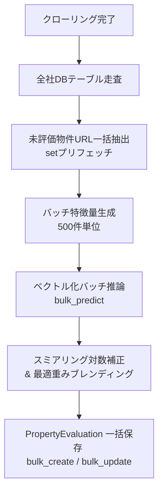

# クローラー仕様書 (Crawler Specification)

本プロジェクトのクローラーにおけるアーキテクチャ、処理フロー、および技術的な詳細仕様について記載します。

## 1. システム構成要素 (Core Components)

主要なクラスおよびファイルの役割と配置です。

| コンポーネント | ファイルパス | 役割 |
| :--- | :--- | :--- |
| `ApiRegistry` | `src/crawler/package/api/api_list.py` | 全ての API エンドポイントと実行クラスのマッピング管理 |
| `ApiAsyncProcBase` | `src/crawler/package/api/api.py` | 非同期 HTTP リクエスト、並列制御、リトライ、Fire-and-Forget の基底ロジック |
| `Parse{Site}{Type}StartAsync` | 各社ディレクトリ (e.g. `mitsui/start.py`) | サイトごとのクロール開始地点（初手）のロジック |
| 各社共通パーサー | 各社ディレクトリ (e.g. `mitsui/mitsui_base.py`) | HTML 解析の共通ユーティリティ、タグ抽出、正規化 |

## 2. 主要概念 (Key Concepts)

### Fire-and-Forget Chain Pattern

再帰的な非同期API呼び出しにより、各ステップが独立して実行される設計パターン。

**特徴:**
- 各APIは即座にHTTP 200を返却（処理完了を待たない）
- 次のステップをHTTP POSTで起動
- タイムアウト（3秒）は成功とみなす
- サーバーレス環境での分散実行が可能

**実装詳細:**
- 基底クラス: `ApiAsyncProcBase` (`src/crawler/package/api/api.py`)
- タイムアウト設定: `FIRE_AND_FORGET_TIMEOUT = 3.0`

### Dual Storage Pattern

数値データを文字列と数値の両方で保持するパターン。

**目的:**
- 元の表記を保持（表示用）
- 数値化してクエリ・集計を可能に

**対象フィールド:**
- 価格: `priceStr` (例: "5,480万円") + `price` (例: 54800000)
- 面積: `senyuMensekiStr` (例: "81.65㎡") + `senyuMenseki` (例: 81.65)
- 管理費: `kanrihiStr` + `kanrihi`
- 修繕積立金: `syuzenTsumitateStr` + `syuzenTsumitate`
- 徒歩分数: `railwayWalkMinute{N}Str` + `railwayWalkMinute{N}`

### Transportation Fields Pattern

最大5路線までのアクセス情報を保持。

**構造:**
- 5路線 × 8フィールド = 40フィールド
- 各路線のフィールド（N=1~5）:
  1. `transfer{N}`: 乗り換え情報
  2. `railway{N}`: 沿線名
  3. `station{N}`: 駅名
  4. `railwayWalkMinute{N}Str`: 徒歩分数（文字列）
  5. `railwayWalkMinute{N}`: 徒歩分数（数値）
  6. `busStation{N}`: バス停名
  7. `busWalkMinute{N}Str`: バス徒歩分数（文字列）
  8. `busWalkMinute{N}`: バス徒歩分数（数値）

**例:**
```
railway1 = "JR山手線"
station1 = "東京"
railwayWalkMinute1Str = "5分"
railwayWalkMinute1 = 5
```

### Computed and Derived Fields

パース時に計算される派生フィールド。

**主な計算フィールド:**

1. **kyutaishin（旧耐震判定）**
   - 築年月が1982年1月1日より前の場合に1
   - 新耐震基準導入前の物件を特定

2. **per-square-meter fees（平米単価）**
   - `kanrihi_p_heibei = kanrihi / senyuMenseki`
   - `syuzenTsumitate_p_heibei = syuzenTsumitate / senyuMenseki`
   - 管理費・修繕積立金の平米あたりコスト

3. **floor decomposition（階数情報の分解）**
   - `floorType_kai`: 所在階
   - `floorType_chijo`: 地上階数
   - `floorType_chika`: 地下階数
   - 例: "2階/地上10階/地下1階" → kai=2, chijo=10, chika=1

4. **railwayCount（路線数）**
   - 利用可能な路線の数（1~5）

5. **busUse1（バス利用の有無）**
   - バスを利用する場合は1、そうでない場合は0

---

## 3. アーキテクチャ詳細 (Architecture Details)

### 対応種別
本クローラーは、以下の不動産種別に対応しています。
*   **投資用不動産** (investment)
    *   一棟マンション（RC造・鉄骨造などの集合住宅一棟）
    *   一棟アパート（木造・軽量鉄骨造などの集合住宅一棟）
    *   投資用戸建て（賃貸収入目的の一戸建て）
    *   ※区分マンション、ビル、店舗/事務所などは収集対象外
*   **マンション** (mansion)
*   **土地** (tochi)
*   **戸建** (kodate)

### Fire-and-Forget 方式
本クローラーは、Google Cloud Functions などのサーバーレス環境での実行も想定し、「Fire-and-Forget」方式の非同期API呼び出しを採用しています。

*   **再帰的呼び出し**: `Start` -> `Area` -> `List` -> `Detail` の各ステップは、次のステップのAPIエンドポイントをHTTPリクエストで呼び出すことで連鎖します。
*   **即時レスポンス**: 呼び出し元の関数は、リクエストを送信した後、処理の完了を待たずに即座にレスポンス（ステータス 200）を返します。
*   **タイムアウト設定**: 次の処理をトリガーする際のリクエストタイムアウトは **3.0秒** に設定されており、接続が確立された時点で成功とみなします（実際の処理完了を待ちません）。

### 構成
本システムは `python:3.11-slim` イメージを使用し、不要なブラウザエンジン（Playwright）を排除した最小構成です。
すべてのサイトが `aiohttp` による HTTP リクエストと `BeautifulSoup4` による HTML 解析で完結するよう設計されています。

### 並列処理設定 (Concurrent Processing Configuration)

#### パラメータ一覧

| パラメータ | 値 | 説明 | 定義場所 |
|-----------|-----|------|---------|
| `FIRE_AND_FORGET_TIMEOUT` | 3.0秒 | 次ステップ起動時のHTTPタイムアウト | `api.py` |
| `DEFAULT_PARARELL_LIMIT` | 2 | デフォルトの並列リクエスト数 | `api.py` |
| `DETAIL_PARARELL_LIMIT` | 6 | 詳細ページ取得時の並列数 | `api.py` |
| `TCP_CONNECTOR_LIMIT` | 100 | aiohttpのTCP接続プール上限 | `api.py` |

#### 並列処理の動作

**Region/List API:**
- 並列数: `DEFAULT_PARARELL_LIMIT = 2`
- 同時に2地域または2ページを処理
- サイトへの負荷を考慮した控えめの設定

**Detail API:**
- 並列数: `DETAIL_PARARELL_LIMIT = 6`
- 同時に6物件の詳細ページを取得
- 詳細ページは個別の物件情報のため、やや高い並列数を許容

**TCP接続:**
- 上限: `TCP_CONNECTOR_LIMIT = 100`
- aiohttpのコネクションプール全体で100接続まで
- 全てのリクエストで共有されるプール

#### 調整方法

サイトへの負荷を調整したい場合、`src/crawler/package/api/api.py` で値を変更できます：

```python
# より控えめの設定
DEFAULT_PARARELL_LIMIT = 1  # 2 → 1に変更
DETAIL_PARARELL_LIMIT = 3   # 6 → 3に変更

# より高速な設定（非推奨）
DEFAULT_PARARELL_LIMIT = 4  # 2 → 4に変更
DETAIL_PARARELL_LIMIT = 10  # 6 → 10に変更
```

---

## 4. エラーハンドリング & 障害耐性制御 (Error Handling & Robustness)

クローリングの安定性とパイプラインの完遂率を高めるため、以下の制御メカニズムを実装・適用しています。

### 4.1 ネットワーク & 通信エラーハンドリング

*   **ネットワークエラー (`ClientConnectorError`, `ServerDisconnectedError`)**:
    *   一時的なネットワーク障害とみなし、**1回のリトライ**を実施します。
    *   リトライ前に待機時間（`sleep(10)` = 10秒）を設けています。
*   **タイムアウト (`TimeoutError`)**:
    *   Fire-and-Forget の設計上、タイムアウトは**「リクエスト送信成功」**として扱います。エラーログは出力せず、処理を継続します。
*   **DB接続エラー (`OperationalError`)**:
    *   DBへの同時接続過多などで保存に失敗した場合、**30秒待機**してから再試行します。
*   **バリデーションエラー (`ReadPropertyNameException`)**:
    *   取得データ項目の型不整合やパース失敗時はエラーログを記録し、対象ページを `error_pages/` へ自動保存します。

### 4.2 クローラー優先順位制御原則 (Smallest-Site-First)

大容量サイトや大手ポータルの遅延によって他サイトのクロールが未実施になる事態を防止するため、処理が早く完了する小規模サイト・電鉄系・ハウスメーカー系から優先的にクロールを実行します。

*   **優先実行順序**:
    1.  ハウスメーカー系 / 電鉄系 / 小規模サイト (`sekisui`, `afr`, `daiwa`, `totate`, `odakyu`, `sumirin`, `heim`, `rearie`, `keio`, `seibu`, `keikyu`, `sotetsu`, `keisei`, `daikyo`)
    2.  信託・銀行系列 (`smtrc`, `sumai1`, `mizuho`)
    3.  主要仲介・ポータル (`mitsui`, `sumifu`, `tokyu`, `nomura`, `misawa`, `athome`, `homes`)

### 4.3 障害制御 & アラートフィルタリング仕様

*   **連続タイムアウト Fast-Fail & サーキットブレイカー**:
    *   相手サーバーが無応答・タイムアウトを繰り返す場合（連続3回以上）、ダラダラとリトライを続けず「接続失敗」と判定して該当ジョブを即時中断 (Abort) し、パイプラインのハングアップを防止します。
*   **0件取得失敗分類原則 (Zero-Count Failure)**:
    *   クローリング処理が正常終了（Exit Code 0）した場合であっても、新規取得件数が0件である場合は正常とみなさず「0件取得失敗」としてエラーアラートを発報し、失敗ジョブとして記録します。
*   **物件公開終了 (404/掲載終了) の Slack アラート除外**:
    *   物件の公開終了（HTTP 404, Page Not Found, 掲載終了）による取得不可は正常なライフサイクルであるため、Slack アラートチャンネルへの通知対象から除外（スキップ）します。
*   **Slack疎通事前自己チェック (Step 0)**:
    *   クローリングおよびパイプラインの起動前（Step 0）に必ず `check_slack_connection.py` を自動実行し、設定不備（`channel_not_found` 等）による通知不達を未然に防止します。

---

## 5. 各サイト固有の解析ロジック詳細

#### 三井のリハウス (Mitsui)
三井のリハウス独自の抽出・変換処理です。
- **旧耐震判定 (`kyutaishin`)**: 築年月が 「1982年1月1日」 以前の物件を `True` (旧耐震) としてフラグを立てます。
- **階数分解 (`floorType_...`)**: 「所在階 / 地上階 / 地下階」を正規表現で分離し、それぞれ数値として保持します（例: 「2階/地上10階/地下1階」 -> `floorType_kai:2`, `kaisu:10`, `kaisu_under:1`）。
- **平米単価計算**: 価格と専有面積から算出します（`price / senyuMenseki`）。

#### 住友不動産販売 (Sumifu)
- **エリア・リスト取得**: `region` -> `area` -> `list` の多段階構成となっています。
- **データ保持**: 投資用物件以外は `SumifuModel` を継承し、広範な共通フィールド（69項目）を保持します。

#### ミサワホーム不動産 (Misawa)
- **交通情報の簡略化**: 他のサイトが 5路線×8フィールドを保持するのに対し、ミサワは `railway1`, `station1`, `walkMinute1` の **3フィールドのみ** を抽出・保存します。
- **共通基底**: 全種別で `MisawaCommon` を継承します。

---

## 7. 実行環境とパラメータ

詳細な設定値については **[API 構造ドキュメント](api_structure.md)** および **[開発者ガイド](development_guide.md)** を参照してください。
- **タイムアウト**: Fire-and-Forget 実行時は `3.0s`。
- **並列数**: ローカル実行時はデフォルト `2`（詳細ページのみ `6`）。
解析が完了した直後に、1件ごとにデータベースへ保存 (`save()` メソッド) します。
*   **重複管理**:
    *   同一物件が既に存在する場合、最新の情報を上書きするか、履歴として保持します（Django モデルの実装に準拠）。

## 5. 処理フロー詳細 (Process Flow)

各サイトのクローリングは、以下のエンドポイント連鎖によって実行されます。

### 三井のリハウス (`mitsui`)
1.  **Start** (`/api/mitsui/{type}/start`): 都道府県一覧を取得。
2.  **Area** (`/api/mitsui/{type}/area`): 市区町村一覧を取得。
3.  **List** (`/api/mitsui/{type}/list`): 物件一覧ページをページング走査。
4.  **Detail** (`/api/mitsui/{type}/detail`): 物件詳細を解析・保存。

### 住友不動産販売 (`sumifu`)
1.  **Start** (`/api/sumifu/{type}/start`): 地域選択。
2.  **Region** (`/api/sumifu/{type}/region`): 地域内市区町村を特定。
3.  **List** (`/api/sumifu/{type}/list`): 一覧取得。
4.  **Detail** (`/api/sumifu/{type}/detail`): 詳細解析・保存。

### 東急リバブル (`tokyu`)
1.  **Start** (`/api/tokyu/{type}/start`): エリア選択。
2.  **Area** (`/api/tokyu/{type}/area`): 市区町村選択。
3.  **List** (`/api/tokyu/{type}/list`): 一覧ページング。
4.  **Detail** (`/api/tokyu/{type}/detail`): 詳細解析・保存。

### 野村の仲介＋ (`nomura`)
1.  **Start** (`/api/nomura/{type}/start`): クロール開始。
2.  **Detail**: 詳細ページから情報を抽出。

### ミサワホーム不動産 (`misawa`)
1.  **Start** (`/api/misawa/{type}/start`): 検索トップから地域選択。
2.  **List** (`/api/misawa/{type}/list`): 一覧解析。
3.  **Detail** (`/api/misawa/{type}/detail`): 詳細解析・保存。

## 6. 詳細ページの解析ロジック (Parsing Logic)

HTML解析には `BeautifulSoup4` を使用しています。

### 基本戦略
1.  **要素の特定**: CSSセレクタを使用して対象データを特定します。
2.  **テーブル走査**: 物件詳細は主に `<table>` 内にあるため、`th` (項目名) に応じた `td` (値) 取得を自動化しています。
3.  **データ整形**: 通貨（万円→円）や面積（㎡除去）の数値変換を各社パーサーで行います。

**構造:**
- 5路線 × 8フィールド = 40フィールド
- 各路線のフィールド（N=1~5）:
  1. `transfer{N}`: 乗り換え情報
  2. `railway{N}`: 沿線名
  3. `station{N}`: 駅名
  4. `railwayWalkMinute{N}Str`: 徒歩分数（文字列）
  5. `railwayWalkMinute{N}`: 徒歩分数（数値）
  6. `busStation{N}`: バス停名
  7. `busWalkMinute{N}Str`: バス徒歩分数（文字列）
  8. `busWalkMinute{N}`: バス徒歩分数（数値）

**例:**
```
railway1 = "JR山手線"
station1 = "東京"
railwayWalkMinute1Str = "5分"
railwayWalkMinute1 = 5
```

### Computed and Derived Fields

パース時に計算される派生フィールド。

**主な計算フィールド:**

1.  **kyutaishin（旧耐震判定）**
    - 築年月が1982年1月1日より前の場合に1
    - 新耐震基準導入前の物件を特定

2.  **per-square-meter fees（平米単価）**
    - `kanrihi_p_heibei = kanrihi / senyuMenseki`
    - `syuzenTsumitate_p_heibei = syuzenTsumitate / senyuMenseki`
    - 管理費・修繕積立金の平米あたりコスト

3.  **floor decomposition（階数情報の分解）**
    - `floorType_kai`: 所在階
    - `floorType_chijo`: 地上階数
    - `floorType_chika`: 地下階数
    - 例: "2階/地上10階/地下1階" → kai=2, chijo=10, chika=1

4.  **railwayCount（路線数）**
    - 利用可能な路線の数（1~5）

5.  **busUse1（バス利用の有無）**
    - バスを利用する場合は1、そうでない場合は0

---

## 3. アーキテクチャ詳細 (Architecture Details)

### 対応種別
本クローラーは、以下の不動産種別に対応しています。
*   **投資用不動産** (investment)
    *   一棟マンション（RC造・鉄骨造などの集合住宅一棟）
    *   一棟アパート（木造・軽量鉄骨造などの集合住宅一棟）
    *   投資用戸建て（賃貸収入目的の一戸建て）
    *   ※区分マンション、ビル、店舗/事務所などは収集対象外
*   **マンション** (mansion)
*   **土地** (tochi)
*   **戸建** (kodate)

### Fire-and-Forget 方式
本クローラーは、Google Cloud Functions などのサーバーレス環境での実行も想定し、「Fire-and-Forget」方式の非同期API呼び出しを採用しています。

*   **再帰的呼び出し**: `Start` -> `Area` -> `List` -> `Detail` の各ステップは、次のステップのAPIエンドポイントをHTTPリクエストで呼び出すことで連鎖します。
*   **即時レスポンス**: 呼び出し元の関数は、リクエストを送信した後、処理の完了を待たずに即座にレスポンス（ステータス 200）を返します。
*   **タイムアウト設定**: 次の処理をトリガーする際のリクエストタイムアウトは **3.0秒** に設定されており、接続が確立された時点で成功とみなします（実際の処理完了を待ちません）。

### 構成
本システムは `python:3.10-slim` イメージを使用し、不要なブラウザエンジン（Playwright）を排除した最小構成です。
すべてのサイトが `aiohttp` による HTTP リクエストと `BeautifulSoup4` による HTML 解析で完結するよう設計されています。

### 並列処理設定 (Concurrent Processing Configuration)

#### パラメータ一覧

| パラメータ | 値 | 説明 | 定義場所 |
|-----------|-----|------|---------|
| `FIRE_AND_FORGET_TIMEOUT` | 3.0秒 | 次ステップ起動時のHTTPタイムアウト | `api.py` |
| `DEFAULT_PARARELL_LIMIT` | 2 | デフォルトの並列リクエスト数 | `api.py` |
| `DETAIL_PARARELL_LIMIT` | 6 | 詳細ページ取得時の並列数 | `api.py` |
| `TCP_CONNECTOR_LIMIT` | 100 | aiohttpのTCP接続プール上限 | `api.py` |

#### 並列処理の動作

**Region/List API:**
- 並列数: `DEFAULT_PARARELL_LIMIT = 2`
- 同時に2地域または2ページを処理
- サイトへの負荷を考慮した控えめの設定

**Detail API:**
- 並列数: `DETAIL_PARARELL_LIMIT = 6`
- 同時に6物件の詳細ページを取得
- 詳細ページは個別の物件情報のため、やや高い並列数を許容

**TCP接続:**
- 上限: `TCP_CONNECTOR_LIMIT = 100`
- aiohttpのコネクションプール全体で100接続まで
- 全てのリクエストで共有されるプール

#### 調整方法

サイトへの負荷を調整したい場合、`src/crawler/package/api/api.py` で値を変更できます：

```python
# より控えめの設定
DEFAULT_PARARELL_LIMIT = 1  # 2 → 1に変更
DETAIL_PARARELL_LIMIT = 3   # 6 → 3に変更

# より高速な設定（非推奨）
DEFAULT_PARARELL_LIMIT = 4  # 2 → 4に変更
DETAIL_PARARELL_LIMIT = 10  # 6 → 10に変更
```

---

## 4. エラーハンドリング & リトライ (Error Handling)

クローリングの安定性を高めるため、以下のエラーハンドリングを実装しています。

*   **ネットワークエラー (`ClientConnectorError`, `ServerDisconnectedError`)**:
    *   一時的なネットワーク障害とみなし、**1回のリトライ**を実施します。
    *   リトライ前に待機時間（`sleep(10)` = 10秒）を設けています。
*   **タイムアウト (`TimeoutError`)**:
    *   Fire-and-Forget の設計上、タイムアウトは**「リクエスト送信成功」**として扱います。エラーログは出力せず、処理を継続します。
*   **DB接続エラー (`OperationalError`)**:
    *   DBへの同時接続過多などで保存に失敗した場合、**30秒待機**してから再試行します。

### 各サイト固有の解析ロジック詳細

#### 三井のリハウス (Mitsui)
三井のリハウス独自の抽出・変換処理です。
- **旧耐震判定 (`kyutaishin`)**: 築年月が 「1982年1月1日」 以前の物件を `True` (旧耐震) としてフラグを立てます。
- **階数分解 (`floorType_...`)**: 「所在階 / 地上階 / 地下階」を正規表現で分離し、それぞれ数値として保持します（例: 「2階/地上10階/地下1階」 -> `floorType_kai:2`, `kaisu:10`, `kaisu_under:1`）。
- **平米単価計算**: 価格と専有面積から算出します（`price / senyuMenseki`）。

#### 住友不動産販売 (Sumifu)
- **エリア・リスト取得**: `region` -> `area` -> `list` の多段階構成となっています。
- **データ保持**: 投資用物件以外は `SumifuModel` を継承し、広範な共通フィールド（69項目）を保持します。

#### ミサワホーム不動産 (Misawa)
- **交通情報の簡略化**: 他のサイトが 5路線×8フィールドを保持するのに対し、ミサワは `railway1`, `station1`, `walkMinute1` の **3フィールドのみ** を抽出・保存します。
- **共通基底**: 全種別で `MisawaCommon` を継承します。

---

## 5. 処理フロー詳細 (Process Flow)

各サイトのクローリングは、以下のエンドポイント連鎖によって実行されます。

### 三井のリハウス (`mitsui`)
1.  **Start** (`/api/mitsui/{type}/start`): 都道府県一覧を取得。
2.  **Area** (`/api/mitsui/{type}/area`): 市区町村一覧を取得。
3.  **List** (`/api/mitsui/{type}/list`): 物件一覧ページをページング走査。
4.  **Detail** (`/api/mitsui/{type}/detail`): 物件詳細を解析・保存。

### 住友不動産販売 (`sumifu`)
1.  **Start** (`/api/sumifu/{type}/start`): 地域選択。
2.  **Region** (`/api/sumifu/{type}/region`): 地域内市区町村を特定。
3.  **List** (`/api/sumifu/{type}/list`): 一覧取得。
4.  **Detail** (`/api/sumifu/{type}/detail`): 詳細解析・保存。

### 東急リバブル (`tokyu`)
1.  **Start** (`/api/tokyu/{type}/start`): エリア選択。
2.  **Area** (`/api/tokyu/{type}/area`): 市区町村選択。
3.  **List** (`/api/tokyu/{type}/list`): 一覧ページング。
4.  **Detail** (`/api/tokyu/{type}/detail`): 詳細解析・保存。

### 野村の仲介＋ (`nomura`)
1.  **Start** (`/api/nomura/{type}/start`): クロール開始。
2.  **Detail**: 詳細ページから情報を抽出。

### ミサワホーム不動産 (`misawa`)
1.  **Start** (`/api/misawa/{type}/start`): 検索トップから地域選択。
2.  **List** (`/api/misawa/{type}/list`): 一覧解析。
3.  **Detail** (`/api/misawa/{type}/detail`): 詳細解析・保存。

## 6. 詳細ページの解析ロジック (Parsing Logic)

HTML解析には `BeautifulSoup4` を使用しています。

### 基本戦略
1.  **要素の特定**: CSSセレクタを使用して対象データを特定します。
2.  **テーブル走査**: 物件詳細は主に `<table>` 内にあるため、`th` (項目名) に応じた `td` (値) 取得を自動化しています。
3.  **データ整形**: 通貨（万円→円）や面積（㎡除去）の数値変換を各社パーサーで行います。

### サイト固有の特記事項
*   **三井のリハウス**: 接道状況から最も幅員が広い道路を自動選定。旧耐震（1982年以前）の自動判定。
*   **住友不動産販売**: 投資用物件での利回り・賃料の個別パース。
*   **ミサワホーム不動産**: サイト構造の変化（h1/h2フォールバック）に対応。

---

## 7. 実行環境とパラメータ

詳細な設定値については **[API 構造ドキュメント](api_structure.md)** および **[開発者ガイド](development_guide.md)** を参照してください。
- **タイムアウト**: Fire-and-Forget 実行時は `3.0s`。
- **並列数**: ローカル実行時はデフォルト `2`（詳細ページのみ `6`）。
解析が完了した直後に、1件ごとにデータベースへ保存 (`save()` メソッド) します。
*   **重複管理**:
    *   同一物件が既に存在する場合、最新の情報を上書きするか、履歴として保持します（Django モデルの実装に準拠）。

---

## 8. バルクML評価・ベクトル化推論アーキテクチャ (Bulk ML Evaluation)

クローリングによって保存された未評価物件に対し、高速かつ高精度に理論価格を付与するためのアーキテクチャ。

### 8.1 処理パイプライン概要


### 8.2 高速化設計
- **オンメモリ常駐モデル直接実行**: HTTP API通信を排し、プロセス内に常駐したモデルへ直接アクセス。
- **ベクトル化バッチ推論 (`bulk_predict_first_stage`)**: 特徴量を一括で2次元配列（DataFrame）化し、LightGBM / XGBoost / CatBoost / RF で一括行列予測。
- **DBアクセスの一括化**: 評価済URLのインメモリセット比較による事前除外と、`bulk_create` / `bulk_update` によるN+1クエリの完全排除。

---

## 9. 経済的価値創出還元アーキテクチャ (Economic Value Capitalization Architecture)

物件の「理論価値」を単なる市場価格の統計平均ではなく、「経済的価値を生む力（収益力・利用容積力）」として定義し、価格と価値の歪みを客観的に抽出する。

### 9.1 価値還元コンポーネント
1. **想定収益還元価値（Imputed Economic Value）**:
   - 居住用・投資用を問わず、「当該立地・面積・構造・築年数で獲得可能な想定純家賃（NOI）」を地域期待利回りで割り戻した資産価値アンカー。
2. **潜在容積延床面積（Potential Volume Floor Area）**:
   - 敷地面積 × 指定容積率（FAR）により、敷地が創出可能な総延床面積を算出し、都心高容積率商業地の経済価値を正当に反映。
3. **規模非線形減退（Scale Non-Linear Discount）**:
   - 1,000㎡を超える広大土地・山林・原野について、宅地単価の単純乗算を排し、有効開発可能規模に応じた指数減退モデルを適用。
4. **経済的減価・制約フィルター（Economic Rights & Rebuild Restriction）**:
   - 借地権、再建築不可、瑕疵物件について、将来キャッシュフロー阻害率に応じた減価係数を自動適用。
5. **種別誤認・データ異常防御（Misclassification & Anomaly Defense）**:
   - 敷地権なし区分所有の戸建て混入時の自動マンションリルート、面積数値汚染（500㎡超）のサニタイズ、築年数欠損補正。

