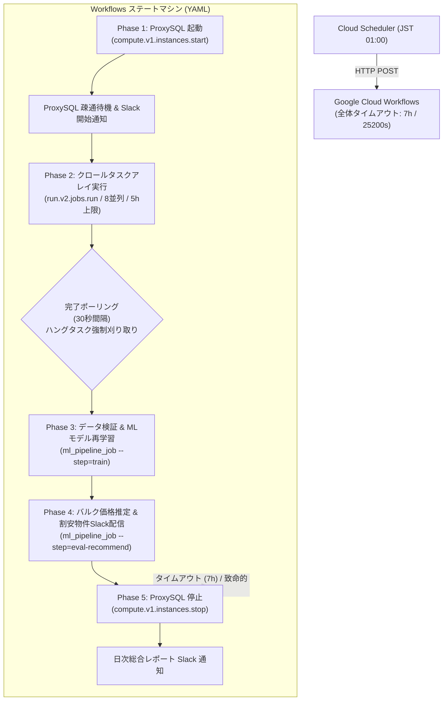

# Cloud Workflows パイプライン統合オーケストレーション基本設計書

## 1. システム構成図

## 2. タイムアウト設計仕様

| 項目 | 設定値 | 主体 | 役割 |
|---|---|---|---|
| **ワークフロー全体枠** | **25,200秒（7時間）** | Cloud Workflows (`execution_timeout`) | 万一の無限待機に対する絶対安全弁。到達時は `finally` で ProxySQL を緊急停止 |
| **クローリング処理枠** | **18,000秒（5時間）** | Cloud Run Job (`timeout = "18000s"`) & Workflows 監視 | クローラータスクアレイの許容上限時間。超過時はタスクを打ち切って後続へ |
| **無進捗ハング閾値** | **300秒（5分）** | 各コンテナ親プロセス（`run_all_crawlers.py`） | 該当ジョブの通信・ログが5分沈黙した場合に SIGKILL で個別刈り取り |
| **DB 接続・クエリ** | **接続 10s / クエリ 120s** | Django ORM / MySQL クライアント | 一時的な接続待ちでプロセスがハングするのを防止 |

## 3. インフラ・Terraform 構成設計
* `terraform/workflows.tf`:
  * `google_workflows_workflow`: `realestate-pipeline-workflow-${var.environment}`
  * `source_contents`: ワークフロー定義 YAML ファイル (`workflows/daily_pipeline.yaml`)
* `terraform/scheduler.tf`:
  * `google_cloud_scheduler_job`: Workflows の実行エンドポイント（`workflows.googleapis.com`）をターゲットに変更。
* `terraform/iam.tf`:
  * ワークフロー用サービスアカウントに必要な権限（Compute Instance Admin, Run Invoker, Secret Accessor）を付与。
