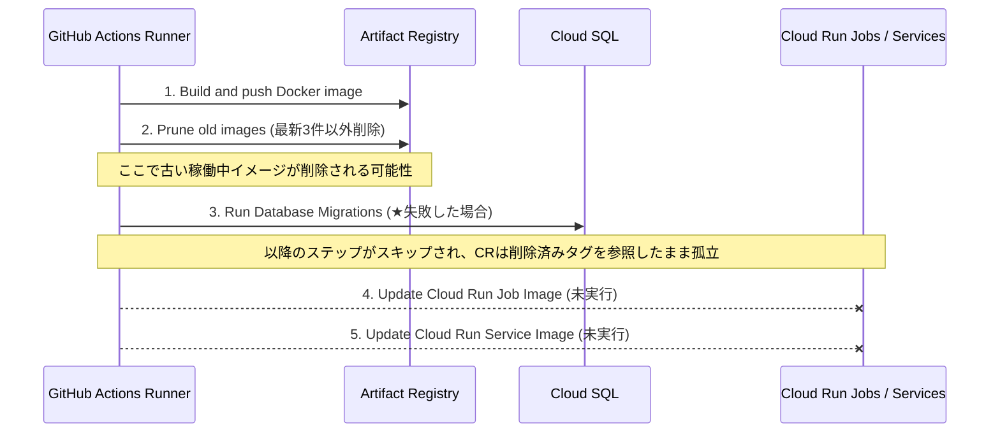
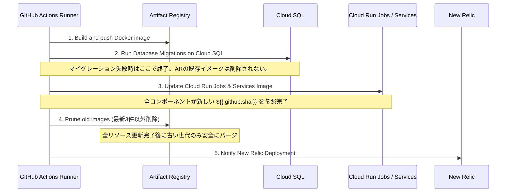

# deploy-production ワークフローにおけるイメージ管理・デプロイ順序安全化基本設計書 (Issue #593)

## 1. 概要
本基本設計書は、本番環境デプロイパイプライン（`.github/workflows/deploy-production.yml`）における各ステップの依存関係および実行シーケンスの設計を定義する。

## 2. デプロイ実行シーケンス設計

### 2.1 変更前シーケンス（課題あり）

### 2.2 変更後シーケンス（安全設計）

## 3. ステップ配置仕様

| 順序 | ステップ名 | 役割 | 失敗時影響 |
|---|---|---|---|
| 1 | Checkout & GCP Auth & Docker Buildx | ビルド準備 | 後続中止（影響なし） |
| 2 | Build and push Docker image | 新イメージ（latest + sha）の生成と登録 | 後続中止（影響なし） |
| 3 | Run Database Migrations on Cloud SQL | マイグレーション実行 | 失敗時中止。旧イメージ・現稼働環境は無傷のまま保護 |
| 4 | Update Cloud Run Job Image | クローラー本体・各ジョブの参照イメージ更新 | 失敗時中止 |
| 5 | Update Cloud Run Service Image | 各種 Web/Worker/Slack サービスの参照更新 | 失敗時中止 |
| 6 | Prune old images (Keep latest 3 versions) | 最新3世代以外の古いイメージを削除 | デプロイ成功後のみ実行。現行・前世代を確実に保護 |
| 7 | Notify New Relic Deployment | New Relic デプロイマーカー記録 | 非ブロッキング通知 |
