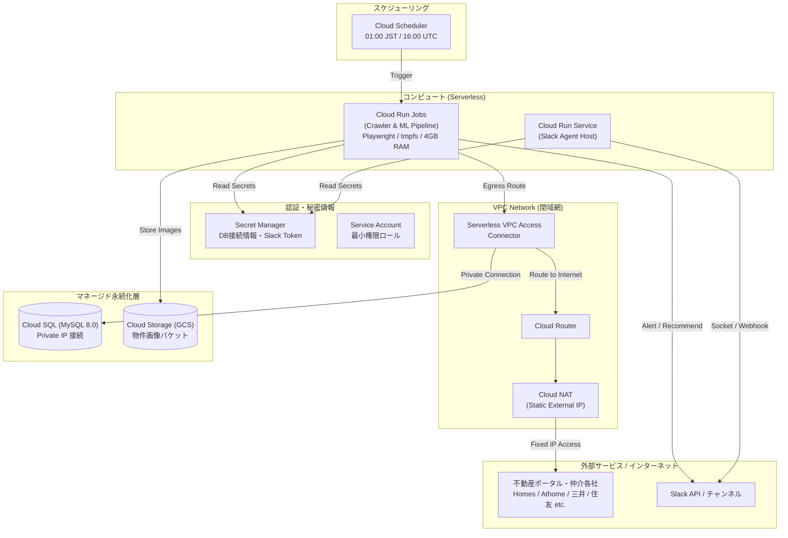

# GCP アーキテクチャ基本設計書 (GCP Architecture Basic Design)

## 1. 全体構成概要
本システムは、完全マネージドなサーバーレス実行基盤（Cloud Run Jobs + Cloud Scheduler）を中心に、データベース（Cloud SQL for MySQL）、ストレージ（Cloud Storage）、およびセキュリティ基盤（VPC + Cloud NAT + Secret Manager）で構成される。

---

## 2. コンポーネント詳細設計

| コンポーネント | GCPサービス | 仕様・サイジング | 役割・選定根拠 |
|---|---|---|---|
| **バッチ実行基盤** | Cloud Run Jobs | 2 vCPU, 4 GiB RAM, タイムアウト 24h, tmpfs 有効 | 初回DBスキーマ自動反映、クローラーおよびML一括評価を実行。Playwrightのメモリ枯渇を防止し、非稼働時コスト¥0。 |
| **定期トリガー** | Cloud Scheduler | 毎日 16:00 UTC (01:00 JST) 実行 | Cloud Run Jobs の実行 API を OIDC 認証付きで安全にキック。 |
| **リレーショナルDB** | Cloud SQL for MySQL 8.0 | `db-f1-micro` または `db-g1-small`, SSD 20GB (自動拡張) | 物件マスタ、トランザクション、地価、評価データの格納。自動バックアップ対応。 |
| **オブジェクトストレージ** | Cloud Storage (GCS) | Standard クラス, リージョン: `asia-northeast1` | 物件画像、エビデンス、モデルアーティファクト保存。MinIOからの完全代替。 |
| **コンテナレジストリ** | Artifact Registry | Docker リポジトリ (`asia-northeast1`) | クローラーDockerイメージの保存・バージョン管理。 |
| **送信元IP固定** | Serverless VPC Access + Cloud NAT | e2-micro コネクタ (2~10台), 手動静的外部IP 1本 | クロール先ポータルからのBot検知・IPブロックを回避。 |
| **シークレット管理** | Secret Manager | レプリケーション: 自動 | DBパスワード、Slack Bot Token、Slack App Token を安全に注入。 |
| **実行権限** | IAM Service Account | クローラー専用 SA | Cloud SQL クライアント、Storage オブジェクト管理者、Secret アクセサーを付与。 |
| **予算・請求アラート** | Cloud Billing Budget + Cloud Monitoring | しきい値: 50%, 80%, 100%, 120%(予測) | メール及びPub/Sub通知により、リソース暴走や過大請求を即時防止。 |

---

## 3. 分散並列実行アーキテクチャ（Cloud Run Jobs タスクアレイ ＆ Coordinator パターン）

### 3.1 タスクアレイによるクローラー分散並列化
Cloud Run Jobs のタスクアレイ機能（`task_count = 8`, `parallelism = 4` 等）を利用し、全 45 以上の巡回ジョブ（サイト×種別）を複数コンテナで分散実行する。

- **タスク割り当てアルゴリズム**:
  - 各コンテナインスタンスに GCP から注入される環境変数 `CLOUD_RUN_TASK_INDEX`（0〜N-1）および `CLOUD_RUN_TASK_COUNT`（N）を参照。
  - `target_jobs` を Smallest-Site-First 順でソート後、Modulo 演算 (`index % task_count == task_index`) により重いポータル（Homes, Athome）や Playwright タスクを均等分散。
- **DBバリア同期 (Coordinator パターン)**:
  - **Task 0**: パイプライン開始時に DB マイグレーション (`manage.py migrate`) を先行実行後、自タスク担当ジョブをクロール。他タスクの完了を DB テーブル（`crawler_task_execution`）でポーリング待機し、全タスク完了後に「データ検証 ➔ MLモデル再学習 ➔ バルク推論 ➔ Slack通知」を一括統括実行。
  - **Task 1〜N-1**: DB 準備完了を待機後、自タスク担当ジョブをクロール。終了時に DB テーブルへステータス（COMPLETED / FAILED）を書き込み、正常終了 (Exit 0)。

### 3.2 MLモデル学習・バルク推論の並列最適化
- **MLモデル学習 (`train.py`)**:
  - LightGBM, XGBoost, CatBoost, RandomForest の学習時に `n_jobs=-1`（または利用可能CPUコア数）を指定し、マルチコア並列化。
- **バルク推論 (`run_bulk_ml_evaluation.py`)**:
  - `ThreadPoolExecutor`（4〜8並行）により、物件モデル群を並行して一括推論＆DB永続化。直列ループによる処理ボトルネックを解消。
- **サイト内詳細取得並行度 (`_getCloudPararellLimit`)**:
  - 環境変数 `CLOUD_DETAIL_CONCURRENCY`（デフォルト 5）により、GCP帯域に最適化された並行リクエスト数を安全に設定可能。

