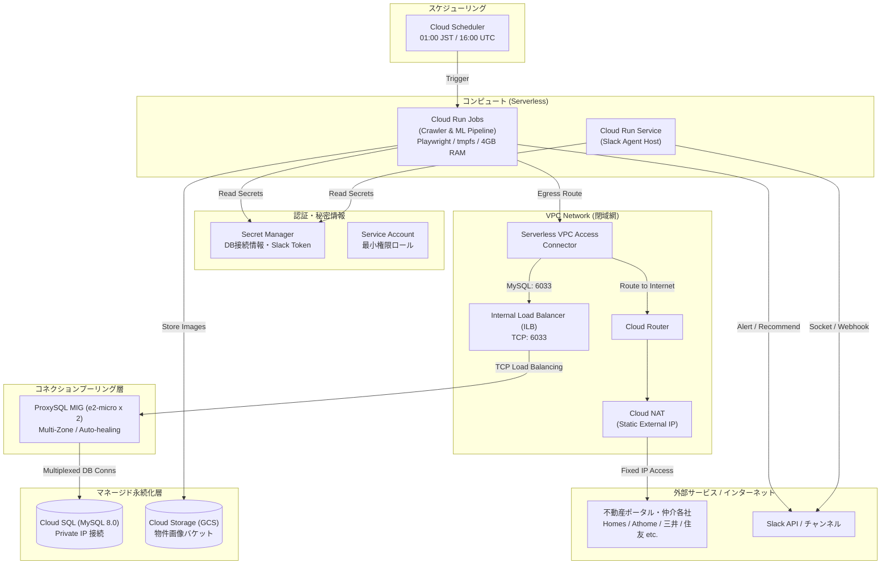

# GCP アーキテクチャ基本設計書 (GCP Architecture Basic Design)

## 1. 全体構成概要
本システムは、完全マネージドなサーバーレス実行基盤（Cloud Run Jobs + Cloud Scheduler）を中心に、データベース（Cloud SQL for MySQL）、ストレージ（Cloud Storage）、およびセキュリティ基盤（VPC + Cloud NAT + Secret Manager）で構成される。

---

## 2. コンポーネント詳細設計

| コンポーネント | GCPサービス | 仕様・サイジング | 役割・選定根拠 |
|---|---|---|---|
| **バッチ実行基盤** | Cloud Run Jobs | 2 vCPU, 4 GiB RAM, タイムアウト 3600s, tmpfs 有効, Direct VPC Egress | 初回DBスキーマ自動反映、クローラーおよびML一括評価を実行。タイムアウト短縮でゾンビ課金を遮断。 |
| **定期トリガー** | Cloud Scheduler | 毎日 16:00 UTC (01:00 JST) 実行 | Cloud Run Jobs の実行 API を OIDC 認証付きで安全にキック。 |
| **安全停止監視トリガー** | Cloud Scheduler | 毎日 20:00 UTC (05:00 JST) 実行 | バッチ完了後のリソース停止状態（ProxySQL size=0, NAT）を検査し強制停止するセーフティネット。 |
| **コネクションプール** | Compute Engine MIG | `e2-micro` オンデマンド (Autoscaler: Min 0, Max 2), Debian 12, ProxySQL | 多数のクローラープロセスからの同時DB接続を集約・多重化。非稼働時は `size = 0` で課金ゼロ化。 |
| **内部負荷分散** | 内部TCPロードバランサー (ILB) | リージョン内部ロードバランサー, ポート 6033, TCPヘルスチェック, コネクションドレイン (300秒) | ProxySQL MIG へのトラフィック分散、障害時自動フェイルオーバー、スケールイン時のクエリ保護。 |
| **リレーショナルDB** | Cloud SQL for MySQL 8.0 | `db-f1-micro` または `db-g1-small`, SSD 20GB (自動拡張) | 物件マスタ、トランザクション、地価、評価データの格納。自動バックアップ対応。 |
| **オブジェクトストレージ** | Cloud Storage (GCS) | Standard クラス, リージョン: `asia-northeast1` | 物件画像、エビデンス、モデルアーティファクト保存。MinIOからの完全代替。 |
| **コンテナレジストリ** | Artifact Registry | Docker リポジトリ (`asia-northeast1`) | クローラーDockerイメージの保存・バージョン管理。古いイメージの自動削除ポリシー適用。 |
| **送信元IP固定** | Direct VPC Egress + Cloud NAT | サブネット直接アタッチ (Connector廃止), 手動静的外部IP 1本 | クロール先ポータルからのBot検知・IPブロックを回避。バッチ連動でオンデマンド有効化。 |
| **シークレット管理** | Secret Manager | レプリケーション: 自動 | DBパスワード、ProxySQL監視/管理パスワード、Slack Bot Token、Slack App Token を安全に注入。 |
| **実行権限** | IAM Service Account | クローラー専用 SA / ProxySQL専用 SA | Cloud SQL クライアント、Storage オブジェクト管理者、Secret アクセサー等を最小権限で付与。 |
| **予算・請求アラート** | Cloud Billing Budget + Cloud Monitoring | しきい値: 50%, 80%, 100%, 120%(予測) | メール及びPub/Sub通知により、リソース暴走や過大請求を即時防止。 |
| **ログ重大度昇格 & 監視** | Cloud Logging + Cloud Monitoring | ログベースメトリクス + アラートポリシー (Severity: ERROR / CRITICAL) | MySQL 8.0 ログ `MY-010926` (Access denied) や `[ERROR]`, `MY-010048` (Too many connections) を捕捉し重大度 ERROR として即時アラート発報。 |
| **日中帯ゾンビ監視** | Cloud Monitoring | `compute.googleapis.com/instance_group/size` | 日中帯 (JST 06:00〜24:00) に ProxySQL が稼働し続けている場合に ERROR 発報。 |
| **ヘルスチェック監視認証** | Cloud SQL User (`monitor`) + ProxySQL | 専用 `monitor` ユーザー (USAGE権限のみ) + ランダムパスワード | ProxySQL の内部死活監視 (`ping`, `read_only`) の認証を正常化し、認証拒否スパムを根絶。 |

---

## 3. 分散並列実行アーキテクチャ（Cloud Tasks + Cloud Run ワーカー ＆ レートリミット制御）

### 3.1 Cloud Tasks によるクローラー分散並列化 & 流量制御
Cloud Tasks のキューイングおよび流量制御機能（`max_dispatches_per_second = 5`, `max_concurrent_dispatches = 10` 等）を活用し、全 45 以上の巡回ジョブ（サイト×種別）を Cloud Run サービスへディスパッチして同時分散実行する。

- **レート制御 & サイト規模別並行プロセス制御**:
  - 全20〜25社に対して一斉にジョブを開始し、会社間の並列度を最大化。
  - 同一ドメインへの過度な負荷・BANを防止しつつ処理能力を最適化するため、取扱件数・ブラウザ負荷に応じて会社ごとの同時プロセス数を階層制御：
    - **Homes (超大規模ポータル HTTP)**: 同時 **5 プロセス**
    - **Athome (超大規模ポータル Playwright)**: 同時 **3 プロセス** (並行処理加速)
    - **大手5社 (三井, 住友, 東急, 野村, ミサワ)**: 同時 **2 プロセス**
    - **中小・電鉄・ハウスメーカー (17社)**: 同時 **1 プロセス** (同一会社内完全直列)
- **タスクディスパッチ (`dispatch_cloud_tasks.py` / `run_all_crawlers.py`)**:
  - スケジューラー起動時に各社から1種別ずつ全社一斉に投入。同一会社内は割り当て上限枠内で順次直列に消化。
- **完了検知 & 後続パイプライン連携**:
  - 各ワーカーは担当ジョブ完了時に DB（`crawler_task_execution`）へステータスを更新。
  - ディスパッチャーまたは Coordinator が全ジョブの完了を検知後、後続ステップ（バリデーション ➔ ML再学習 ➔ バルク推論 ➔ Slack通知）を一括実行。

### 3.2 MLモデル学習・バルク推論の並列最適化
- **MLモデル学習 (`train.py`)**:
  - LightGBM, XGBoost, CatBoost, RandomForest の学習時に `n_jobs=-1`（または利用可能CPUコア数）を指定し、マルチコア並列化。
- **バルク推論 (`run_bulk_ml_evaluation.py`)**:
  - `ThreadPoolExecutor`（4〜8並行）により、物件モデル群を並行して一括推論＆DB永続化。直列ループによる処理ボトルネックを解消。
- **サイト内詳細取得並行度 (`_getCloudPararellLimit`)**:
  - 環境変数 `CLOUD_DETAIL_CONCURRENCY`（デフォルト 5）により、GCP帯域に最適化された並行リクエスト数を安全に設定可能。

### 3.3 クローリング実行状況レポート設計（全体およびジョブ別時間粒度向上）
- **全体レポート指標**:
  - バッチ開始日時 (`start_time`)、終了日時 (`end_time`)、合計所要時間 (`duration`: 〇時間〇分〇秒 / `elapsed_seconds`) を計測・出力。
- **物件種別別粒度指標**:
  - 過去24時間新規取得件数内訳（会社×種別）および異常ジョブ一覧の各エントリに対し、個別ジョブの `(開始: HH:MM:SS, 終了: HH:MM:SS, 所要: 〇分〇秒)` を付与。
- **データ不整合防止ガード**:
  - 単一種別（ストックヘーベル等）のサイトにおいて、不適合種別のデータが混入しないようパーサーレベルで例外スキップ（`SkipPropertyException`）を実行。

