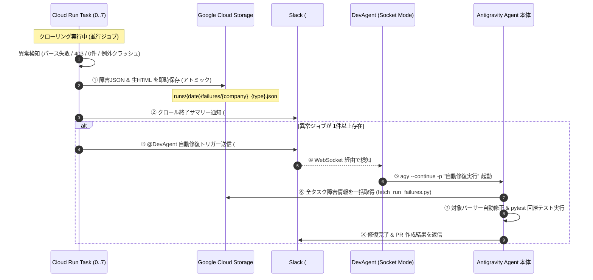

# GCSリアルタイム障害テレメトリ・一括オートヒール基本設計書 (Issue #466)

## 1. 全体アーキテクチャ概要

分散 Cloud Run Jobs（Task Array: Task 0〜7）におけるクローリング実行中、障害発生から Antigravity による自律修復完了までのエンドツーエンドデータフローを定義します。

## 2. モジュール構成と役割分担

| モジュール | パス | 役割 |
|---|---|---|
| **障害テレメトリ管理** | `src/crawler/package/utils/failure_reporter.py` | 障害メタデータ生成、GCS 即時アップロード、GCS 一括回収 API |
| **パーサー基底クラス** | `src/crawler/package/parser/baseParser.py` | パース例外・必須項目欠落検知時の生HTML GCS 自動保存フック |
| **API ハンドラ基底** | `src/crawler/package/api/api.py` | 403・0件・Fetch 失敗時のエラー情報 GCS 連携 |
| **CLI 実行エントリー** | `src/crawler/main.py` | 未捕捉例外時の非ゼロ終了（exit code 1）とトレース出力 |
| **分散オーケストレーター** | `src/crawler/scripts/ops/run_all_crawlers.py` | 子プロセス異常監視、リアルタイム GCS 書き出し、Slack `#dev-agent` ゼロタッチトリガー発信 |
| **一括回収 CLI** | `src/crawler/scripts/debug_tools/fetch_run_failures.py` | Antigravity が GCS から指定日全障害を 1 回でロードする CLI |

## 3. GCS バケット構成とライフサイクル

- 使用バケット: 既存の `STORAGE_BUCKET`（Terraform `realestate-images-${project}-${env}`）
- プレフィックス規約:
  - `runs/{YYYYMMDD}/failures/{company}_{property_type}.json`
  - `runs/{YYYYMMDD}/error_pages/{company}_{property_type}/{sha256_hash}.html`
  - `runs/{YYYYMMDD}/error_pages/{company}_{property_type}/{sha256_hash}_meta.json`
- ライフサイクル管理:
  - 既存の GCS バケットライフサイクルルール（非現行30日削除、180日Nearline等）に従い、無駄なストレージ課金を防止。

## 4. クローラー実行・ストレージ堅牢化方針 (Issue #477 / Issue #479)

1. **ストレージ抽象化とネイティブ GCS**:
   - `STORAGE_BACKEND=gcs` または `IS_CLOUD=true` 時は `google.cloud.storage.Client` による GCS API を使用。
   - `STORAGE_BACKEND` 未指定または `minio` 時は従来の `boto3`（S3互換）を使用。
2. **生 HTML の直接引き渡し**:
   - パース失敗時のハンドラ `_save_error_html_by_url` に手元の `raw_html` を直接引き渡し。相手サーバーへの不要な再 GET リクエストを排除。
3. **インプロセスルーティングの二重化**:
   - `ApiRegistry` に正規パス（`/api/...`）とレガシー GCP パス（`/..._GCP`）の双方を登録。これにより `IS_CLOUD=true` の有無に関わらず常にインプロセスで解決。
4. **レガシー暗号スイート適用**:
   - `misawa.py` の全クラスに `MisawaInvestmentConnectorMixin` を適用。
5. **Homes Mansion パーサー整合**:
   - `homes.py` の `ParseHomesMansionDetailFuncAsync` / `ParseHomesMansionStartAsync` が `HomesMansionParser` を利用。
6. **DecimalField 丸め整合**:
   - `converter.py` の `parse_menseki` / `parse_ratio` で `quantize(Decimal('0.01'))` を適用。
