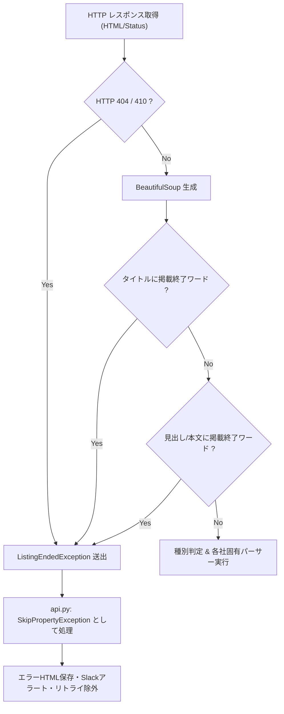

# 掲載終了ページ共通ハンドリング基本設計書 (Issue #600)

## 1. 全体アーキテクチャ

掲載終了ページの検知は、各社パーサーのパース処理（`_parsePropertyDetailPage`）が呼び出される前、`ParserBase.parsePropertyDetailPage` のパイプライン初期段階で一元的に実施する。



---

## 2. 判定キーワード定義

基底パーサー `ParserBase` に以下の定数クラス変数を定義する：

```python
LISTING_ENDED_TITLE_KEYWORDS = (
    "掲載終了",
    "掲載が終了",
    "掲載を終了",
    "成約済",
    "ご成約",
    "お探しの物件は見つかりません",
    "お探しのページは見つかりません",
    "物件が見つかりません",
)

LISTING_ENDED_BODY_KEYWORDS = (
    "掲載が終了したか、成約済みになった可能性があります",
    "お探しの物件は、掲載が終了",
    "掲載を終了いたしました",
    "掲載終了物件",
    "ご指定の物件は掲載を終了",
    "お探しのページは見つかりませんでした",
    "お探しの物件は見つかりませんでした",
    "お探しのページは存在しないか、掲載が終了",
    "現在、掲載を停止しております",
    "この物件は現在掲載されていません",
)
```

---

## 3. 各レイヤーの責務

1. **HTTP レベル (`_getContent`)**:
   - HTTP 404, 410 を検知し `ListingEndedException` を送出（既存仕様の継続維持）。
2. **タイトル・ヘッダーレベル (`_raise_on_listing_title` / `_check_listing_ended`)**:
   - `<title>`, `<h1>`, `<h2>` 等からキーワード照合。高速判定。

---

## 4. 東急リバブル カタログ・売り出し終了判定 (Issue #764)

東急リバブルの物件URL（`/mansion/C.../`）において、売出中の部屋がないカタログページは以下の特徴を持つ：
- タイトルに `購入・売却・賃貸 物件情報` を含む（売出中物件は `｜マンション購入｜東急リバブル`）。
- または、販売価格がなく、本文中に `売り出し中の物件を見る` 等の売り出し部屋なし案内を含む。

`tokyuParser.py` の `check_tokyu_listing_ended` で上記パターンを検出し、`ListingEndedException` を送出する。

3. **本文・メッセージボックスレベル**:
   - タイトル等で判定できない場合、ページ内エラー通知領域（`.not-found`, `.mod-message-end`, `.error-message` 等）または本文テキストからキーワード走査。
4. **ディスパッチ層 (`api.py`)**:
   - `ListingEndedException`（`SkipPropertyException`）を捕捉し、エラー処理（HTML保存・リトライ・アラート）をスキップ。
