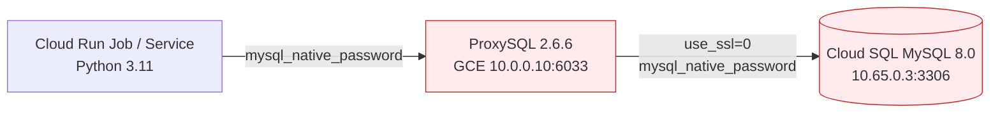

# MySQL 認証プラグイン移行基本設計書 (Issue #572)

## 1. システム構成と認証アーキテクチャ

### 移行前 (Before)


### 移行後 (After)
```mermaid
flowchart LR
    A[Cloud Run Job / Service<br>Python 3.11 / mysqlclient 2.3.0] -->|caching_sha2_password| B[ProxySQL 2.6.6<br>GCE 10.0.0.10:6033]
    B -->|use_ssl=1 (TLS暗号化)<br>caching_sha2_password| C[(Cloud SQL MySQL 8.0<br>10.65.0.3:3306)]
    
    style B fill:#e8f5e9,stroke:#2e7d32
    style C fill:#e8f5e9,stroke:#2e7d32
```

## 2. コンポーネント別変更方針

| コンポーネント | 変更内容 | 理由・効果 |
|---|---|---|
| **Cloud SQL (MySQL 8.0)** | `default_authentication_plugin = "mysql_native_password"` フラグを削除 | MySQL 8.0 標準の `caching_sha2_password` に復元し、将来の 8.4/9.0 互換性を確保。 |
| **ProxySQL (2.6.6)** | `mysql_servers` の `use_ssl=0` ➔ `use_ssl=1` に変更 | Cloud SQL への TLS 暗号化接続を有効化。RSA 公開鍵交換を不要化し、`caching_sha2_password` の完全認証を高速疎通。 |
| **Cloud SQL Users** | `sumifu` / `monitor` の認証プラグインを `caching_sha2_password` へ変更 | 非推奨警告の発生源を根絶。 |
| **Python アプリケーション** | コード改修不要 | `requirements.txt` に `cryptography==50.0.1`, `mysqlclient==2.3.0` が導入済みのため完全対応。 |

## 3. セキュリティ・暗号化設計
- Cloud SQL 側は `ssl_mode = "ALLOW_UNENCRYPTED_AND_ENCRYPTED"` 設定済み。
- ProxySQL 側は `use_ssl=1` を指定することで、CA 証明書の事前手配なしに TLS 暗号化ハンドシェイクを完了する（VPC 内部トラフィックの機密性向上）。

## 4. 運用・ロールバック方針
- 認証プラグインは MySQL ユーザーごとに独立して適用されるため、万が一障害が発生した場合は `ALTER USER ... IDENTIFIED WITH mysql_native_password` により即座にロールバック可能。
