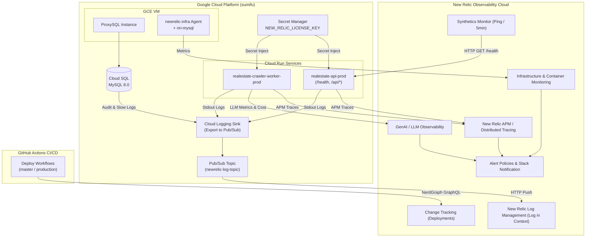

# New Relic 統合監視 基本設計書

## 1. システムアーキテクチャ概要
本設計は、Cloud Run、GCE (ProxySQL)、Cloud SQL、ローカル/Docker、および GitHub Actions CI/CD に対し、New Relic によるフルスタック可観測性（APM、インフラ、コンテナ、ログ、外形監視、GenAI、デプロイ追跡、NRQLアラート）を提供する包括的構成を定義する。



## 2. コンポーネント設計

### 2.1 Python APM エージェント（newrelic）
- **初期化タイミング**: アプリケーションエントリーポイント（`src/crawler/main.py`）の最上部、Django/Flask 等のフレームワークや DB ライブラリがロードされる直前に `init_new_relic()` を呼び出す。
- **設定値の優先順位**:
  1. 環境変数 `NEW_RELIC_LICENSE_KEY`
  2. 環境変数 `NEW_RELIC_APP_NAME` (既定値: `realestate-crawler`)
  3. 環境変数 `NEW_RELIC_DISTRIBUTED_TRACING_ENABLED` (既定値: `true`)
- **フォールバック**: `NEW_RELIC_LICENSE_KEY` が空、または `newrelic` モジュールのロードに失敗した場合は警告ログを出力し、通常起動を継続する。

### 2.2 ヘルスチェック設計
- エンドポイント: `GET /` および `GET /health`
- レスポンス:
  ```json
  {
    "status": "ok",
    "timestamp": "2026-09-26T02:40:00.000000+00:00"
  }
  ```
- 認証: API キー等のヘッダー認証を免除し、常時 HTTP 200 で返答。

### 2.3 GCP Secret Manager ＆ Terraform 設計
- **シークレット定義**:
  - `google_secret_manager_secret.new_relic_license_key`: `realestate-new-relic-license-key-${var.environment}`
  - `google_secret_manager_secret_version.new_relic_license_key_version`: 初期プレースホルダーを登録し、`lifecycle { ignore_changes = [secret_data] }` により安全に本番キーを保持。
- **Cloud Run サービス & ジョブ注入**:
  - `cloud_run_api_service.tf`、`cloud_run_crawler_service.tf`、および `cloud_run_job.tf`（`realestate-crawler-pipeline-${var.environment}`）に `NEW_RELIC_LICENSE_KEY` を Secret Key Ref として追加。
- **IAM（必須）**:
  - `terraform/iam.tf` の `google_secret_manager_secret_iam_member.secret_accessor` の `for_each` に `new_relic_license_key` を含め、`crawler-runner-${var.environment}` へ `roles/secretmanager.secretAccessor` を付与する。
  - Secret 参照のみで IAM を付与しない場合、Cloud Run は `SecretsAccessCheckFailed` となり最新リビジョンが Ready にならない。

### 2.4 New Relic Synthetics (外形監視)
- **監視方式**: SIMPLE (HTTP Ping)
- **対象 URI**: `https://realestate-api-prod-62ys4zbasq-an.a.run.app/health`
- **実行ロケーション**: `AP_NORTHEAST_1` (Tokyo), `AP_EAST_1` (Hong Kong)
- **監視間隔**: 5分（`EVERY_5_MINUTES`）
- **プロビジョニング**: NerdGraph GraphQL API を利用した自動スクリプト `setup_new_relic_synthetics.py`。

### 2.5 コンテナ & インフラ深層監視 (Infrastructure & nri-docker)
- **Docker コンテナ監視**:
  - `docker-compose.newrelic.yml` にて `newrelic/infrastructure:latest` を定義。
  - ホスト `/var/run/docker.sock` をマウントし、コンテナごとの CPU/Memory 使用量、スロットル時間、OOM 予兆を検知。
- **ProxySQL & MySQL 監視**:
  - `nri-mysql` 定義（ProxySQL 管理ポート 6032 および MySQL 3306）により接続数、スロークエリ、バッファプール使用率を収集。

### 2.6 GCP Cloud Logging ➔ New Relic ログ統合 (Log in Context)
- `terraform/new_relic_gcp_integration.tf` において以下を宣言:
  - `google_pubsub_topic.new_relic_log_topic`: ログ集約用 Pub/Sub トピック。
  - `google_logging_project_sink.new_relic_log_sink`: Cloud Run サービス（`cloud_run_revision`）、Cloud Run Job（`cloud_run_job`）、Cloud SQL、GCE ProxySQL のログ抽出フィルタリング＆Pub/Sub ルーティング。
  - `google_pubsub_subscription.new_relic_log_push`: New Relic HTTP インテークエンドポイント（`https://gcp-api.newrelic.com/log/v1`）宛ての Push サブスクリプション。
- **Deploy SA IAM**: `terraform/iam.tf` の `google_project_iam_member.github_actions_logging_config_writer`（`roles/logging.configWriter`）と、`new_relic_gcp_integration.tf` の topic 限定 `google_pubsub_topic_iam_member.github_actions_newrelic_topic_iam`（当該 New Relic トピックのみカスタムロール `projects/${var.project_id}/roles/pubsubTopicIamManager`＝`get`/`getIamPolicy`/`setIamPolicy`）により、log sink 作成と sink writer の topic IAM 操作を可能にする。`roles/pubsub.admin` は付与しない（Trivy GCP-0007 / Checkov CKV_GCP_42）。カスタムロール定義は bootstrap（`gcloud iam roles create`）で作成し Terraform は membership のみ管理する。`var.github_actions_sa_email` は `secrets.GCP_SERVICE_ACCOUNT` と同一の Deploy SA を指すこと。
- トレース ID 相関: Python APM がログ出力時に `trace.id` を付与し、New Relic 画面上で 1 クリックでトレースとログを横断検索可能。

### 2.7 GenAI / LLM 監視 (New Relic AI Monitoring)
- `src/crawler/package/utils/newrelic_helper.py` の `record_llm_event()` により、Gemini 等のモデル名、トークン消費量、レイテンシ、推定 USD コストを New Relic カスタムイベント（`LlmEvent`）として記録。

### 2.8 デプロイ変更追跡 (Change Tracking) & クローラー NRQL アラート
- **Change Tracking**: `src/crawler/scripts/notify_new_relic_deployment.py` により GitHub Actions から NerdGraph `changeTrackingCreateDeployment` を呼び出し。
- **NRQL アラート**: `src/crawler/scripts/setup_new_relic_crawler_alerts.py` により「パース遅延」「0件取得失敗」「403/429急増」「メモリ高負荷」条件を一括自動プロビジョニング。

### 2.9 パイプライン実行・バッチクローラー APM & メトリクス計装
- **エントリーポイント計装**: `src/crawler/scripts/ops/run_pipeline.py` および `src/crawler/scripts/ops/run_all_crawlers.py` の冒頭で `init_new_relic()` を呼び出し、Cloud Run Job 実行全体の APM トレーシングを有効化。
- **クローラー完了時イベント記録**: `run_all_crawlers.py` で各サイトのクロール処理終了時（正常終了・エラー・タイムアウト）に `record_crawler_metrics()` を呼び出し、サイト別・種別別の取得件数・所要時間・0件ステータスを `CrawlerExecution` カスタムイベントへ即座に送信。


