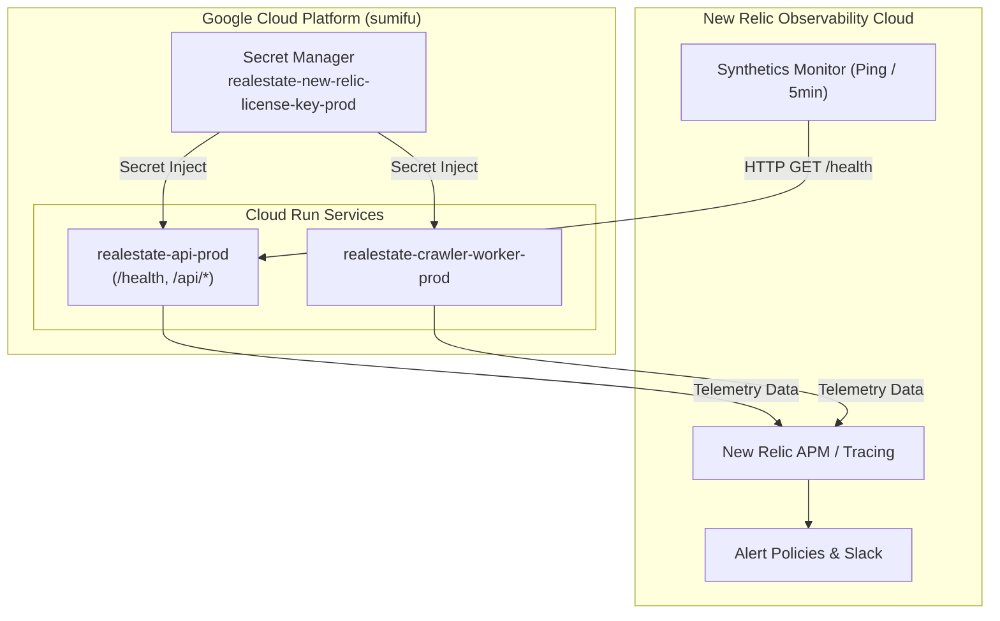

# New Relic 統合監視 基本設計書

## 1. システムアーキテクチャ概要
本設計は、Cloud Run 上で動作する Flask アプリケーション（API・クローラー）に対し、New Relic によるフルスタック可観測性（APM、ログ、外形監視）を提供する構成を定義する。



## 2. コンポーネント設計

### 2.1 Python APM エージェント（newrelic）
- **初期化タイミング**: アプリケーションエントリーポイント（`src/crawler/main.py`）の最上部、Django/Flask 等のフレームワークや DB ライブラリがロードされる直前に `init_new_relic()` を呼び出す。
- **設定値の優先順位**:
  1. 環境変数 `NEW_RELIC_LICENSE_KEY`
  2. 環境変数 `NEW_RELIC_APP_NAME` (既定値: `realestate-crawler`)
  3. 環境変数 `NEW_RELIC_DISTRIBUTED_TRACING_ENABLED` (既定値: `true`)
- **フォールバック**: `NEW_RELIC_LICENSE_KEY` が空、または `newrelic` モジュールのロードに失敗した場合は警告ログを出力し、通常起動を継続する。

### 2.2 ヘルスチェック設計
- エンドポイント: `GET /` および `GET /health`
- レスポンス:
  ```json
  {
    "status": "ok",
    "timestamp": "2026-09-26T02:40:00.000000+00:00"
  }
  ```
- 認証: API キー等のヘッダー認証を免除し、常時 HTTP 200 で返答。

### 2.3 GCP Secret Manager ＆ Terraform 設計
- **シークレット定義**:
  - `google_secret_manager_secret.new_relic_license_key`: `realestate-new-relic-license-key-${var.environment}`
  - `google_secret_manager_secret_version.new_relic_license_key_version`: 初期プレースホルダーを登録し、`lifecycle { ignore_changes = [secret_data] }` により安全に本番キーを保持。
- **Cloud Run サービス注入**:
  - `cloud_run_api_service.tf` および `cloud_run_crawler_service.tf` に `NEW_RELIC_LICENSE_KEY` を Secret Key Ref として追加。

### 2.4 New Relic Synthetics (外形監視)
- **監視方式**: SIMPLE (HTTP Ping)
- **対象 URI**: `https://realestate-api-prod-62ys4zbasq-an.a.run.app/health`
- **実行ロケーション**: `AP_NORTHEAST_1` (Tokyo), `AP_EAST_1` (Hong Kong)
- **監視間隔**: 5分（`EVERY_5_MINUTES`）
- **プロビジョニング**: NerdGraph GraphQL API を利用した自動スクリプト `setup_new_relic_synthetics.py`。
