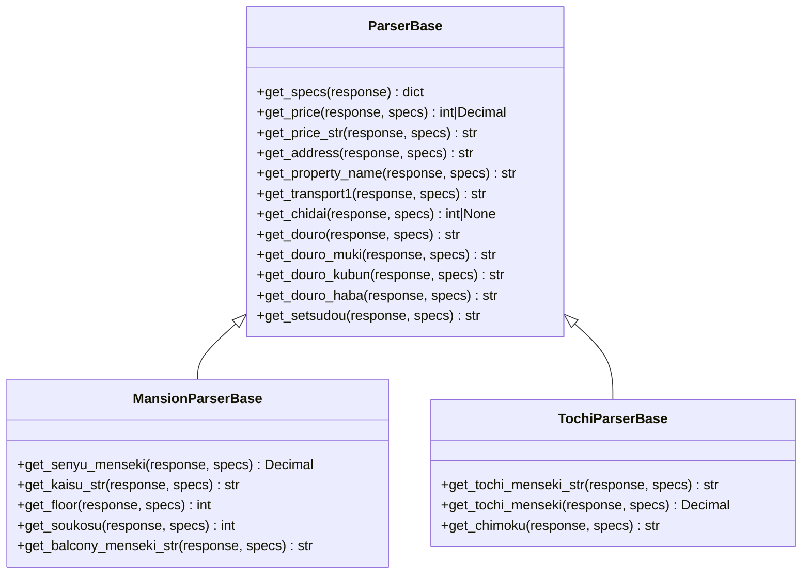

# パーサー Getter メソッド化 基本設計書

## 1. 全体アーキテクチャ方針
パーサークラス群の密結合を解消し、表示バリエーションへの耐性を高めるため、**Getter パイプラインパターン** を採用する。

### 1.1 概念構造


## 2. Getter インターフェース仕様
すべての Getter は HTML 全体のみを受け取る以下の標準シグネチャを持つ：
```python
def get_<field_name>(self, response: BeautifulSoup) -> <Return_Type>:
```
- 引数 `response`: 詳細ページ全体の `BeautifulSoup`（内部で `self._get_specs(response)` のキャッシュ辞書を参照し、呼び出し側での specs 引き回しは行わない）。

### 2.1 探索順序（多段フォールバック規約）
1. **セレクター探索**: `self.selectors` に登録されたセレクター、または新旧デザインの特有 CSS セレクターで DOM 要素を取得。
2. **テーブル探索**: `specs` 辞書から、該当フィールドに対応する候補キー配列（例: `["接道状況", "接道", "道路"]`）を順次チェック。
3. **汎用 DOM / 正規表現探索**: 見出し（h1, h2）、本文、アピールブロック、meta タグなどから正規表現マッチ。
4. **コンバーター変換**: 文字列を `package.utils.converter`（`parse_price`, `parse_menseki`, `parse_chikunengetsu` 等）で型確定。

## 3. `_parsePropertyDetailPage` の純化仕様
各パーサーの `_parsePropertyDetailPage` は抽出ロジックを持たず、以下のように純粋なマッピングのみを実行する：
```python
def _parsePropertyDetailPage(self, item, response: BeautifulSoup):
    item = super()._parsePropertyDetailPage(item, response)
    specs = self._get_specs(response)
    
    item.price = self.get_price(response, specs)
    item.priceStr = self.get_price_str(response, specs)
    item.address = self.get_address(response, specs)
    item.propertyName = self.get_property_name(response, specs)
    ...
    return item
```

## 4. 後方互換性仕様
既存コードおよび既存テスト [`test_parser_abstract_methods.py`](file:///C:/Users/weare/.gemini/antigravity/worktrees/realestate_crawler/refactor_parser_getters/src/crawler/tests/unit/test_parser_abstract_methods.py) との互換性を担保するため、旧来の `_parseXxx` メソッドは新設する `get_<field_name>` に委譲するラッパーとする：
```python
def _parsePrice(self, response: BeautifulSoup, specs=None):
    return self.get_price(response, specs)
```
