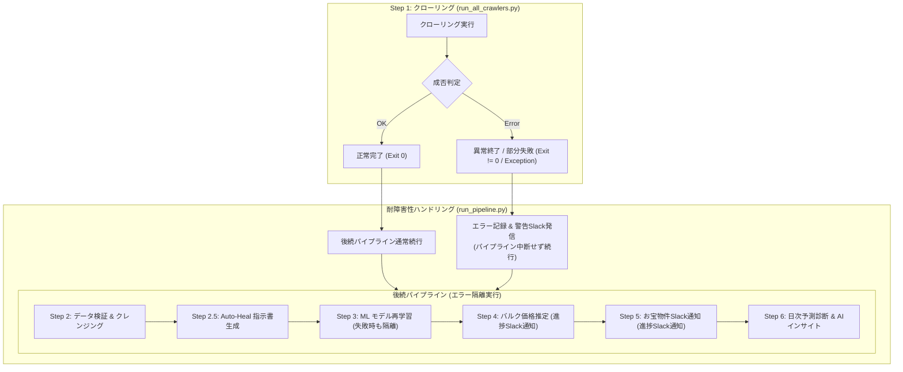

# パイプライン耐障害性向上＆ML価格推定・お宝物件通知進捗Slack通知 基本設計書

## 1. システム構成・処理フロー

## 2. モジュール間設計

### 2.1 `run_pipeline.py`（パイプライン制御）
* **`_run_crawler_step` のエラー制御**:
  - `run_command` 呼び出しを try-except で保護。
  - クローラー実行が失敗した場合でも、`logger.error` にスタックトレースを記録し、失敗フラグを保持した上で `True`（後続処理続行）を返す。
  - Worker の場合は従来通り他タスクに委譲して終了（`return False`）。Coordinator の場合は他タスク集約レポートを送信後、後続ステップへ進む。
* **`_run_post_crawl_pipeline` のエラー隔離**:
  - 各ステップ（Step 2, 2.5, 3, 4, 5, 6）を個別の try-except または `continue_on_error` オプション付きで実行。
  - 特に Step 3（MLモデル再学習）がデータ不足やライブラリ例外で失敗した場合でも、既存の学習済みモデルを用いた Step 4（バルク価格推定）および Step 5（お宝物件通知）は必ず実行する。

### 2.2 `run_bulk_ml_evaluation.py`（バルク価格推定）
* **Slack通知チャンネル**: `SLACK_ALERT_PROPERTY_ALERT`（デフォルト: `property_alert`）
* **通知契機とメッセージ内容**:
  1. **開始時**:
     - `🚀 【バルク価格推定開始】 未評価物件の一括価格予測および投資シミュレーション評価を開始します (並行スレッド: {concurrency}, 全 {len(models)} モデル)...`
  2. **モデル単位の進捗**:
     - 各モデル完了時、評価件数 > 0 の場合に通知（0件の場合はログのみでSlackノイズ抑制）:
       `📊 【価格推定進捗】 {model_name}: 評価 {cnt} 件 (スキップ: {skp} 件) | 累計 {evaluated_count} 件完了`
  3. **完了時**:
     - `✅ 【バルク価格推定完了】 評価完了: {evaluated_count} 件, スキップ: {skipped_count} 件, 所要時間: {duration_str}`
     - 失敗モデルがある場合:
       `⚠️ 一部モデルで評価失敗: {failed_models}`

### 2.3 `send_recommendations.py`（お宝物件Slack通知）
* **Slack通知チャンネル**:
  - 進捗・サマリー通知: `SLACK_ALERT_PROPERTY_ALERT`（デフォルト: `property_alert`）
  - 個別物件カード通知: `goodproperty-*` チャンネル（従来仕様を維持）
* **通知契機とメッセージ内容**:
  1. **開始時**:
     - `🔍 【お宝物件スクリーニング開始】 未通知の割安物件・高利回り優良物件の抽出を開始します...`
  2. **スクリーニング結果・配信進捗**:
     - 候補検出時:
       `🎯 【お宝物件検出】 {len(matched_candidates)} 件の候補物件を検出しました。優先度上位 {len(top_candidates)} 件を各Slackチャンネルへ配信します。`
     - 候補0件時:
       `ℹ️ 【お宝物件通知】 現在配信基準を満たす新規お宝物件はありませんでした (0件)。`
  3. **配信完了時**:
     - `✅ 【お宝物件配信完了】 計 {sent_count}/{len(top_candidates)} 件のお宝物件カードを配信完了しました。`
