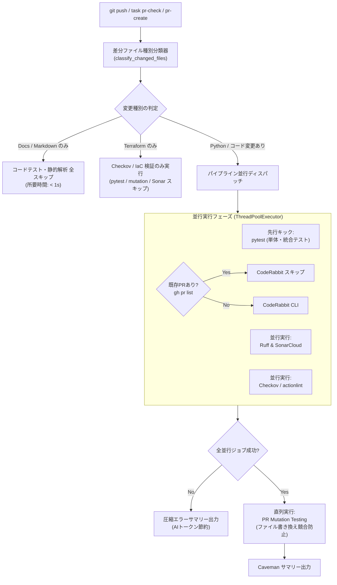

# 変更ファイル動的選別・pre_pr_check 並列最適化 基本設計書 (Issue #579)

## 1. システム構成図

## 2. モジュール設計
1. **`src/crawler/scripts/ops/pre_pr_check.py`**:
   - `classify_changed_files(files)`: `has_python`, `has_terraform`, `has_workflow`, `is_docs_only` を判定。
   - `check_has_open_pr(branch)`: 既存 PR の有無をキャッシュ付きで高速検出。
   - `run_parallel_pipeline()`: 先行 pytest と静的解析・セキュリティの並列実行、完了後の直列 mutation 実行。
   - `format_terse_summary()`: 出力ログを Caveman 形式で要約し、不要なスタックトレースを切り捨てる。
2. **`.githooks/pre-push`**:
   - レートリミット（429）発生時の Soft Fail（Warning 昇格）処理を実装。
   - 既存 PR がある場合の高速検証モード適用。
3. **`.coderabbit.yaml`**:
   - `terraform/**`, `.github/workflows/**` を `path_filters` に追加して除外。
