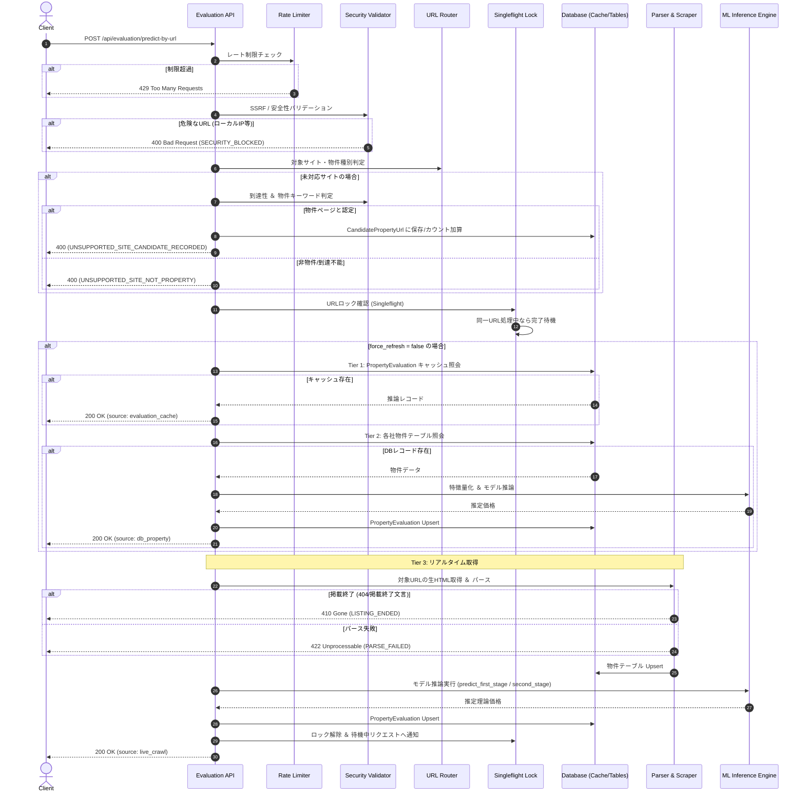

# 物件詳細URL価格推定API 基本設計書（外部設計）

## 1. APIエンドポイント概要

- **HTTP Method**: `POST`
- **Path**: `/api/evaluation/predict-by-url`
- **Authentication**: Header `X-API-KEY` (環境変数 `ESTIMATION_API_KEY` と照合)
  - ※内部システム（本システム自身、バッチ、正規キー保持者、ローカル通信）からの接続は、**流量制限（レートリミット）およびロックアウトの完全免除対象**。
- **Content-Type**: `application/json`

---

## 2. リクエスト仕様

### 2.1 リクエストボディ (JSON)
```json
{
  "url": "https://www.rehouse.co.jp/buy/mansion/bkdetail/FKPBAA05/",
  "force_refresh": false,
  "interior_score": 3.0,
  "layout_score": 3.0
}
```

### 2.2 パラメータ一覧
| 項目名 | 型 | 必須 | デフォルト値 | 説明 |
|---|---|---|---|---|
| `url` | string | ○ | - | 不動産物件詳細ページのURL |
| `force_refresh` | boolean | - | `false` | `true` の場合、キャッシュをバイパスして強制的に再スクレイピング・再推論を実行 |
| `interior_score` | number | - | `3.0` | 内装クオリティスコア (1.0〜5.0)。二次精密予測で使用 |
| `layout_score` | number | - | `3.0` | 間取りスコア (1.0〜5.0)。二次精密予測で使用 |

---

## 3. レスポンス仕様

### 3.1 成功レスポンス (200 OK)
```json
{
  "success": true,
  "url": "https://www.rehouse.co.jp/buy/mansion/bkdetail/FKPBAA05/",
  "data_source": "evaluation_cache",
  "site": "mitsui",
  "property_type": "mansion",
  "property_info": {
    "propertyName": "パークホームズ〇〇",
    "price": 45000000,
    "address": "東京都世田谷区桜丘1-1-1",
    "station": "経堂",
    "walkMinute": 8,
    "senyuMenseki": 72.5,
    "chikunengetsu": "2010-05-01",
    "kouzou": "RC"
  },
  "prediction": {
    "first_stage_predicted_price": 4850,
    "second_stage_predicted_price": 4920,
    "price_gap": 350,
    "divergence_ratio": 1.078,
    "is_bargain": false
  },
  "investment": null,
  "message": "Estimation completed successfully"
}
```

#### `data_source` の値
- `evaluation_cache`: Tier 1 (推論結果キャッシュ) より返却
- `db_property`: Tier 2 (DB既存物件データからのオンデマンド推論) より返却
- `live_crawl`: Tier 3 (リアルタイムクローリング＆推論) より返却

---

### 3.2 エラーレスポンス

#### 共通エラーフォーマット
```json
{
  "success": false,
  "url": "https://example.com/property/12345",
  "data_source": null,
  "error_code": "UNSUPPORTED_SITE_CANDIDATE_RECORDED",
  "message": "指定されたサイトは現在未対応ですが、今後のクローリング候補として登録されました。",
  "details": {
    "domain": "example.com",
    "candidate_recorded": true
  }
}
```

#### エラーコード一覧
| HTTP Status | `error_code` | 説明 |
|---|---|---|
| **400 Bad Request** | `INVALID_URL` | URLの形式不正、スキーム不正 (http/https以外) |
| **400 Bad Request** | `SECURITY_BLOCKED` | SSRF検知（ローカルIP/プライベートIP/メタデータアクセス） |
| **400 Bad Request** | `UNSUPPORTED_SITE_CANDIDATE_RECORDED` | 未対応サイトだが物件と認定され、候補DBに登録された |
| **400 Bad Request** | `UNSUPPORTED_SITE_NOT_PROPERTY` | 未対応サイトかつ物件情報が確認できない |
| **403 Forbidden** | `IP_LOCKED_OUT` | 悪質接続（SSRF試行、429乱打、401多発等）による一時的アクセス遮断 |
| **404 / 410 Gone** | `LISTING_ENDED` | 物件の掲載が終了・削除されている |
| **422 Unprocessable** | `PARSE_FAILED` | ページのHTML構造から必須項目（価格/面積/住所）が抽出できない |
| **429 Too Many Requests** | `RATE_LIMIT_EXCEEDED` | 単位時間あたりのリクエスト数制限を超過 |
| **504 Gateway Timeout** | `TARGET_SITE_TIMEOUT` | 対象サーバーが無応答・タイムアウト |
| **500 Internal Error** | `ESTIMATION_FAILED` | 機械学習推論エラー |

---

## 4. 全体処理シーケンス



---

## 5. URL正規化・クエリパラメータ無視突合仕様
1. **リクエストURLの正規化**:
   - `yarl` ライブラリ（`yarl.URL`）を利用し、リクエストされたURLからクエリパラメータ（`?utm_source=...` 等）およびフラグメント（`#...`）を除去した正規化ベースURLを生成する。
2. **Singleflightキー**:
   - 排他キーは `predict_url:{normalized_url}` とし、パラメータ違いの多重リクエストを確実に同一実行に統合・合流させる。
3. **DB突合クエリ (Tier 1 & Tier 2)**:
   - DB内のレコードにクエリパラメータが付与されている場合（例: `?DOWN=1`）と付与されていない場合の両方に適合するクエリ条件（`field = normalized OR field LIKE normalized?%`）を発行。
   - 取得結果に対して `yarl` による等価判定を実施し、クエリパラメータの有無・相違に関わらず同一物件として確実に突合する。

---

## 6. パーサー未対応サイトのエラーログ監視仕様
パーサーが未準備の物件URLが指定された場合、ログ監視システムや自律修復エージェントが新規パーサー開発対象として自動検出できるように `ERROR` レベルでログを出力する。

| イベント | ログレベル | ログ識別プレフィックス | 出力内容 |
|---|---|---|---|
| 未対応サイト（物件認定済） | `ERROR` | `[PARSER_UNAVAILABLE]` | ドメイン、正規化URL、ページタイトル、抽出キーワード、リクエスト回数 |
| ルート定義済だがパーサー読込不能 | `ERROR` | `[PARSER_NOT_FOUND]` | 指定URL、パーサークラス名、例外スタックトレース |

---

## 7. 動的物件種別判別およびルーティング連携仕様
1. **判別モジュール (`PropertyTypeDetector`)**:
   - URL、ページタイトル、HTML構造、スペック辞書のいずれか、あるいは複数から物件種別を総合判定する独立ユーティリティ。
   - 各種別判定ルール:
     - `apartment`: 「一棟売りアパート」「一棟売りマンション」「一棟ビル」「収益」「投資用」等のキーワード（※「一棟マンション」は `mansion` より優先して `apartment` と判定）。
     - `mansion`: 「区分マンション」「中古マンション」「新築マンション」等。
     - `kodate`: 「一戸建て」「新築戸建」「中古戸建」「テラスハウス」等。
     - `tochi`: 「売地」「土地」「建築条件付土地」等。
2. **ルーティング (`UrlRouter`) との連携**:
   - URLパスのみで種別特定が完結しないサイト（例: `toushi.homes.co.jp/bukkendetail/index/<id>`）において、デフォルト種別（`apartment`）を割り当てるとともに、`PropertyTypeDetector` と連携して動的にパーサー・モデルを解決可能とする。
3. **多層防御判定アーキテクチャ (Multi-Tier Defense Architecture)**:
   - **第1層: 決定論的ガードレール (Yield Guard & Physical Guard)**
     - 「利回り（表面/想定/実質/現況）」「オーナーチェンジ」「満室想定」「年間予定賃料」や `grossYield > 0` を検知した場合は無条件で `apartment`（投資用）確定。
     - 「土地面積 0 + RC構造」の場合は `kodate` を禁止し `mansion` へ強制是正。
   - **第2層: 高速ルールエンジン (<0.1ms)**
     - スペック辞書 ➔ ページタイトル ➔ 本文テキスト ➔ URLパス の優先度で判定。
   - **第3層: AI判定フォールバック (Gemini 1.5 Flash)**
     - ルールエンジンで判定不能なエッジケースにのみ起動。
   - **第4層: 事後サニタイザー (Post-AI Sanitizer)**
     - AI出力結果に対しても第1層ガードレールを再適用し、ハルシネーションによる誤分類を100%遮断。
4. **全プロジェクト共通化 (SSOT)**:
   - ML推論パイプライン (`predict.py`)、APIレイヤー (`api.py`)、および各社投資パーサー (`smtrc`, `mizuho`, `odakyu`, `sumai1`, `sumirin`) の物件種別判定を `PropertyTypeDetector` に一元化。
