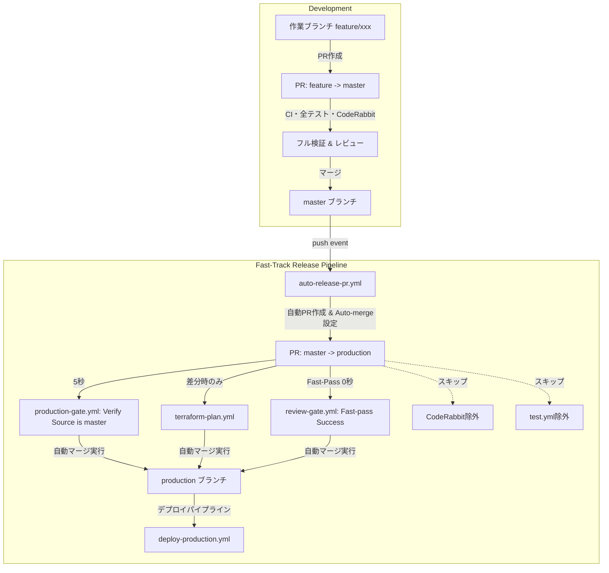

# 基本設計書: Prodマージ高速化・CIトリガー最適化・Dependabot集約の一貫改善 (Issue #376)

## 1. システム構成と変更概要

本設計では、`master` ➔ `production` へのデプロイパイプラインを「手動・重複走査」から「軽量・全自動（Continuous Delivery）」へと昇華させる。

### アーキテクチャ概要

## 2. コンポーネント別基本設計

### 2.1 CodeRabbit 設定 (`.coderabbit.yaml`)
- `reviews.auto_review.base_branches`:
  - 変更前: `["master", "production"]`
  - 変更後: `["master"]`
- 効果: リリースPRに対する重複レビュー・指摘・承認待ちを完全停止。

### 2.2 テストパイプライン (`.github/workflows/test.yml`)
- `pull_request.branches`:
  - 変更前: `[main, master, production]`
  - 変更後: `[main, master]`
- 効果: `master` でテスト済みの同一コミットに対するユニット・ミューテーションテストの重複実行を抑止。

### 2.3 レビューゲートウェイ (`.github/workflows/review-gate.yml`)
- ターゲットブランチが `production` の場合の挙動:
  - PRの `base.ref === 'production'` の場合、未解決会話走査やチェックボックス走査を行わず、直ちに `state: 'success'` をコミットステータスに登録して終了（Fast-Pass）。
- トリガーの適正化:
  - 不要な高頻度トリガー（issue_comment の冗長な発火）を抑止。

### 2.4 自動リリースPRパイプライン (`.github/workflows/auto-release-pr.yml`)
- トリガー: `push` (branches: `[master]`)
- 処理フロー:
  1. `gh pr list --base production --head master --state open` で既存PRの有無を確認。
  2. なければ直近のコミットメッセージ・Issue番号からタイトル・本文を生成して `gh pr create` を実行。
  3. `gh pr merge <PR_NUMBER> --auto --merge` を設定。
  4. 既存PRがあれば自動で最新コミットが反映される。

### 2.5 Dependabot 設定 (`.github/dependabot.yml`)
- 各エコシステムに `groups` 設定を追加:
  - `pip`: `production-dependencies` (patterns: `["*"]`)
  - `github-actions`: `github-actions-dependencies` (patterns: `["*"]`)
  - `terraform`: `terraform-dependencies` (patterns: `["*"]`)
  - `docker`: `docker-dependencies` (patterns: `["*"]`)
- スケジュール:
  - `pip` の interval を `daily` から `weekly` に変更（毎週月曜日など週1回のまとめ更新）。
