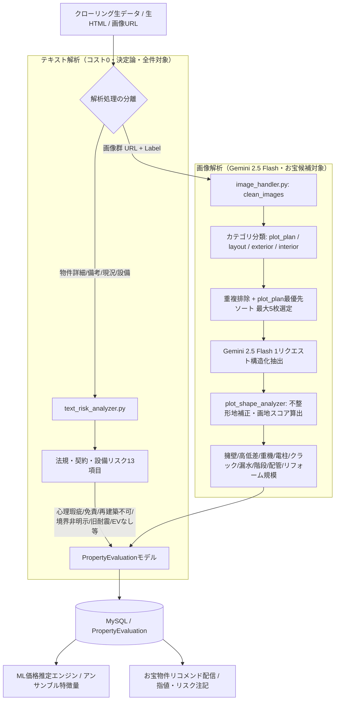

# プロ買い付け目線リスク・土地形状評価エンジン 基本設計書

## 1. システムアーキテクチャ概要 (Issue #409)

本設計は、プロの不動産買い付け業者（買取再販、建売デベロッパー、一棟収益投資家）の実務査定基準をシステムに導入し、物件の「隠れたコスト」「減価要因」「指値材料」を高精度に自動検出・数値化するための基本設計です。

---

## 2. 処理フローと責務分担 (Scraping-First & 1物件1AIリクエスト原則)

### 2.1 2大解析パイプラインの分離
1. **テキストリスク解析 (Deterministic Text Risk Pipeline)**:
   - 全物件に対してバルク実行時に即座に適用（APIコスト0、ミリ秒処理）。
   - 正規表現パターンマッチングにより、契約免責、心理瑕疵、再建築不可、旧耐震、境界非明示、インフラ（ガス/下水/在来浴室）、3階以上階段などの客観的リスクを判定。
2. **画像マルチモーダル解析 (Selective Multimodal Vision Pipeline)**:
   - 画像解析上限（1日200件）および一次スクリーニング（割安判定等）を通過した物件を対象に実行。
   - テキストからは抽出不可能な「区画図（敷地形状）」「外観（擁壁・高低差・解体難易度・基礎クラック）」「内装（階段勾配・洗濯機位置・露出配管・リフォーム規模）」を1物件につき1回のGemini API呼び出しで一括取得。

---

## 3. 画像選別・優先度制御アーキテクチャ

### 3.1 カテゴリ分類仕様
画像クレンジング時（`clean_images`）、ラベルおよびURLからホワイトリストキーワードで分類：

| カテゴリ | 判定キーワード | 優先度 | 目的 |
|---|---|---|---|
| `plot_plan` | 区画, 敷地配置, 土地図, 公図, 測量図, 実測図, 区画図 | 最優先 (0) | かげ地割合、間口奥行比、通路幅、セットバックの幾何判定 |
| `layout` | 間取, 平面 | 高 (1) | 部屋配置、水回り、室内動線 |
| `exterior` | 外観, 建物, エントランス, 共有, ロビー, アプローチ, 庭 | 中 (2) | 擁壁、道路高低差、重機進入路、基礎クラック、外壁状態 |
| `interior` | （その他有効画像） | 低 (3) | 階段勾配、洗濯機置場、露出配管、リフォーム劣化度 |

### 3.2 送信画像選別ルール
- 同一URLの重複を完全排除。
- 上記優先度（`plot_plan` ➔ `layout` ➔ `exterior` ➔ `interior`）順でソートし、先頭最大5枚をGeminiに送信。
- これにより、区画図が存在する物件では確実に区画図がAIの視覚情報に含まれることを保証。

---

## 4. 土地形状幾何解析（幾何エンジン連携）

Gemini Visionにより抽出された `shadow_area_ratio`（かげ地割合: 想定整形地面積に対する非利用部分の面積比率）から、国税庁の財産評価基本通達に基づき補正率を算定：

1. **かげ地割合**:
   $$\text{かげ地割合} = \frac{\text{想定整形地面積} - \text{対象画地面積}}{\text{想定整形地面積}}$$
2. **国税庁不整形地補正率 (`calculate_nta_irregular_discount`)**:
   - 普通住宅地区の基準テーブルに従い、かげ地割合に応じて 0.60 〜 1.00 の補正係数を算出。
3. **総合画地スコア (`shape_score_100`)**:
   $$\text{Score} = \max(0.0, \min(100.0, 100.0 - (\text{shadow\_ratio} \times 100.0)))$$
   - 完全な正方形・長方形（かげ地0%）で 100点満点、極端な不整形・旗竿地で減点。

---

## 5. プロ目線リスク・コスト評価項目一覧

| カテゴリ | 項目名 | 型・値域 | 買い付け業者の判断基準・実務的影響 |
|---|---|---|---|
| **土地・擁壁** | `retaining_wall_risk` | `none`, `rc_legal`, `stone_masonry`, `two_tier_illegal` | 間知石や二段擁壁は再建築時に擁壁やり替え（数百〜数千万円）が必要なため致命的減価 |
| **土地・造成** | `ground_elevation_diff_m` | Float (m) | 道路から1m以上の高低差は残土処分・擁壁造成費が嵩む |
| **解体・重機** | `demolition_difficulty` | `low`, `medium`, `high` | 前面道路狭小や旗竿通路2m未満は重機が入らず手壊し解体（解体費2〜3倍） |
| **敷地インフラ** | `utility_pole_risk` | `none`, `pole`, `guy_wire` | 敷地内電柱・支線は駐車場配置や建築プランを阻害（移設交渉リスク） |
| **建物構造** | `foundation_crack_risk` | Boolean / None | 幅0.5mm以上の構造クラックは不同沈下・耐震性欠如の疑い |
| **雨漏り・漏水** | `water_leak_risk` | Boolean / None | 軒天・天井・壁の染みは雨漏り・給排水管破損の直接サイン |
| **間取り・階段** | `stair_steepness` | `gentle`, `standard`, `steep`, `unknown` | 昭和の急勾配階段（蹴上高大・踏面小）はファミリー層・高齢者敬遠 |
| **水回り** | `indoor_washing_machine_space` | `indoor`, `outdoor`, `unknown` | 洗濯機室外置き（バルコニー/玄関先）は若年層賃料下落要因（室内化工事必須） |
| **給排水配管** | `exposed_pipes_risk` | Boolean / None | 露出配管や古い鉛管・鉄管は全更新（スケルトンリフォーム）が必要 |
| **費用規模** | `renovation_budget_tier` | `tier_none`, `tier_light`, `tier_medium`, `tier_heavy`, `tier_full` | 再販想定における原価見積もり（軽微〜フルスケルトン）の即時判定 |
