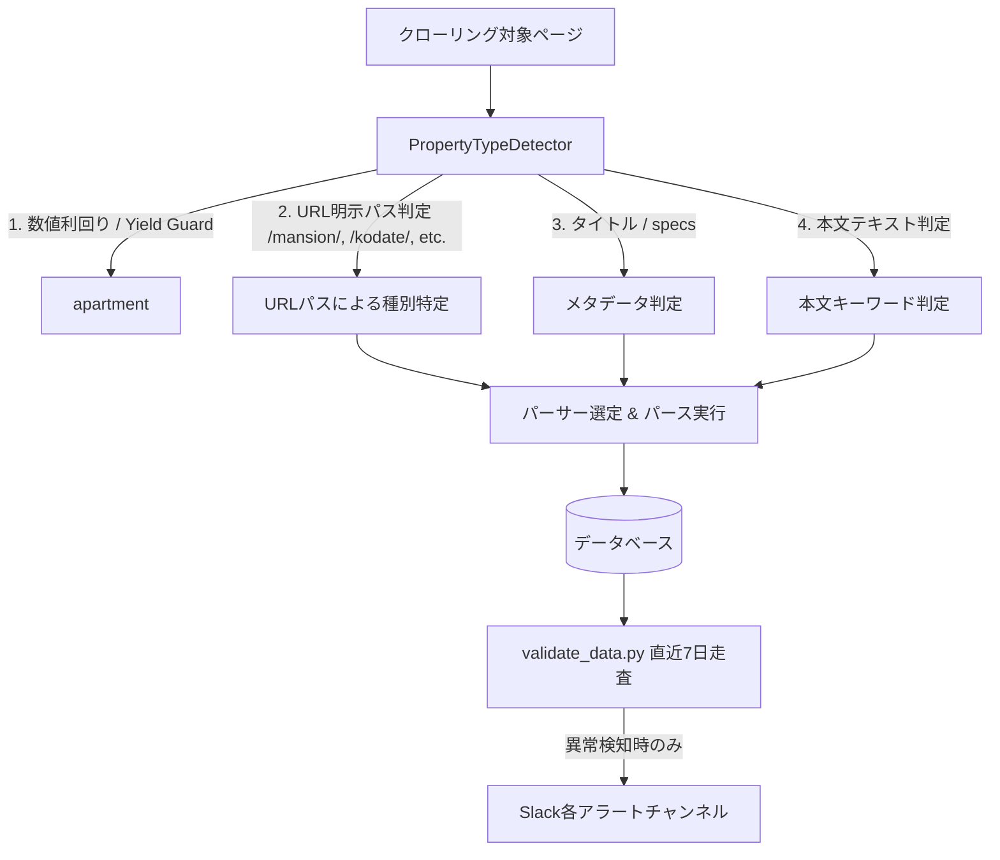

# 基本設計書: PropertyTypeDetector 誤判定防止およびデータ整合性検証最適化

## 1. 全体構造
本機能は、クローラーのパーサー切り替え判定エンジン（`PropertyTypeDetector`）および監視バッチ（`validate_data.py`）の動作仕様を最適化し、誤ルーティングの根絶と監視アラートの信頼性向上を実現する。

## 2. モジュール別基本設計
### 2.1 PropertyTypeDetector
- **URL判定の昇格**:
  - `_detect_rule_based` において、`_detect_from_url(url)` を `html_text` 走査より前（Yield Guard / specs / title の後、本文全文検索の前）に配置する。
  - URL パスが `/mansion/`, `/kodate/`, `/tochi/`, `/apartment/`, `/invest/` などの明確なドメインパスを含む場合、フッターの「土地権利」などの単語に引っ張られずに正しく種別を維持する。
- **土地キーワードの精密化**:
  - 単独の「土地」が「土地権利」「土地面積」など表項目の一部として HTML 全文に高頻度で出現するため、全文検索で誤判定を引き起こす。
  - `TOCHI_KEYWORDS` では「売土地」「売り土地」「建築条件付土地」「売地」等の売買意図が明示的なキーワードを対象とし、単独語「土地」による誤爆を抑制する。

### 2.2 validate_data.py
- **直近データ走査（`VALIDATE_DATA_DAYS`）**:
  - デフォルト `VALIDATE_DATA_DAYS = 7`。
  - `item.inputDate >= since` または `item.updateDateTime >= since_dt` の条件でクエリをフィルタリング（`filter(inputDate__gte=since)`）。
  - 全件フルスキャンを行いたい場合のために、環境変数または引数で全件モード（`--all` または `VALIDATE_DATA_DAYS=0`）も許容する。
