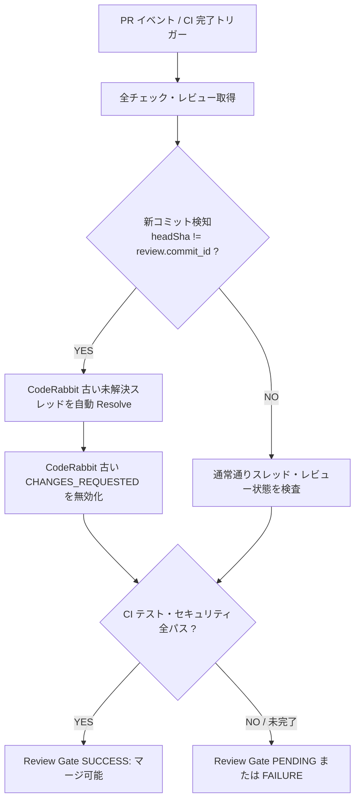

# Review Gate CodeRabbit デッドロック解消および自動 Resolve 化 基本設計書 (Issue #589)

## 1. システム構成と判定フロー
Review Conversation Gate は PR イベントおよび関連 CI 完了イベントで駆動し、以下のフローで判定を行う。



## 2. API インターフェース設計 (GraphQL)
未解決の CodeRabbit スレッドに対して、GitHub GraphQL Mutation を実行する。

```graphql
mutation ResolveThread($threadId: ID!) {
  resolveReviewThread(input: { threadId: $threadId }) {
    thread {
      id
      isResolved
    }
  }
}
```

## 3. レビュー状態マッピング
- レビュアーが CodeRabbit かつ `r.commit_id !== headSha` の場合:
  - 状態を `OBSOLETE_CHANGES_REQUESTED` とみなし、`changesRequested` リストから除外。
- レビュアーが人間の場合:
  - コミットの成否にかかわらず、人間が Approve または Resolve するまでブロックを維持。
