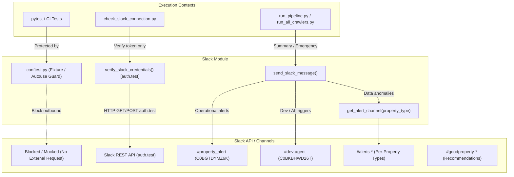

# Slack通知最適化・テスト時外部送信遮断およびチャンネル不整合是正 基本設計書 (Issue #642)

## 1. 全体構造とアーキテクチャ設計

本改修では、Slack 送信基盤における以下の3つの柱を再構築する：
1. **テスト環境の送信隔離層（Test Isolation Barrier）**: pytest テストセッション開始時に Slack トークンと HTTP クライアントを無害化。
2. **疎通チェックのサイレント化（Silent Health Check）**: メッセージ投稿なしで Slack API の認証健全性を確認する新プロトコル。
3. **チャンネルルーティングの標準化（Channel Routing SSOT）**: 各スクリプトにおける送信先の環境変数参照と種別アラートの一元解決。

## 2. モジュール別設計仕様

### 2.1 `src/crawler/tests/conftest.py`（テスト時隔離ガード）
* pytest 実行時、全テストに自動適用される `autouse=True` の fixture を追加。
* 環境変数 `SLACK_BOT_TOKEN`, `SLACK_APP_TOKEN` を `mock-test-token-blocked` 等の無効トークンに一時置換。
* さらに万が一テストが `send_slack_message` を実呼出した場合でも、`aiohttp.ClientSession.post` が Slack API の URL（`https://slack.com/api/chat.postMessage`）を叩く直前にガードし、テストプロセスから外部インターネット上の実 Slack への投稿を物理遮断する。

### 2.2 `package/utils/slack.py`（基盤ユーティリティ拡張）
* **`verify_slack_credentials() -> tuple[bool, str]` の新設**:
  - `https://slack.com/api/auth.test` を呼び出し、トークンが有効か、Bot ユーザー（`bot_id`, `user_id`）が認識されているかを検証。
  - メッセージは一切送信せず、JSON レスポンスの `ok: true` をもって正常判定とする。
* **`get_alert_channel(property_type: str) -> str` の新設**:
  - `mansion`, `kodate`, `tochi`, `invest_apartment`, `invest_kodate` に対応するチャンネル ID（または環境変数）を統一的に返す。

### 2.3 `check_slack_connection.py`（事前疎通チェックの改修）
* 従来の `send_crawling_summary_alert("🔄 【接続テスト】 ...")` の実投稿を全廃。
* `verify_slack_credentials()` を呼び出して認証チェックを行い、成功時はログ出力のみで終了。

### 2.4 `run_all_crawlers.py`（自動修復トリガーのチャンネル正規化）
* `send_slack_message(message=auto_heal_msg, channel="#dev-agent")` を `send_dev_report(auto_heal_msg)` に切り替え、環境変数 `SLACK_DEV_CHANNEL` または既知のチャンネル ID を使用。

### 2.5 `validate_data.py`（個別アラートチャンネルIDのハードコード排除）
* `package.utils.slack.get_alert_channel` を利用し、コード内の ID 直書きを解消。

### 2.6 `run_all_crawlers.py`（詳細処理 vs 未変更スキップの内訳集計および通知）
* **ジョブ完了時通知**:
  - `start_dt` 以降の `inputDateTime >= start_dt`（新規詳細処理）および `updateDateTime >= start_dt`（更新詳細処理およびスキップバッチ更新）を区別、またはジョブ実行時の詳細処理件数 (`fetched`) とスキップ件数 (`skipped`) を集計。
  - ジョブ完了メッセージに `詳細処理: {fetched} 件 / 未変更スキップ: {skipped} 件 (計: {total} 件)` を表示。
  - `total == 0` の場合のみ `ZeroCountFailure` としてアラート。
* **24時間サマリーレポート**:
  - 過去24時間の取得件数を `詳細処理 {fetched} 件 / 未変更スキップ {skipped} 件 (計: {cnt} 件)` の形式で内訳出力。
