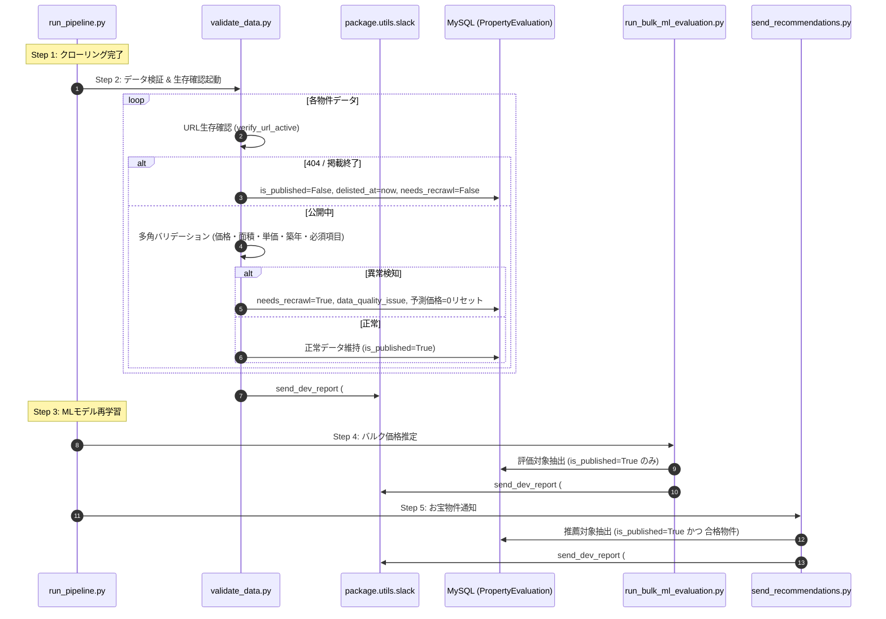

# Slack進捗通知の分離、公開終了物件のDB保持、価格推定前データ検証の厳格化およびAuto-Healフラグ連携 基本設計書 (Issue #665)

## 1. システム構成・処理フロー

---

## 2. モジュール間インターフェース設計

### 2.1 Slack 通知ルーティングの統一規約
| 目的 | 送信先関数 | 環境変数 | デフォルトチャンネル |
|---|---|---|---|
| **バッチ進捗・サマリー** | `send_dev_report()` | `SLACK_DEV_CHANNEL` | `dev-agent` |
| **データ監視結果報告** | `send_dev_report()` | `SLACK_DEV_CHANNEL` | `dev-agent` |
| **お宝物件推薦通知** | `send_slack_message()` | `SLACK_RECOMMEND_*` | `goodproperty-*` |
| **重大障害（停止・例外）** | `send_crawling_summary_alert()` | `SLACK_ALERT_PROPERTY_ALERT` | `property_alert` |

### 2.2 データバリデーション基準マトリクス
| チェック観点 | 判定条件 | エラー種別 | アクション |
|---|---|---|---|
| **生存確認** | 404 または 掲載終了文言検知 | 公開終了 | `is_published=False`, `delisted_at=now` (除外) |
| **価格異常** | `price_man <= 0` or `< 100` or `> 200,000` | 価格異常 | `needs_recrawl=True`, 価格=0 |
| **面積異常** | `area <= 5.0` or `> 5,000.0` | 面積異常 | `needs_recrawl=True`, 価格=0 |
| **㎡単価異常** | `unit_price < 1,000円` or `> 15,000,000円` | 単価異常 | `needs_recrawl=True`, 価格=0 |
| **築年数異常** | 西暦 < 1900 または 未来 > 現在+3年 | 築年数異常 | `needs_recrawl=True`, 価格=0 |
| **必須項目欠損** | マンションの所在階/専有面積、戸建の土地/建物面積 | スペック欠損 | `needs_recrawl=True`, 価格=0 |
| **物件特性 (仕様)** | 再建築不可、借地権、心理的瑕疵 | 特性Warning | 特徴量フラグのみ付与（正常扱い） |
