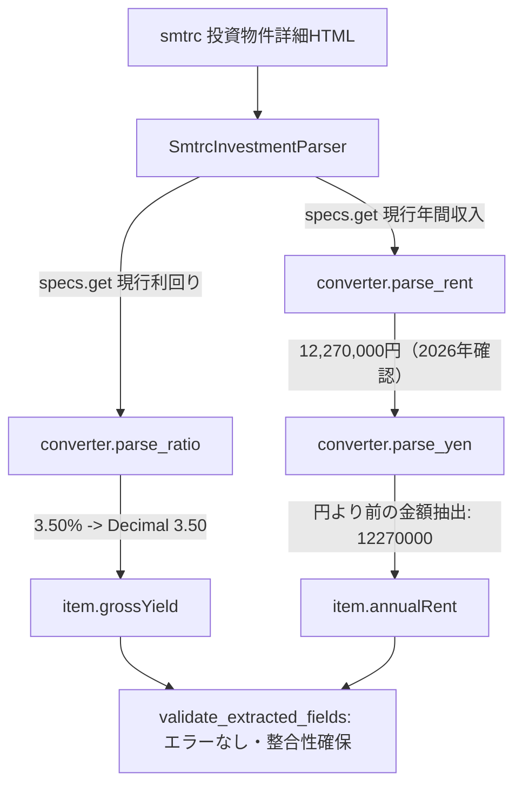

# smtrc 投資物件パース（現行利回り対応・年収文字列正規化）基本設計書 (Issue #775)

## 1. 全体アーキテクチャ
本改修では以下の2層を修正する：
1. **ユーティリティ層 (`converter.py`)**: `parse_yen` における円記号前金額の優先抽出
2. **パーサー・セレクター層 (`smtrcParser.py`, `smtrc.yaml`)**: `SmtrcInvestmentParser` における `現行利回り` キー対応



## 2. モジュール別設計

### 2.1 ユーティリティ層 (`src/crawler/package/utils/converter.py`)
- 対象関数: `parse_yen(text)`
- 設計方針:
  - 入力文字列に `円` が含まれる場合、`r'(\d[\d,]*)\s*円'` のマッチを試行し、金額部分の数字のみを取得する。
  - `円` が含まれない、またはマッチしない場合は従来の `re.sub(r'\D', '', text)` にフォールバックする。
  - これにより `12,270,000円（2026年8月18日確認）` ➔ `12270000` となり、日付数字の混入を完全に防止。

### 2.2 パーサー層 (`src/crawler/package/parser/smtrcParser.py`)
- 対象クラス: `SmtrcInvestmentParser`
- 対象メソッド: `_apply_invest_yield_and_rent(item, specs: dict)`
- 設計方針:
  - `gross_yield_str` の探索キーに `specs.get("現行利回り", "")` を追加する。
    ```python
    gross_yield_str = (
        specs.get("利回り", "")
        or specs.get("表面利回り", "")
        or specs.get("想定利回り", "")
        or specs.get("現行利回り", "")
    )
    ```

### 2.3 セレクター層 (`config/selectors/smtrc.yaml`)
- `investment.field_mappings` に `現行利回り: "grossYield"` を追加。
