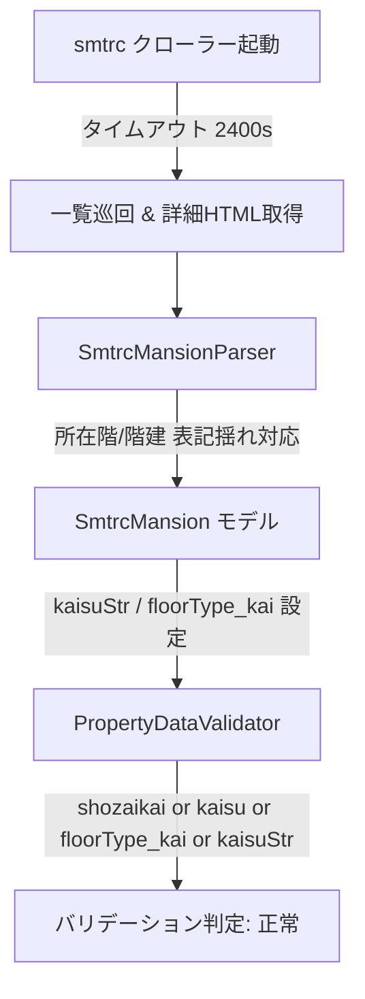

# smtrcクローラータイムアウト延長・所在階パースおよびバリデータ誤検知解消 基本設計書

## 1. 全体アーキテクチャ
本改修では以下の3箇所を連携して改修する：
1. **API層 (`smtrc.py`)**: クローラー一覧取得タイムアウトの延長
2. **パーサー層 (`smtrcParser.py`)**: 所在階の複合ヘッダー取得強化
3. **データ検証層 (`data_validator.py`)**: マンション所在階判定モデル属性フォールバック



## 2. モジュール別設計

### 2.1 API層 (`src/crawler/package/api/smtrc.py`)
- 対象クラス:
  - `ParseSmtrcMansionStartAsync`
  - `ParseSmtrcKodateStartAsync`
  - `ParseSmtrcTochiStartAsync`
  - `ParseSmtrcInvestmentStartAsync`
- 変更内容:
  - `_getTimeOutSecond(self)` の戻り値を `600` から `2400` に変更。

### 2.2 パーサー層 (`src/crawler/package/parser/smtrcParser.py`)
- 対象メソッド:
  - `SmtrcMansionParser._parsePropertyDetailPage`
- 変更内容:
  - `kaisuStr` の抽出元キーを拡張：
    ```python
    item.kaisuStr = (
        specs.get("所在階", "")
        or specs.get("所在階/階建", "")
        or specs.get("所在階／階建", "")
        or specs.get("階数", "")
    )
    ```

### 2.3 データ検証層 (`src/crawler/package/utils/data_validator.py`)
- 対象メソッド:
  - `PropertyDataValidator._check_mansion_specs`
- 変更内容:
  - マンション階数チェック判定の拡張：
    ```python
    floor = (
        getattr(item, "shozaikai", None)
        or getattr(item, "kaisu", None)
        or getattr(item, "floorType_kai", None)
        or getattr(item, "kaisuStr", None)
    )
    ```
