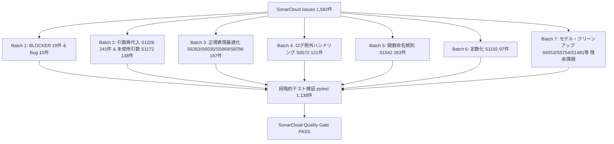

# 基本設計書: SonarCloudオープン課題全件解消アーキテクチャ設計

## 1. 全体構造とアプローチ
全1,583件の課題を、影響度・安全度・パターン特性に応じて7つのバッチ（群）に分類し、段階的・決定論的に修正する。



## 2. カテゴリ別修正方針

### 2.1 BLOCKER / 重大バグ
- **S1845（メソッド名大文字小文字重複）**:
  - `MansionParserBase` の `@abstractmethod` は `_parseSouKosu` (大文字K)。
  - `heimParser`, `mitsuiParser`, `nomuraParser`, `sumifuParser`, `tokyuParser` で混在していた `_parseSoukosu` を削除または `_parseSouKosu` に統合。
- **S3516（メソッド内同一戻り値）**:
  - `_getApiKey` 内の `if os.getenv('IS_CLOUD', ''): return ""` / `return ""` を `return os.getenv('API_KEY', '')` に統合。
- **S1763（到達不能コード）**:
  - `baseParser.py` 内の `return` 直後の `yield` を削除。
- **S905（副作用のない文）**:
  - `show_migrations.py` 末尾の全角ハイフン `ー` を削除。

### 2.2 引数再代入 (S1226) & 未使用引数 (S1172)
- 対象: `misawaParser.py`, `mitsuiParser.py`, `nomuraParser.py`, `sumifuParser.py`。
- **S1226**:
  ```python
  # 変更前
  def _parseXXX(self, response, specs=None):
      specs = self._get_specs(response)
      return specs.get(...)

  # 変更後
  def _parseXXX(self, response, specs=None):
      target_specs = specs if specs is not None else self._get_specs(response)
      return target_specs.get(...)
  ```
- **S1172**:
  - ポリモーフィックなシグネチャ `(response, specs=None)` で `specs` を参照しないメソッドは、引数名を `_specs=None` に統一し、未使用を明示。

### 2.3 正規表現最適化 (S6353, S6035, S5869, S8786)
- **S6353**: `[0-9]` ➔ `\d`
- **S6035**: `(a|b)` ➔ `[ab]`
- **S5869**: `[\s\u3000]` ➔ `\s`（Python の `\s` は全角空白 `\u3000` を包含）
- **S8786**: `\s*(?:約)?\s*` ➔ `\s*(?:約\s*)?`（Catastrophic Backtracking の抑止）

### 2.4 ログ例外ハンドリング (S8572)
- `except Exception:` 内で `logging.error(...)` + `logging.error(traceback.format_exc())` を呼んでいる箇所を、標準の `logging.exception(...)` に置き換え、スタックトレースを自動出力させる。

### 2.5 関数命名規約 (S1542)
- `routes/` 内の Flask ビュー関数を PEP 8 準拠の snake_case に統一。`main.py` 等のインポート元も整合更新。
