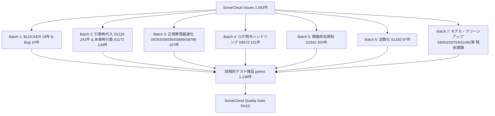
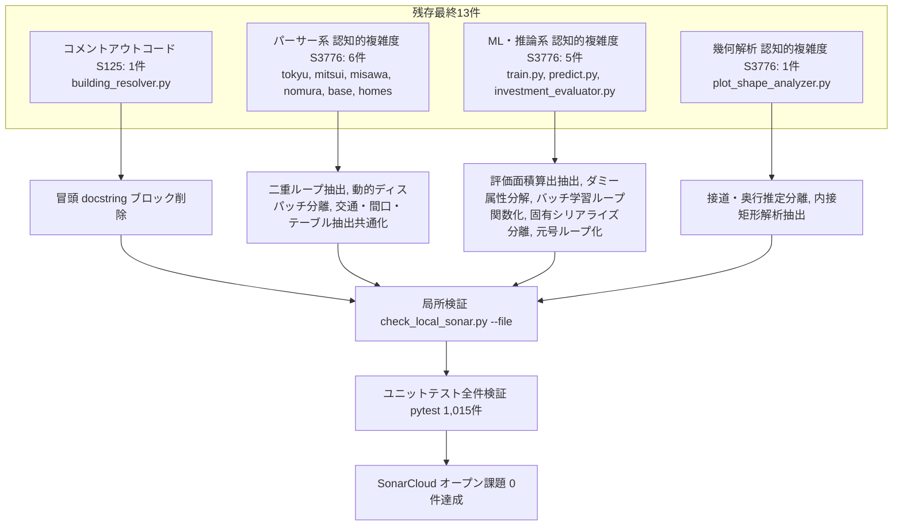
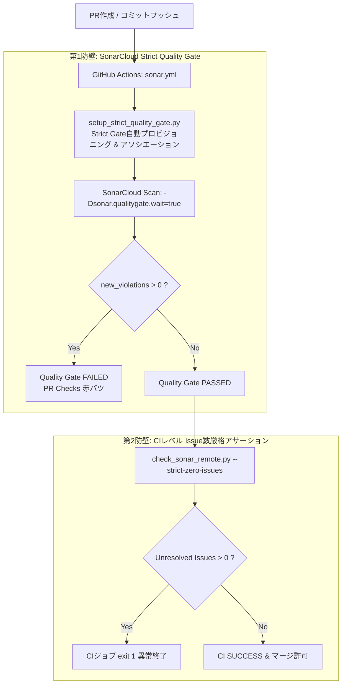
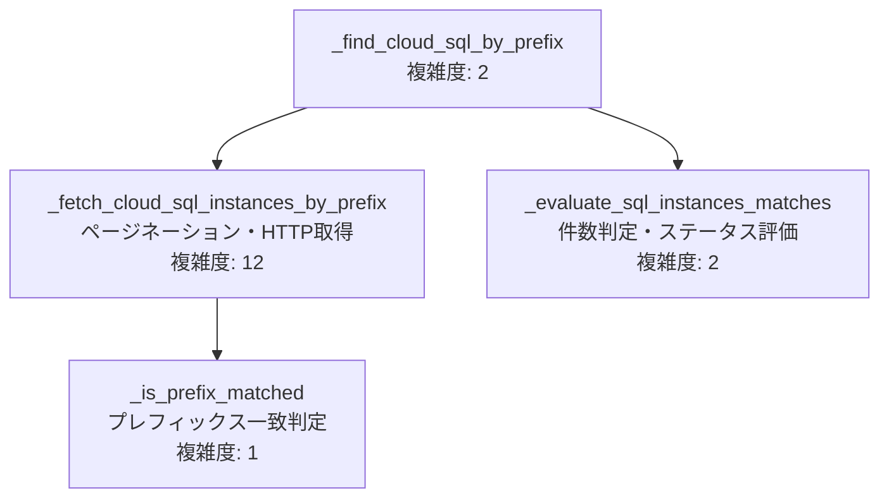

# 基本設計書: SonarCloudオープン課題全件解消アーキテクチャ設計

## 1. 全体構造とアプローチ
全1,583件の課題を、影響度・安全度・パターン特性に応じて7つのバッチ（群）に分類し、段階的・決定論的に修正する。



## 2. カテゴリ別修正方針

### 2.1 BLOCKER / 重大バグ
- **S1845（メソッド名大文字小文字重複）**:
  - `MansionParserBase` の `@abstractmethod` は `_parseSouKosu` (大文字K)。
  - `heimParser`, `mitsuiParser`, `nomuraParser`, `sumifuParser`, `tokyuParser` で混在していた `_parseSoukosu` を削除または `_parseSouKosu` に統合。
- **S3516（メソッド内同一戻り値）**:
  - `_getApiKey` 内の `if os.getenv('IS_CLOUD', ''): return ""` / `return ""` を `return os.getenv('API_KEY', '')` に統合。
- **S1763（到達不能コード）**:
  - `baseParser.py` 内の `return` 直後の `yield` を削除。
- **S905（副作用のない文）**:
  - `show_migrations.py` 末尾の全角ハイフン `ー` を削除。

### 2.2 引数再代入 (S1226) & 未使用引数 (S1172)
- 対象: `misawaParser.py`, `mitsuiParser.py`, `nomuraParser.py`, `sumifuParser.py`。
- **S1226**:
  ```python
  # 変更前
  def _parseXXX(self, response, specs=None):
      specs = self._get_specs(response)
      return specs.get(...)

  # 変更後
  def _parseXXX(self, response, specs=None):
      target_specs = specs if specs is not None else self._get_specs(response)
      return target_specs.get(...)
  ```
- **S1172**:
  - ポリモーフィックなシグネチャ `(response, specs=None)` で `specs` を参照しないメソッドは、引数名を `_specs=None` に統一し、未使用を明示。

### 2.3 正規表現最適化 (S6353, S6035, S5869, S8786)
- **S6353**: `[0-9]` ➔ `\d`
- **S6035**: `(a|b)` ➔ `[ab]`
- **S5869**: `[\s\u3000]` ➔ `\s`（Python の `\s` は全角空白 `\u3000` を包含）
- **S8786**: `\s*(?:約)?\s*` ➔ `\s*(?:約\s*)?`（Catastrophic Backtracking の抑止）

### 2.4 ログ例外ハンドリング (S8572)
- `except Exception:` 内で `logging.error(...)` + `logging.error(traceback.format_exc())` を呼んでいる箇所を、標準の `logging.exception(...)` に置き換え、スタックトレースを自動出力させる。

### 2.5 関数命名規約 (S1542)
- `routes/` 内の Flask ビュー関数を PEP 8 準拠の snake_case に統一。`main.py` 等のインポート元も整合更新。

## 3. 残存151件解消アーキテクチャ設計 (Issue #421)

```mermaid
flowchart TD
    subgraph S151[残存151件]
        R1[正規表現バックトラック S8786: 48件]
        R2[認知的複雑度 S3776: 77件]
        R3[コメントコード S125: 7件]
        R4[例外ログ S8572: 6件]
        R5[シグネチャ S2638: 4件]
        R6[例外・未使用・記法 S5713/S1481/S6035/S3457/S1172/S7780: 9件]
    end

    R1 --> A1[有限量指定子化 \\d{1,5} または 文字列分割 split]
    R2 --> A2_1[scripts/ 除外設定適正化 sonar.exclusions]
    R2 --> A2_2[コア関数早期リターン・ヘルパー抽出]
    R3 --> A3[旧コードコメント完全削除 & 自然文平易化]
    R4 --> A4[logging.exception 統一置換]
    R5 --> A5[specs=None パラメータ付与]
    R6 --> A6[冗長例外削除, _化, [ab]化, %エスケープ, String.raw]

    A1 --> TEST[全テスト検証 pytest]
    A2_1 --> TEST
    A2_2 --> TEST
    A3 --> TEST
    A4 --> TEST
    A5 --> TEST
    A6 --> TEST
    TEST --> ZERO[SonarCloud 残存オープン課題 0件]
```

### 3.1 S8786 (正規表現バックトラック) 解消設計
1. **無制限量指定子の有限長化**:
   - `\d+` ➔ `\d{1,5}` または `\d{1,10}`（階数、年、月、丁目、号、パーセント、面積）
   - `.+?` ➔ `[^市区町村]{1,20}` 等、文字クラス境界の厳格化
2. **決定論的文字列処理への移行**:
   - `re.search(r'(\d+)階', text)` ➔ `text.split("階")[0]` から数字抽出

### 3.2 S3776 (認知的複雑度) 低減設計
1. **内部ツール群の Sonar 設定適正化**:
   - `sonar-project.properties` および `.github/workflows/sonar.yml` の `sonar.exclusions` に `**/scripts/**` を明示追加。
2. **主要モジュールのリファクタリング**:
   - `main.py::execute_crawl_task`: タスク初期化・メトリクス保存を別関数へ分離。
   - `building_resolver.py::resolve_and_update`: 正規化とDB更新のパイプライン化。
   - `differential.py::filter_differential_items`: フィルタ条件判定の抽出。

### 3.3 その他ルール解消設計
- **S125**: `mitsui_routes`, `tokyu_routes` の残存 `# request_json = ...` コメントを削除。`building_resolver` や `sync_all_potentials` の docstring 内コード類似表記を平易な日本語へ修正。
- **S8572**: `main.py`, `api.py` の `logging.error(..., exc_info=True)` を `logging.exception(...)` に統一。
- **S2638**: `seibuParser`, `sumirinParser` の `_parsePrice`, `_parseAddress` に基底シグネチャ `specs=None` を追加。
- **S5713**: `tokyuParser` の `json.JSONDecodeError`（`ValueError` サブクラス）、`api.py` の `ListingEndedException`（`SkipPropertyException` サブクラス）の冗長指定を削除。
- **S1481**: `api.py:1195`, `sync_estat_municipalities.py:165` の未使用変数を `_` に変更。
- **S6035**: `sumifuParser.py` の `re.split(u'/|／|\n', val)` を `re.split(r'[/／\n]', val)` に置換。
- **S3457**: `resolve_duplicate_evaluations.py` の `100% clean` を `100%% clean` に置換。
- **S1172**: `tokyuParser.py:1085` の `_parseAddress(self, response, _specs=None)` に改名。
- **S7780**: `slack_agent_host.js` の `replaceAll('"', String.raw`\"`)` に置換。

## 4. 残存最終13件完全ゼロ化アーキテクチャ設計 (Issue #428)



### 4.1 設計方針
1. **認知的複雑度の徹底低減（S3776 <= 15）**:
   - 多段ネスト（ループ内の条件分岐、二重ループ）の解消：内部ループや条件ブロックを責務ごとに単機能のプライベートヘルパーメソッドへ抽出。
   - 連続する三項演算子（Ternary Operators）および多数の `elif` 分岐の平坦化・テーブル検索化。
   - 関数内ローカル関数定義（Closure）の排除：モジュールスコープのヘルパー関数化により関数のネスト深度を加算させない。
2. **安全性の担保**:
   - シグネチャ・戻り値・型の一致を完全保証し、呼び出し元への破壊的変更（Breaking Change）をゼロに抑制。

## 5. 第4期: Strict Quality Gate ＆ 多層防御アーキテクチャ設計 (Issue #436)

### 5.1 背景と問題の局所化
PR #433 において、`src/crawler/package/utils/gcp_resources.py` の新規Code Smell（S8572）が1件発生したが、Built-in Sonar way Quality Gateが適用されていたため、Maintainability Rating Aのまま通過した。
### 5.2 多層防御アーキテクチャ


### 5.3 Quality Gate 条件構成比較

| 指標 (Metric) | Sonar way (旧設定) | MyWay (初期設定) | Strict Gate (新設定) | 判定基準・理由 |
| :--- | :--- | :--- | :--- | :--- |
| **new_violations** | 未設定 (Ratingのみ) | `> 0` でエラー | **`> 0` でエラー** | 新規Issueが1件でもあれば即座に弾く |
| **new_reliability_rating** | `> 1` (Aより悪化) | `> 1` | **`> 1`** | バグ許容ゼロ |
| **new_security_rating** | `> 1` (Aより悪化) | `> 1` | **`> 1`** | 脆弱性許容ゼロ |
| **new_maintainability_rating** | `> 1` (Aより悪化) | `> 1` | **`> 1`** | 保守性維持 |
| **new_duplicated_lines_density** | `> 3.0%` | `> 3.0%` | **`> 3.0%`** | 重複コード防止 |
| **new_security_hotspots_reviewed**| `< 100%` | `< 100%` | **`< 100%`** | ホットスポット100%レビュー |
| **new_coverage** | `< 80.0%` | `< 80.0%` (罠) | **除外 (設定なし)** | `sonar.coverage.exclusions=**` に適合 |
| **branch_coverage** | 未設定 | `< 80.0%` (罠) | **除外 (設定なし)** | カバレッジ未測定による誤爆防止 |
| **violations** (全体) | 未設定 | `> 0` | **未設定または新コード優先** | master historical debtによる巻き込み防止 |

## 6. 第5期: gcp_resources 認知的複雑度低減設計 (Issue #442)

### 6.1 課題と構造分析
- `src/crawler/package/utils/gcp_resources.py` の `_find_cloud_sql_by_prefix` は、Cloud SQLインスタンス一覧のページネーションループ (`while True`)、名前マッチング (`for` + `if ... or ...`)、マッチ件数に応じた評価分岐 (`len == 1`, `len > 1`, `len == 0`)、例外捕捉 (`try ... except`) が1関数内に同居しており、認知的複雑度 16（許容上限 15）に達していた。

### 6.2 責務分割設計


- 各関数の認知的複雑度を最大でも 12（許容上限 15）以下に抑え、SonarCloud S3776 を完全クリアする。


