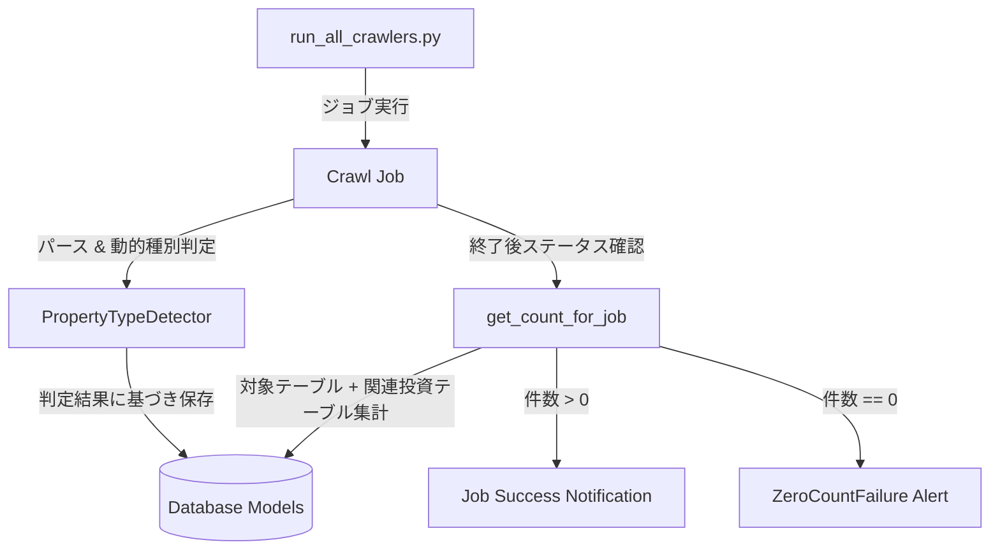

# クローラー巡回安定化・動的種別集計・WAF/タイムアウト耐性強化 外部設計書 (Issues #819, #820, #821, #822)

## 1. システム構成・処理フロー

## 2. 外部インターフェース仕様
1. **ジョブ件数集計 (`get_count_for_job`)**:
   - 入力: `company: str`, `ptype: str`, `start_dt: datetime.datetime`
   - 出力: `(detail_count: int, skipped_count: int, total_count: int)`
   - 変更点:
     - `ptype == 'invest_kodate'` の場合、同一会社の `investment_apartment` または `apartment` モデルの件数も合算して返却する。
2. **SMTRC WAF/ブランク応答ハンドリング**:
   - 入力: 取得 HTML / bytes
   - 判定: `len(content) < 1000` の場合、正常な物件一覧・詳細ではないと判定してリトライ。
3. **Sumai1 タイムアウト耐性**:
   - `Sumai1Parser` に `REQUEST_TIMEOUT_SEC = 25` を設定し、`_getContent` で適切なタイムアウトを適用。
