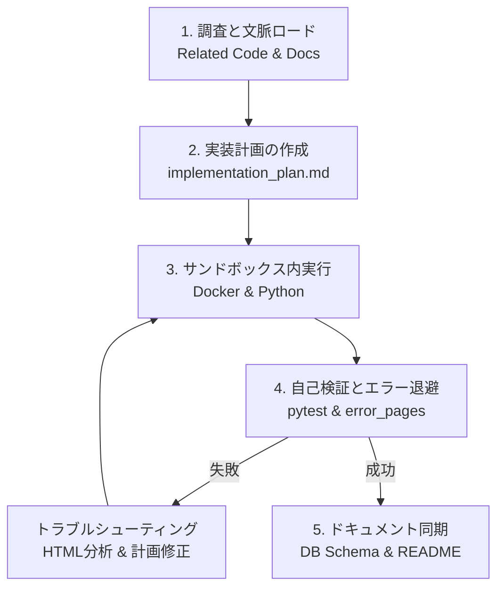

# AI駆動開発ガイド (AI-Driven Development Guide)

本リポジトリで作業を行うAIエージェント（開発アシスタント）向けの指示書・開発ガイドラインです。AIエージェントは、実装・デバッグ・リファクタリング等のタスクを開始する前に、必ず本ドキュメントを熟読し、定義された開発プロセスと制約を厳格に遵守してください。

---

## 👑 セントラルドグマ: ドキュメント駆動開発 (Document-Driven Development)

本プロジェクトにおけるすべての開発行為（設計、実装、テスト、デバッグ）は、**ドキュメントを最上位 of 正とし、ドキュメントを起点として動く「ドキュメント駆動開発」を絶対的な原則（セントラルドグマ）**とします。

1. **ドキュメント・ファースト (Document First)**:
   - 実装を開始する前に、まず該当する設計ドキュメント（`docs/` 配下）を調査し、必要に応じて変更仕様をドキュメント側へ先に記述しなければならない。
   - 設計に定義されていないコード変更は認めない。
2. **仕様とコードの同期 (Complete Sync)**:
   - 実装コードは常に最新のドキュメントの写像でなければならない。コード変更時は速やかにドキュメント側（例: DBスキーマ、API構造など）も更新する。
3. **推測の排除 (No Speculations)**:
   - 仕様が曖昧な場合は独断で実装せず、ドキュメントを修正して明確な仕様を定めた上でコードを修正する。

---

## 1. AIエージェント向けコンテキストマップ

開発対象のソースコードと、参照すべき設計ドキュメントの対応表です。AIは変更を加える前に、対応するドキュメントを必ず読み込んでください。

| 開発対象 | ソースコードの場所 | 参照すべき設計ドキュメント |
| :--- | :--- | :--- |
| **パーサー (HTML解析)** | `package/parser/` | [parser_design_guidelines.md](parser_design_guidelines.md) (One-Item-One-Method) [parser_implementation_procedure.md](parser_implementation_procedure.md) (抽出手順) [field_naming_standards.md](../internal_design/field_naming_standards.md) (フィールド名統一規約) |
| **データベースモデル** | `package/models/` | [database_schema.md](../internal_design/database_schema.md) (テーブル・カラム定義) [property_types.md](../domain/property_types.md) (物件種別判定ロジック) |
| **クローラーAPI・通信** | `package/api/`, `routes/` | [api_structure.md](../internal_design/api_structure.md) (連鎖的非同期API構造) |
| **機械学習・画像解析** | `package/ml/` | [project_status_and_design_intent.md](../requirements/project_status_and_design_intent.md) (ビジョンと2段階予測) |

---

## 2. AI駆動開発の標準ライフサイクル (ADD Lifecycle)

AIエージェントは、以下の5つのフェーズからなる開発サイクルを厳格に実行してください。

### 2.1 調査と文脈ロード (Research & Context Loading)
*   **コードとテストの把握**: 変更対象のコードだけでなく、対応するテストコード（`tests/unit/test_*.py`）を必ず読み込みます。
*   **エラーHTMLの確認**: 既存のパースエラーを修正する場合は、`tests/error_pages/` に保存されているHTMLを確認し、どのような不整合が起きているか分析します。

### 2.2 実装計画の作成 (Implementation Planning)
*   **計画ファイルの出力**: 大規模な変更や仕様変更を行う場合は、`implementation_plan.md` を作成し、人間（ユーザー）の承認を得てから実行します。
*   **影響範囲の特定**: 変更がDBスキーマや他サイトのパーサーに及ぼす影響をリストアップします。

### 2.3 サンドボックス環境での実行 (Sandbox Execution)
*   **Dockerコンテナ内での実行**: 
    Pythonスクリプトやテストの実行は、必ずDockerコンテナ内で行います。ホストOS（Windows）上で直接Pythonコマンドを動かしてはなりません。
    *   *正しい例*: `docker-compose exec -T app pytest src/crawler/tests/unit/test_mitsui_parser.py`
    *   *誤った例*: `pytest src/crawler/tests/unit/...`

### 2.4 自己検証とクオリティ保証 (Self-Verification & QA)
*   **pytestの実行**: 変更後は必ず `task test`（またはコンテナ内での pytest）を実行し、テストがすべてパスすることを確認します。
*   **再現HTMLの保存**: 新たなエラーを検出した場合は、エラーが発生した物件ページHTMLを `src/crawler/tests/error_pages/{company_type}/{id}.html` に退避させ、それをテストケースに組み込みます。

### 2.5 ドキュメントの同期 (Documentation Sync)
*   **スキーマ情報の更新**: モデル（`package/models/*.py`）を変更した場合、必ず [database_schema.md](../internal_design/database_schema.md) を最新の定義に手動で更新します。
*   **READMEの更新**: `docs/` 配下にファイルを新設・変更・削除した場合は、必ず [README.md](../../README.md) の「ドキュメント一覧」を更新します。

---

## 3. AIエージェント向けの禁止事項 (Antipatterns)

AIエージェントが実装時に陥りやすい間違いと、それを防ぐための禁止事項です。

*   ❌ **ブラウザレンダリング（Playwrightなど）の再導入**:
    *   本プロジェクトは軽量・高速化のためにブラウザレンダリングを廃止し、`aiohttp` + `BeautifulSoup4` の静的HTMLパースに統一されています。Playwright等のライブラリを復活させてはなりません。
*   ❌ **安易な null=True/blank=True の追加によるエラー隠蔽**:
    *   厳格化フィールド（価格、面積、間取りなど）でパースエラーや保存エラーが出た際、エラーを回避するためにモデル定義を緩めて（`null=True` 等にして）保存を強行してはなりません。パーサーのセレクタを修正し、データを正しく抽出してください。
*   ❌ **データベース接続を閉じる処理の省略**:
    *   クローラーの大量保存処理時にはコネクションプールが枯渇しやすいため、`afterRunProc` などの一括処理やリトライ処理内では、適切に `close_old_connections()` を呼び出してください。

---
**更新日**: 2026年7月9日  
**対象**: すべてのAI開発エージェント・アシスタント
