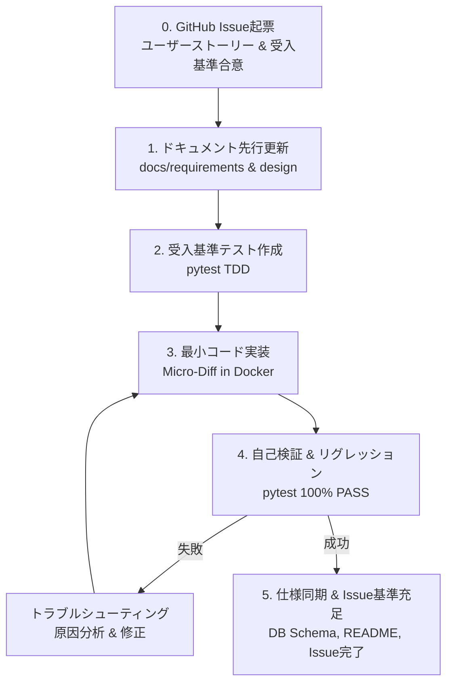

# AI駆動開発ガイド (AI-Driven Development Guide)

本リポジトリで作業を行うAIエージェント（開発アシスタント）向けの指示書・開発ガイドラインです。AIエージェントは、実装・デバッグ・リファクタリング等のタスクを開始する前に、必ず本ドキュメントを熟読し、定義された開発プロセスと制約を厳格に遵守してください。

---

## 👑 セントラルドグマ: Issue起票 ＆ 仕様駆動開発 (Issue-Driven & Spec-Driven Development)

本プロジェクトにおけるすべての開発行為（設計、実装、テスト、デバッグ）は、**「GitHub Issue起票 ➔ 仕様ドキュメント定義 ➔ テスト ➔ 実装」のトップダウンライフサイクルを絶対的な原則（セントラルドグマ）**とします。

1. **Issueファースト ＆ 受入基準合意 (Issue-First)**:
   - 今後修正・追加する内容は、すべて Issue の単位で GitHub Issues に起票する。
   - ユーザーストーリーおよび「アクセプタンスクライテリア (受入基準)」を定義し、内容に問題がないことを確認・合意した上で実装に着手する。
2. **ドキュメント・ファースト (Document-First)**:
   - 仕様マークダウンの構図（要件 ➔ 設計）は維持する。
   - 実装を開始する前に、まず該当する設計ドキュメント（`docs/requirements/` ➔ `docs/external_design/`, `docs/basic_design/` ➔ `docs/internal_design/`）を先行更新する。
   - 設計に定義されていないコード変更は認めない。
3. **仕様とコードの同期 (Complete Sync)**:
   - 実装コードは常に最新のドキュメントおよび受入基準の写像でなければならない。コード変更時は速やかにドキュメント側（例: DBスキーマ、API構造など）も更新する。
4. **推測の排除 (No Speculations)**:
   - 仕様が曖昧な場合は独断で実装せず、Issueの受入基準および仕様ドキュメントを明確に定めた上でコードを修正する。

---

## 1. AIエージェント向けコンテキストマップ

開発対象のソースコードと、参照すべき設計ドキュメントの対応表です。AIは変更を加える前に、対応するドキュメントを必ず読み込んでください。

| 開発対象 | ソースコードの場所 | 参照すべき設計ドキュメント |
| :--- | :--- | :--- |
| **パーサー (HTML解析)** | `package/parser/` | [parser_design_guidelines.md](parser_design_guidelines.md) (One-Item-One-Method) [parser_implementation_procedure.md](parser_implementation_procedure.md) (抽出手順) [field_naming_standards.md](../internal_design/field_naming_standards.md) (フィールド名統一規約) |
| **データベースモデル** | `package/models/` | [database_schema.md](../internal_design/database_schema.md) (テーブル・カラム定義) [property_types.md](../domain/property_types.md) (物件種別判定ロジック) |
| **クローラーAPI・通信** | `package/api/`, `routes/` | [api_structure.md](../internal_design/api_structure.md) (連鎖的非同期API構造) |
| **機械学習・画像解析** | `package/ml/` | [project_status_and_design_intent.md](../requirements/project_status_and_design_intent.md) (ビジョンと2段階予測) |

---

## 2. AI駆動開発の標準ライフサイクル (ADD Lifecycle)

AIエージェントは、以下のフェーズからなる開発サイクルを厳格に実行してください。

```mermaid
graph TD
    A[0. GitHub Issue起票<br>ユーザーストーリー & 受入基準合意] --> B[1. ドキュメント先行更新<br>docs/requirements & design]
    B --> C[2. 受入基準テスト作成<br>pytest TDD]
    C --> D[3. 最小コード実装<br>Micro-Diff in Docker]
    D --> E[4. 自己検証 & リグレッション<br>pytest 100% PASS]
    E -->|失敗| F[トラブルシューティング<br>原因分析 & 修正]
    F --> D
    E -->|成功| G[5. 仕様同期 & Issue基準充足<br>DB Schema, README, Issue完了]
```

### 2.0 GitHub Issue起票 ＆ 受入基準合意 (Issue-Driven Initiation)
*   **Issue起票**: 変更・新規開発・バグ修正は必ず Issue 単位で GitHub Issues に起票します。
*   **受入基準 (AC) の合意**: 概要/ユーザーストーリー、アクセプタンスクライテリア（受入基準）を明記し、内容に問題がないことを確認・合意した上で実装へ進みます。

### 2.1 調査・文脈ロード ＆ ドキュメント先行更新 (Research & Spec-First)
*   **コードとテストの把握**: 変更対象のコードおよび既存テスト（`tests/unit/test_*.py`）を確認します。
*   **仕様マークダウンの先行更新**: 仕様マークダウンの構図（要件 ➔ 外部設計 ➔ 内部設計）に従い、コード実装前に `docs/` 配下の仕様ドキュメントを更新します。

### 2.2 受入基準に基づくテストコード作成 (TDD)
*   **テストファースト**: Issueのアクセプタンスクライテリアおよび更新された仕様ドキュメントを満たすテストコード（`pytest`）を、コード実装前に記述します。

### 2.3 サンドボックス環境での最小コード実装 (Sandbox Execution)
*   **最小限の実装 (Micro-Diff)**: 仕様とテストを満たす最小限の実装を行います。
*   **Dockerコンテナ内での実行**: 
    Pythonスクリプトやテストの実行は、必ずDockerコンテナ内で行います。ホストOS（Windows）上で直接Pythonコマンドを動かしてはなりません。
    *   *正しい例*: `docker compose exec -T app pytest src/crawler/tests/unit/test_mitsui_parser.py`
    *   *誤った例*: `pytest src/crawler/tests/unit/...`

### 2.4 自己検証とクオリティ保証 (Self-Verification & QA)
*   **pytestの実行**: 変更後は必ずテスト（またはコンテナ内での pytest）を実行し、全件パスすることを確認します。
*   **再現HTMLの保存**: 新たなエラーを検出した場合は、エラーが発生した物件ページHTMLを `src/crawler/tests/error_pages/{company_type}/{id}.html` に退避させ、それをテストケースに組み込みます。

### 2.5 ドキュメント同期 ＆ 受入基準充足確認 (Documentation Sync & Verification)
*   **スキーマ情報の更新**: モデル（`package/models/*.py`）を変更した場合、必ず [database_schema.md](../internal_design/database_schema.md) を最新の定義に手動で更新します。
*   **READMEの更新**: `docs/` 配下にファイルを新設・変更・削除した場合は、必ず [README.md](../../README.md) の「ドキュメント一覧」を更新します。
*   **Issue受入基準の確認**: 起票した GitHub Issue のアクセプタンスクライテリアがすべて達成されていることを確認します。

---

## 3. AIエージェント向けの禁止事項 (Antipatterns)

AIエージェントが実装時に陥りやすい間違いと、それを防ぐための禁止事項です。

*   ❌ **ブラウザレンダリング（Playwrightなど）の再導入**:
    *   本プロジェクトは軽量・高速化のためにブラウザレンダリングを廃止し、`aiohttp` + `BeautifulSoup4` の静的HTMLパースに統一されています。Playwright等のライブラリを復活させてはなりません。
*   ❌ **安易な null=True/blank=True の追加によるエラー隠蔽**:
    *   厳格化フィールド（価格、面積、間取りなど）でパースエラーや保存エラーが出た際、エラーを回避するためにモデル定義を緩めて（`null=True` 等にして）保存を強行してはなりません。パーサーのセレクタを修正し、データを正しく抽出してください。
*   ❌ **データベース接続を閉じる処理の省略**:
    *   クローラーの大量保存処理時にはコネクションプールが枯渇しやすいため、`afterRunProc` などの一括処理やリトライ処理内では、適切に `close_old_connections()` を呼び出してください。

---
**更新日**: 2026年7月9日  
**対象**: すべてのAI開発エージェント・アシスタント
