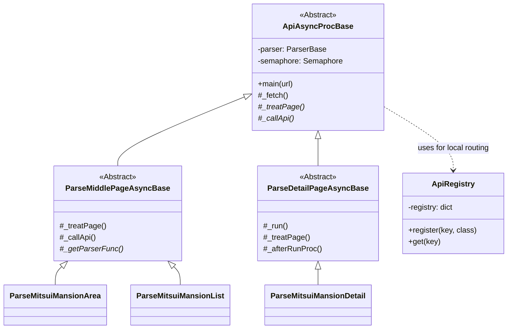
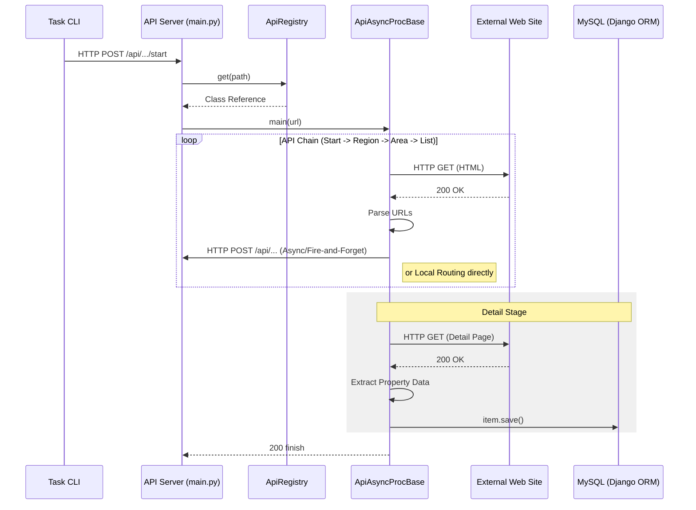
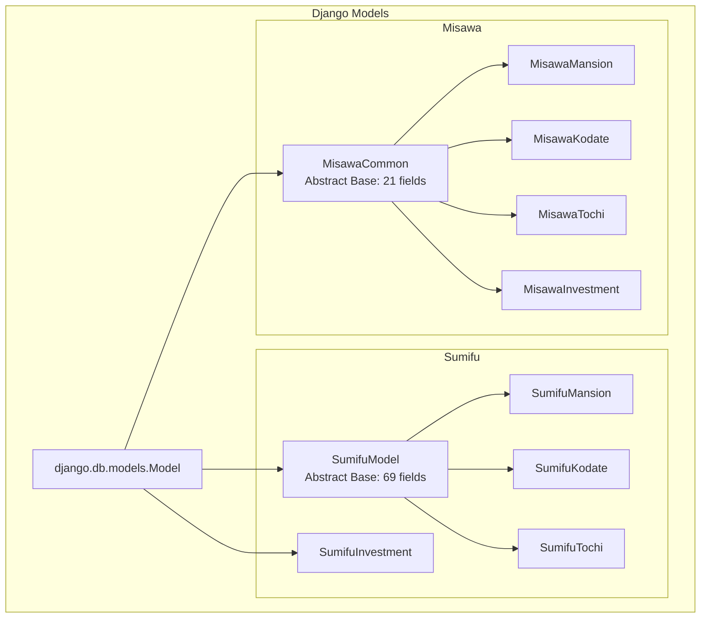

# 内部設計書 (Internal Design)

本システムの内部構造、クラス継承関係、およびデータフローについて設計図を用いて説明します。

## 1. クラス継承図 (Class Diagram)

API通信およびクローリングの中核となるクラス群は、`ApiAsyncProcBase` を頂点とした継承構造を持っています。

---

## 2. API チェーン・データフロー (Sequence Diagram)

`task crawl` コマンド実行から DB 保存までのシーケンスです。

---

## 3. モデル継承関係 (Data Model Inheritance)

複数の物件種別やサイト間で共通するフィールドを効率的に管理するため、Django の抽象基底クラスを利用しています。

---

## 4. 重複検知ロジック

本システムでは、物件の重複を `pageUrl` フィールドで識別します。
- **Index**: データベースレベルで `pageUrl` に UNIQUE インデックスまたは一般インデックスを付与。
- **Save Logic**: 既存のURLが見つかった場合、Django ORM の `update_or_create` 相当のロジック、または保存前の存在チェックにより、データの「新規作成」か「更新」かを判別します。
