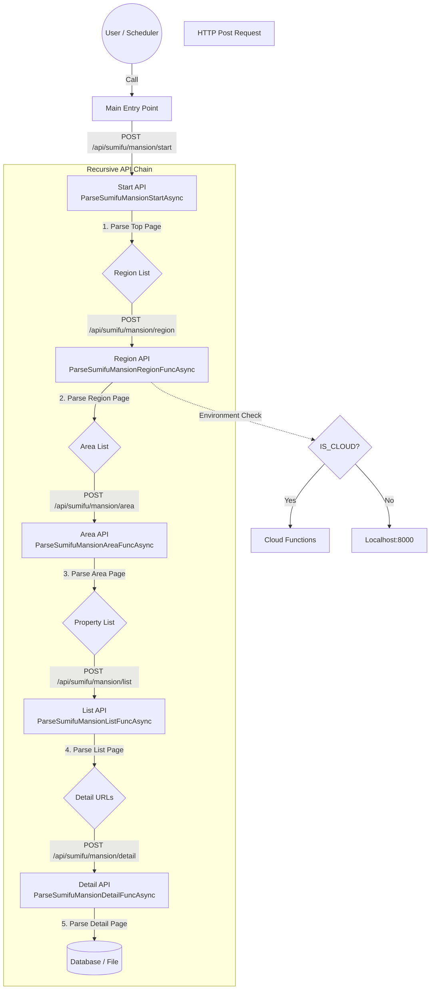

# クローラー API 構造ドキュメント

このプロジェクトのクローラーは、単一のプロセスが全てを実行するのではなく、各階層が次の階層のAPI（クローラー）を呼び出す**連鎖的な（再帰的な）分散アーキテクチャ**を採用しています。

## 1. 概要

エントリーポイント（`Start`）がキックされると、そこから詳細ページの取得まで、APIが次のAPIをHTTPリクエスト経由で呼び出すことで処理が進行します。
これにより、各階層の処理をCloud Functions等のサーバーレス環境に分散させることが容易な構造になっています。

## 2. 処理フロー (Mermaid)

以下は `Sumifu` (住友不動産販売) のマンション検索を例にした処理フローです。



## 3. 実装パラメータ

非同期通信および並列実行に関する主要な設定値です（`package/api/api.py` にて定義）。

| パラメータ名 | 設定値 | 説明 |
| :--- | :--- | :--- |
| `FIRE_AND_FORGET_TIMEOUT` | 3.0 秒 | 次の API をトリガーする際のタイムアウト。接続確立で成功。 |
| `DEFAULT_PARARELL_LIMIT` | 2 | 通常の API 呼び出しにおける並列数制限。 |
| `DETAIL_PARARELL_LIMIT` | 6 | 物件詳細 (`DetailFunc`) 取得時の並列数制限。 |
| `TCP_CONNECTOR_LIMIT` | 100 | TCP コネクタの最大同時接続数。 |

## 4. 環境切り替え

システムは実行環境を自動判定し、API 呼び出し先を切り替えます。
- **ローカル環境**: `localhost:8000` へリクエストを送ります。
- **クラウド環境**: `os.getenv('IS_CLOUD')` が真の場合、Cloud Functions 等のクラウドエンドポイントへリクエストを送ります。

## 5. 投資用物件の取得戦略

投資用物件は**アパート（Apartment）**と**戸建て（Kodate）**の2種類を別々に取得する必要があります。各サイトの構造に応じて、以下の戦略を使い分けます。

### 5.1 基本戦略

#### 戦略A: 検索条件による絞り込み（優先）

物件一覧を表示する際に、検索条件で物件種別を指定して絞り込みます。

**利点**:
- 不要な物件データの取得を回避
- 処理効率が高い
- サーバー負荷が低い

**実装方法**:
- URLパラメータで物件種別を指定（例: `?type=apartment`, `?type=kodate`）
- 開始URLを物件種別ごとに分ける
- API呼び出し時に物件種別パラメータを渡す

#### 戦略B: 一覧からのフィルタリング（フォールバック）

検索条件で絞り込みができない場合、一覧ページから目的の種別のみをピックアップします。

**実装方法**:
1. 一覧ページの全物件を取得
2. 各物件の種別を判定:
   - **URLパターン**: `/apartment/`, `/kodate/` などのパス
   - **物件種別ラベル**: 一覧上の「アパート」「戸建て」表示
   - **メタデータ**: data属性やclass名
3. 目的の種別のみ詳細ページへ進む

### 5.2 サイト別実装

| サイト | 戦略 | 判定方法 | 備考 |
|:---|:---|:---|:---|
| **Sumifu**<br>(住友不動産販売) | 戦略B<br>(フィルタリング) | 詳細ページURL構造<br>ページ内の物件種別情報 | 一覧ページでは種別混在<br>詳細ページで動的モデル切替 |
| **Nomura**<br>(ノムコム・プロ) | 戦略A<br>(検索条件) | URLパラメータ | 可能な限り検索条件で絞込<br>不可の場合は戦略Bへ |
| **Mitsui**<br>(三井のリハウス) | 戦略A<br>(検索条件) | URLパラメータ | 物件種別ごとの開始URL |
| **Tokyu**<br>(東急リバブル) | 戦略B<br>(フィルタリング) | 一覧上のラベル | 一覧ページで種別混在 |
| **Misawa**<br>(ミサワホーム不動産) | 戦略B<br>(フィルタリング) | URLパターン | 詳細URLから種別判定 |

### 5.3 動的モデル切り替え実装

投資用物件パーサーでは、`_parsePropertyDetailPage` メソッド内で物件種別を判定し、適切なモデルに切り替えます。

**実装例（Sumifu）**:

```python
def _parsePropertyDetailPage(self, item, response: BeautifulSoup):
    # デフォルトはKodate
    target_model = SumifuInvestmentKodate
    type_str = "Kodate"
    
    # URL または ページ内容から種別判定
    url = getattr(item, 'pageUrl', '')
    if self._is_apartment(url, response):
        target_model = SumifuInvestmentApartment
        type_str = "Apartment"
    
    # モデルが異なる場合は切り替え
    if not isinstance(item, target_model):
        new_item = target_model()
        new_item.pageUrl = url
        item = new_item
    
    # 物件種別を明示的に設定
    item.propertyType = type_str
    
    # 以降、通常のパース処理
    ...
```

### 5.4 エラーハンドリング

**物件種別判定失敗時**:
- 詳細ログを出力（URL、判定に使用した情報）
- デフォルトモデル（通常はKodate）で処理を継続
- `propertyType` フィールドに "Unknown" を設定

**検証時の確認項目**:
- DB保存後、`propertyType` フィールドで種別分布を確認
- 両方の種別（Apartment/Kodate）のデータが取得できていること
- 件数の偏りがないか確認

### 5.5 並列処理の考慮

投資用物件は2種類のモデルに分かれるため、以下の点に注意:

1. **並列数制限**: 両方の種別を合わせて `DETAIL_PARARELL_LIMIT` 以内に収める
2. **DB接続**: 同時書き込みによる競合を避ける
3. **メモリ管理**: 2種類のモデルインスタンスが同時に存在することを考慮

## 6. 通信エンジン

`aiohttp` を使用した非同期 HTTP 通信を採用しています。ブラウザレンダリング（Playwright 等）を介さないため、リソース消費が極めて少なく、高速なクロールが可能です。
