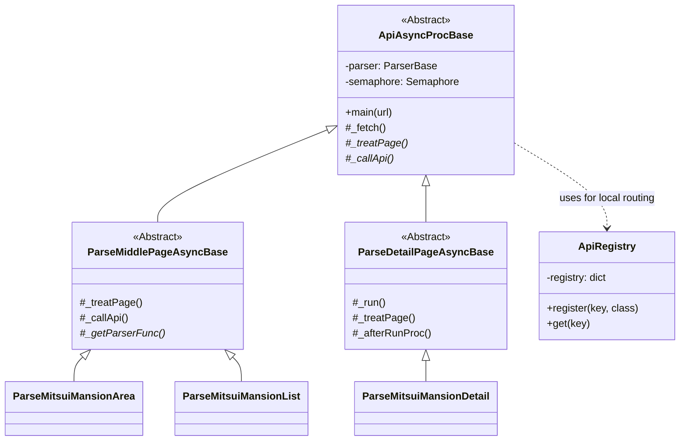
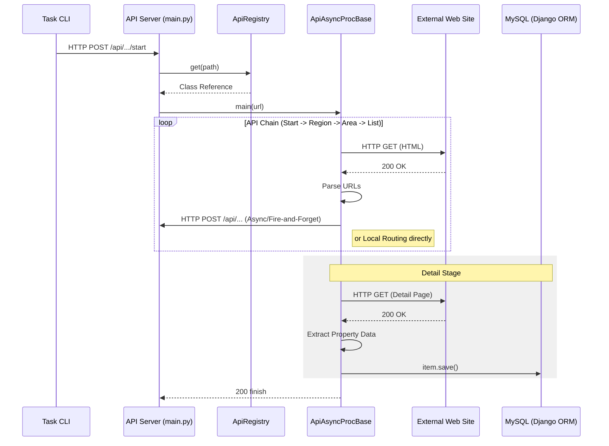
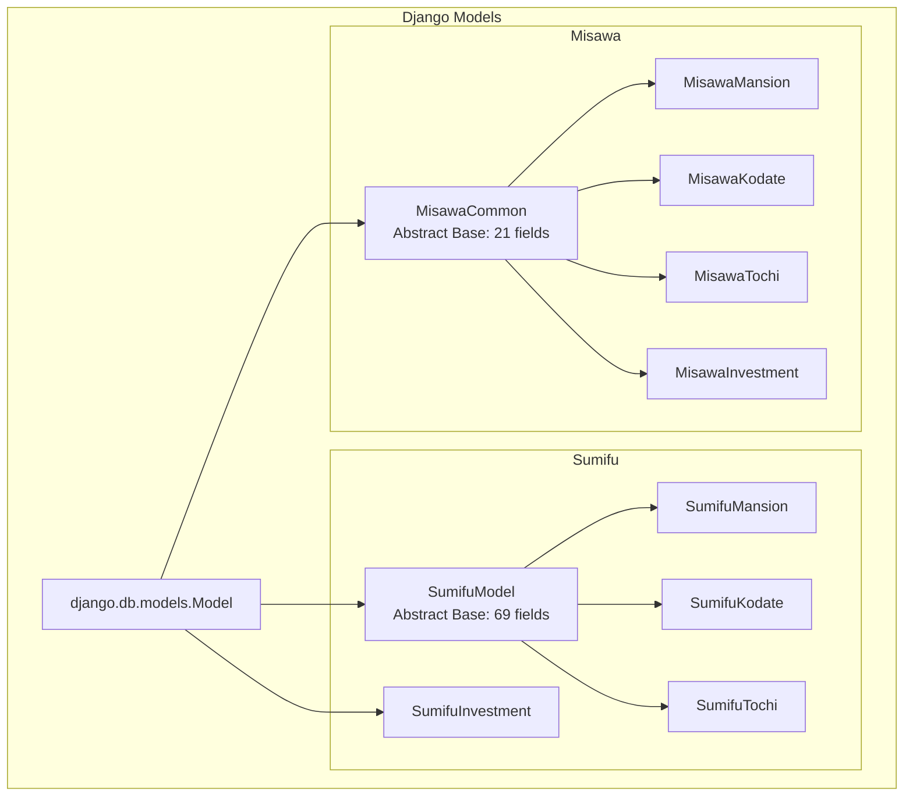

# 内部設計書 (Internal Design)

本システムの内部構造、クラス継承関係、およびデータフローについて設計図を用いて説明します。

## 1. クラス継承図 (Class Diagram)

API通信およびクローリングの中核となるクラス群は、`ApiAsyncProcBase` を頂点とした継承構造を持っています。

---

## 2. API チェーン・データフロー (Sequence Diagram)

`task crawl` コマンド実行から DB 保存までのシーケンスです。

---

## 3. モデル継承関係 (Data Model Inheritance)

複数の物件種別やサイト間で共通するフィールドを効率的に管理するため、Django の抽象基底クラスを利用しています。

---

## 4. 重複検知ロジック

本システムでは、物件の重複を `pageUrl` フィールドで識別します。
- **Index**: データベースレベルで `pageUrl` に UNIQUE インデックスまたは一般インデックスを付与。
- **Save Logic**: 既存のURLが見つかった場合、Django ORM の `update_or_create` 相当のロジック、または保存前の存在チェックにより、データの「新規作成」か「更新」かを判別します。

---

## 5. 投資用物件の実装方針 (Investment Property Implementation Strategy)

投資用物件（収益物件）のクローリングおよびデータ保存においては、以下の通り**物件種別ごとの完全分離**を基本方針とします。

### 5.1 背景
投資用物件には以下の3つの主要な種別が存在し、それぞれ扱う属性データが大きく異なります。
1. **一棟マンション (Whole Mansion)**: 満室時想定年収、総戸数、建物構造（RC等）、エレベーター有無など、ビル全体に関わる項目が多い。
2. **一棟アパート (Whole Apartment)**: 一棟マンションに近いが、木造や軽量鉄骨が多く、独自の項目が必要な場合がある。
3. **投資用戸建 (Investment House)**: 通常の居住用戸建に近く、部屋数や間取りが重要だが、利回り情報も付随する。

これらを単一の「投資用全般テーブル」で管理しようとすると、NULL許容フィールドが大量に発生し、データ品質の管理が困難になります。また、将来的なメンテナンスコストも増大します。

### 5.2 アーキテクチャ方針

#### A. クローラークラスの分離
物件種別ごとに専用の `DetailParser` クラス（非同期処理クラス）を作成します。
汎用的なクラスで分岐処理を行うのではなく、明確にクラスを分けることで責務を分離します。

*   `Parse[SiteName]InvestmentMansionDetail`
*   `Parse[SiteName]InvestmentApartmentDetail`
*   `Parse[SiteName]InvestmentHouseDetail`

#### B. データベーステーブルの分離
物件種別ごとに独立したテーブル（Djangoモデル）を作成します。共通項目（価格、所在地、URLなど）は抽象基底クラス (`InvestmentBaseModel`) で定義し、継承させます。

| 物件種別 | テーブル名 (例) | モデルクラス名 (例) | 備考 |
| :--- | :--- | :--- | :--- |
| 一棟マンション | `[site]_investment_mansion` | `[Site]InvestmentMansion` | 建物全体情報中心 |
| 一棟アパート | `[site]_investment_apartment` | `[Site]InvestmentApartment` | 同上 |
| 投資用戸建 | `[site]_investment_house` | `[Site]InvestmentHouse` | 戸建情報＋利回り |

#### C. データフローの変更
ミドルページ（一覧ページ）の解析ロジック (`_treatPage`) において、リンク先の物件種別を判別し、適切な詳細ページ用パーサークラスへルーティングを行います。

**判別方法:**
*   多くのサイトでは一覧ページの各アイテムに「種別」がテキストで記載されています（例：「一棟マンション」「売アパート」）。
*   URL構造に種別が含まれる場合もあります（例: `/mansion/` vs `/apartment/`）。
*   これらを利用して、API Registryから呼び出すべきパーサークラスを動的に決定します。

---

## 6. 参照ドキュメント

- [データベース定義書 (Database Schema)](database_schema.md): 完全なテーブル・カラム定義
- [API構造ドキュメント (API Structure)](api_structure.md): エンドポイント構造と処理フロー

---

**最終更新**: 2026年1月17日  
**バージョン**: 1.0 (内部設計書として分離)
