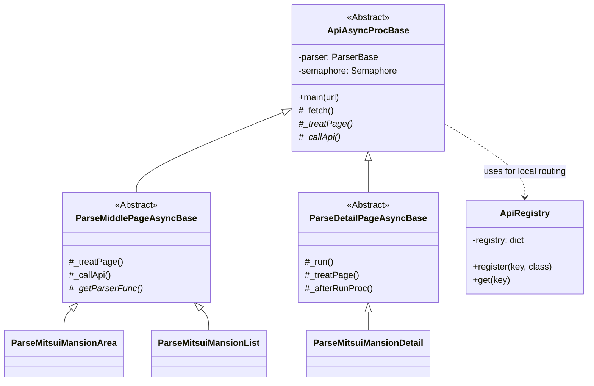
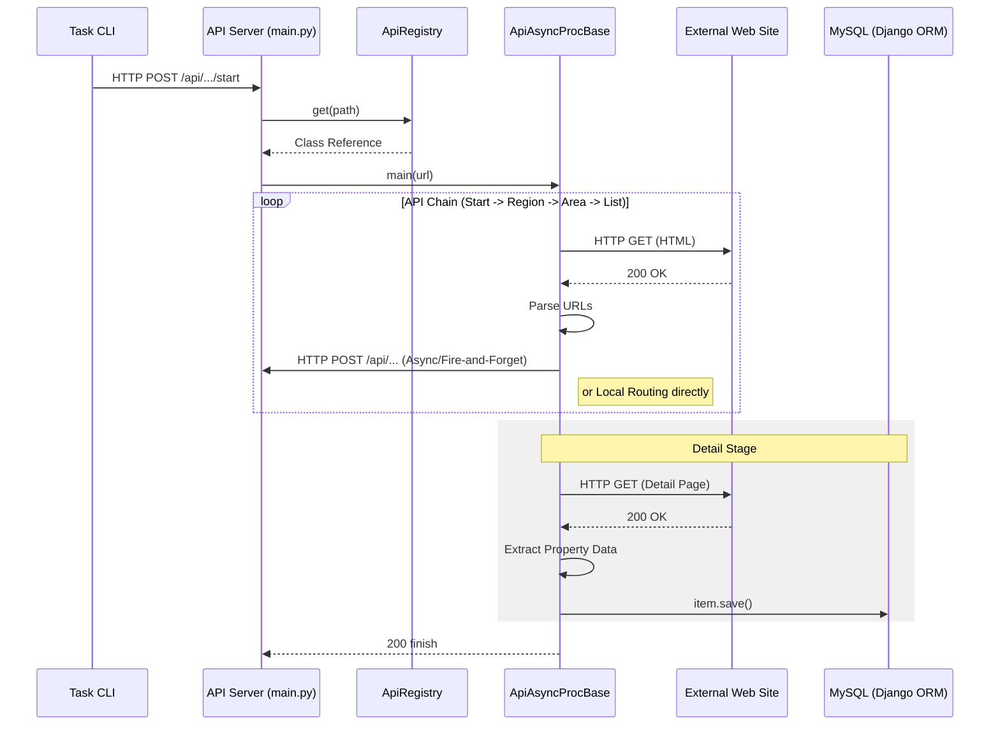
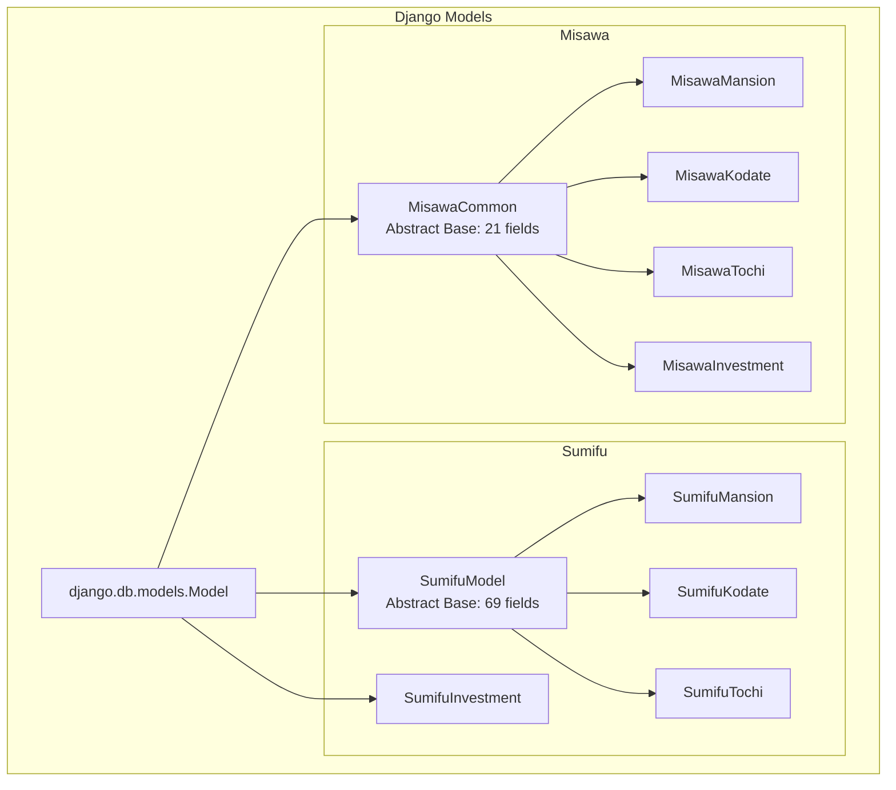

# 内部設計書 (Internal Design)

本システムの内部構造、クラス継承関係、およびデータフローについて設計図を用いて説明します。

## 1. クラス継承図 (Class Diagram)

API通信およびクローリングの中核となるクラス群は、`ApiAsyncProcBase` を頂点とした継承構造を持っています。

```mermaid
classDiagram
    class ApiAsyncProcBase {
        <<Abstract>>
        -parser: ParserBase
        -semaphore: Semaphore
        +main(url)
        #_fetch()
        #_treatPage()*
        #_callApi()*
    }

    class ParseMiddlePageAsyncBase {
        <<Abstract>>
        #_treatPage()
        #_callApi()
        #_getParserFunc()*
    }

    class ParseDetailPageAsyncBase {
        <<Abstract>>
        #_run()
        #_treatPage()
        #_afterRunProc()
    }

    ApiAsyncProcBase <|-- ParseMiddlePageAsyncBase
    ApiAsyncProcBase <|-- ParseDetailPageAsyncBase

    ParseMiddlePageAsyncBase <|-- ParseMitsuiMansionArea
    ParseMiddlePageAsyncBase <|-- ParseMitsuiMansionList
    ParseDetailPageAsyncBase <|-- ParseMitsuiMansionDetail

    class ApiRegistry {
        -registry: dict
        +register(key, class)
        +get(key)
    }

    ApiAsyncProcBase ..> ApiRegistry : uses for local routing
```

---

## 2. API チェーン・データフロー (Sequence Diagram)

`task crawl` コマンド実行から DB 保存までのシーケンスです。

```mermaid
sequenceDiagram
    participant CLI as Task CLI
    participant Srv as API Server (main.py)
    participant Reg as ApiRegistry
    participant Proc as ApiAsyncProcBase
    participant Site as External Web Site
    participant DB as MySQL (Django ORM)

    CLI->>Srv: HTTP POST /api/.../start
    Srv->>Reg: get(path)
    Reg-->>Srv: Class Reference
    Srv->>Proc: main(url)
    
    loop API Chain (Start -> Region -> Area -> List)
        Proc->>Site: HTTP GET (HTML)
        Site-->>Proc: 200 OK
        Proc->>Proc: Parse URLs
        Proc->>Srv: HTTP POST /api/... (Async/Fire-and-Forget)
        Note right of Proc: or Local Routing directly
    end

    rect rgb(240, 240, 240)
    Note over Proc, DB: Detail Stage
    Proc->>Site: HTTP GET (Detail Page)
    Site-->>Proc: 200 OK
    Proc->>Proc: Extract Property Data
    Proc->>DB: item.save()
    end
    
    Proc-->>Srv: 200 finish
```

---

## 3. モデル継承関係 (Data Model Inheritance)

複数の物件種別やサイト間で共通するフィールドを効率的に管理するため、Django の抽象基底クラスを利用しています。

```mermaid
graph TD
    subgraph Django Models
        Base[django.db.models.Model]
        
        subgraph Sumifu
            SBase[SumifuModel<br/>Abstract Base: 69 fields]
            SM[SumifuMansion]
            SK[SumifuKodate]
            ST[SumifuTochi]
            SI[SumifuInvestment]
        end

        subgraph Misawa
            MBase[MisawaCommon<br/>Abstract Base: 21 fields]
            MM[MisawaMansion]
            MK[MisawaKodate]
            MT[MisawaTochi]
            MIN[MisawaInvestment]
        end

        Base --> SBase
        SBase --> SM
        SBase --> SK
        SBase --> ST
        Base --> SI

        Base --> MBase
        MBase --> MM
        MBase --> MK
        MBase --> MT
        MBase --> MIN
    end
```

---

## 4. 重複検知ロジック

本システムでは、物件の重複を `pageUrl` フィールドで識別します。
- **Index**: データベースレベルで `pageUrl` に UNIQUE インデックスまたは一般インデックスを付与。
- **Save Logic**: 既存のURLが見つかった場合、Django ORM の `update_or_create` 相当のロジック、または保存前の存在チェックにより、データの「新規作成」か「更新」かを判別します。

---

## 5. 投資用物件の実装方針 (Investment Property Implementation Strategy)

投資用物件（収益物件）のクローリングおよびデータ保存においては、以下の通り**物件種別ごとの完全分離**を基本方針とします。

### 5.1 背景
投資用物件には以下の3つの主要な種別が存在し、それぞれ扱う属性データが大きく異なります。
1. **一棟マンション (Whole Mansion)**: 満室時想定年収、総戸数、建物構造（RC等）、エレベーター有無など、ビル全体に関わる項目が多い。
2. **一棟アパート (Whole Apartment)**: 一棟マンションに近いが、木造や軽量鉄骨が多く、独自の項目が必要な場合がある。
3. **投資用戸建 (Investment House)**: 通常の居住用戸建に近く、部屋数や間取りが重要だが、利回り情報も付随する。

これらを単一の「投資用全般テーブル」で管理しようとすると、NULL許容フィールドが大量に発生し、データ品質の管理が困難になります。また、将来的なメンテナンスコストも増大します。

### 5.2 アーキテクチャ方針

#### A. クローラークラスの分離
物件種別ごとに専用の `DetailParser` クラス（非同期処理クラス）を作成します。
汎用的なクラスで分岐処理を行うのではなく、明確にクラスを分けることで責務を分離します。

*   `Parse[SiteName]InvestmentMansionDetail`
*   `Parse[SiteName]InvestmentApartmentDetail`
*   `Parse[SiteName]InvestmentHouseDetail`

#### B. データベーステーブルの分離
物件種別ごとに独立したテーブル（Djangoモデル）を作成します。共通項目（価格、所在地、URLなど）は抽象基底クラス (`InvestmentBaseModel`) で定義し、継承させます。

| 物件種別 | テーブル名 (例) | モデルクラス名 (例) | 備考 |
| :--- | :--- | :--- | :--- |
| 一棟マンション | `[site]_investment_mansion` | `[Site]InvestmentMansion` | 建物全体情報中心 |
| 一棟アパート | `[site]_investment_apartment` | `[Site]InvestmentApartment` | 同上 |
| 投資用戸建 | `[site]_investment_house` | `[Site]InvestmentHouse` | 戸建情報＋利回り |

#### C. データフローの変更
ミドルページ（一覧ページ）の解析ロジック (`_treatPage`) において、リンク先の物件種別を判別し、適切な詳細ページ用パーサークラスへルーティングを行います。

**判別方法:**
*   多くのサイトでは一覧ページの各アイテムに「種別」がテキストで記載されています（例：「一棟マンション」「売アパート」）。
*   URL構造に種別が含まれる場合もあります（例: `/mansion/` vs `/apartment/`）。
*   これらを利用して、API Registryから呼び出すべきパーサークラスを動的に決定します。

---

---

## 6. システムアーキテクチャ & 設計方針 (Architecture Principles)

### 6.1 データベース接続コネクションプーリング方針
- 高並列クローリングおよび将来的な Cloud Functions 等のサーバーレス環境移行を見据え、`django-db-connection-pool` による DB コネクションプール管理を採用する。
- 接続上限およびリトライ処理を制御し、`Too many connections (1040)` エラーを未然に防ぐ。

### 6.2 Playwright 利用制限とメモリ並列数独立制御方針
- **Playwright 使用の最小化**: 原則 Playwright は WAF 対策が必須なサイト（Athome等）のみに限定し、その他のサイトでは Playwright を使用せず `aiohttp` 等の軽量HTTP通信に統一する。
- **高メモリジョブと標準ジョブの並列数分離**: `run_all_crawlers.py` で並行処理を行う際は、メモリ消費の大きい Playwright ジョブ上限（`--playwright-parallel`）と標準ジョブ上限（`--parallel` / `--standard-parallel`）を独立して制御する。

### 6.3 クロール処理とMLモデル評価の分離・バルク推論方針 (B案)
- **クローリングとML評価の分離**: クローリング時は同期的ML評価（モデルファイル読込＋推論）を行わず、パースおよびDB保存のみをミリ秒単位で完了させる。
- **バルク推論の実施**: ML 評価はモデルを1回のみメモリロードして一括処理するバルク評価バッチ（`run_bulk_ml_evaluation.py`）または一括評価ステップで処理する。

### 6.4 ユーザー指示の設計方針自動ドキュメント保持原則
- ユーザーから指示された設計方針・システム構成ルール・パフォーマンス制約は、単なる一回限りの対応で終わらせず、必ず [AGENTS.md](file:///.agents/AGENTS.md) および `docs/` 配下の仕様・運用ドキュメントに記載・更新して恒久的に保持する。

### 6.5 物件種別別 Base パーサー階層設計原則
- **階層型パーサーアーキテクチャ**: `ParserBase` 直下に、物件種別ごとの Base パーサークラス（`MansionParserBase`, `KodateParserBase`, `TochiParserBase`, `InvestmentParserBase` 等）を階層的に配置する。
- **全抽象メソッド化**: `ParserBase` には全種別共通項目（`_parsePropertyName`, `_parsePriceStr`, `_parsePrice`, `_parseAddress`, `_parseTransport1` 等）の `@abstractmethod` を定義し、種別特有のパース項目は各種別 Base クラスで `@abstractmethod` として定義する。
- **派生パーサーの完全継承強制**: 各社のパーサークラスは対応する種別別 Base クラスを継承し、未実装の抽象メソッドが存在しないよう厳格に保証する。

### 6.6 ライブ到達・全フィールド動的統合テスト設計原則
- **動的詳細URL抽出**: 各不動産サイトのスタート/一覧URLから最新アクティブ物件の詳細URLを自動抽出する。
- **全定義フィールド検証**: 単一物件パース後、そのモデルで定義された全取得対象フィールド（価格・住所・面積・間取り・構造・築年・交通・建蔽率・容積率等）を取り出し、パース漏れ（意図しない `None` や空文字列）が発生していないかを包括アサーションする。

### 6.6.1 全ジョブクローリング保証テスト設計 (Crawl Guarantee Matrix)
- **SSOT モジュール**: `package.utils.crawl_jobs.CRAWL_JOBS` を本番一括巡回とテストの共通定義とする。`run_all_crawlers.py` はこれを import して利用する。
- **カタログ解決**: `package.utils.crawl_job_catalog` が各ジョブの Start API クラス・シードURL・パーサーを実行時解決する。シード優先順位は `urlList` ➔ `SEED_URL` ➔ ルート関数リテラル / `get_start_url()`。
- **スモークエンジン**: `package.utils.crawl_smoke_engine` が本番パーサー経路で BFS し、詳細URL収集 → 詳細パース → `EXPECTED_SPEC_FIELDS_BY_TYPE` 検証 → `item.save` による DB 永続化確認を行う。独自セレクタによる ad-hoc 抽出は禁止。壁時計 ≤300秒のため会社別バジェットと Playwright 会社間直列＋静的オーバーラップを適用する。
- **ページング検証**: 一覧取得後に `parseNextPage` を呼び、次URLがあれば取得して `SmokeResult.pages_fetched >= 2`。次URL無しは `paging_exhausted=True`。`paging_ok = (pages_fetched >= 2) or paging_exhausted`。
- **種別判定検証**: 成功パース後に `PropertyTypeDetector.detect(use_ai=False)` と `expected_detector_type(job, parser)` を照合。不一致は `SkipPropertyException`。`SmokeResult.property_type_ok` をテストで必須アサート。
- **実行環境別並列プラン (`package.utils.live_parallel`)**:
  - `detect_live_parallel_mode()`: `CRAWL_LIVE_PARALLEL_MODE` 明示値、なければ `GITHUB_ACTIONS`/`CI` → `ci`、それ以外 → `local`。
  - `build_live_parallel_plan()`: 選択ジョブを静的バケット（Playwright 以外）と PW 会社バケット（mizuho → sekisui → athome、各 `-n 0`）に分割。
  - ローカル: 静的 `-n` = `CRAWL_LIVE_XDIST_LOCAL`（既定 `4`）、PW 各社 `-n 0`。
  - CI: 静的 `-n` = `CRAWL_LIVE_XDIST_CI`（既定 `auto`）、PW 各社 `-n 0`。
  - 実行器: `scripts/ops/run_live_crawl_guarantee.py` が静的 ∥ (mizuho → (sekisui ∥ athome)) で起動（壁 ≈ max(static, mizuho + max(sekisui, athome))）。スコープ指定（`CRAWL_GUARANTEE_SITES` 等）時は該当ジョブのみでプラン再構成。
- **命名規約強制**: Start API クラス名は `Parse{Company}{Type}StartAsync` に統一する（例: 京急戸建は `ParseKeikyuKodateStartAsync`）。規約逸脱はカタログ解決テストで FAIL。
- **テスト配置**:
  - オフライン: `tests/unit/test_crawl_job_catalog_sync.py`, `tests/unit/test_live_parallel.py`
  - ライブ: `tests/integration/test_live_crawl_guarantee.py`（`@pytest.mark.live`）

### 6.7 クローラー優先順位制御設計原則 (Smallest-Site-First)
- `run_all_crawlers.py` の実行リスト構成において、処理データ量の少ない小規模サイト・ハウスメーカー系・電鉄系サイトを先頭に配置する。
- 処理時間が長くなりがちな大手ポータル（Homes, Athome）および大手仲介を後半に割り当てることで、パイプライン中断時でも収集済みサイト数を最大化する。

### 6.8 連続タイムアウト Fast-Fail ＆ サーキットブレイカー設計原則
- 同一サイトに対するリクエストで連続 3 回以上のタイムアウト/通信不能が発生した場合、ジョブ実行エンジンが状態異常を検出して当該サイトの処理を即時 Abort（中断）する。
- リトライの無限ループや後続処理の完全停止（ハングアップ）を防止する。

### 6.9 0件取得失敗分類 ＆ 404掲載終了フィルタリング原則
- **Zero-Count Failure**: クローリングプロセスが正常終了しても取得件数が 0 件の場合は「成功」として扱わず「0件取得異常」としてシステムログ・Slackへ失敗判定を発報する。
- **404/掲載終了通知除外**: 対象詳細URLが 404 (Not Found) または掲載終了状態である場合は物件削除ライフサイクルとして検知し、Slack エラーアラートへの発報から自動除外する。

### 6.10 Slack疎通事前自己チェック設計原則 (Step 0)
- ジョブ起動前段階で `src/crawler/scripts/debug_tools/check_slack_connection.py` を事前実行し、設定中の全 Slack チャンネルへの API 送信権限およびチャンネル存在有無をテストする。
- 疎通失敗時はメインパイプラインの起動前に即座に失敗ログを出力して停止する。

### 6.10.1 パイプライン起動時 ProxySQL オンデマンド起動・起動チェック設計原則 (Step 0.2)
- クラウド環境（`IS_CLOUD=true` 等）におけるパイプライン（`run_pipeline.py`）の Coordinator 起動時、DB 接続待機（Step 0.4）に先立ち、ProxySQL MIG を `scale_proxysql_mig(target_size=1)` によりオンデマンド起動する。
- 起動直後にポート 6033 へのソケット疎通ポーリング（起動チェック: `wait_for_proxysql_health`、最大 120 秒）を実施し、ProxySQL がリクエスト受付可能状態になるまで確実に待機する。
- タイムアウト時は例外を送出してパイプラインを即座に中断し、終了時の `finally` 句で `ensure_resources_stopped.py` による縮小（teardown）を安全に実行する。

### 6.10.2 DB 待機 Fail-Fast 設計原則 (Step 0.4)
- `src/crawler/scripts/debug_tools/wait_for_db.py` は、Django `connection.ensure_connection()` の実行前に `socket.create_connection((host, port), timeout=3.0)` による軽量ソケット疎通確認を実施する。
- ホスト未起動・不通時に OS の TCP SYN タイムアウト（約 130 秒）による 1 時間超のハングを防止し、最大待機時間（60〜120秒）以内に失敗を検知して迅速に Fail-Fast 終了する。

### 6.11 本番コンテナイメージのアセット同梱設計原則 (Dockerfile Packaging)
- クローラー実行に必要な静的セレクター設定ファイル（`config/selectors/*.yaml`）は、本番 Docker イメージのビルド時に `/app/config/` 配下へ漏れなく COPY 同梱する。
- ローカル環境のボリュームマウント（ホストパス直結）への暗黙依存を排除し、Cloud Run 等のサーバーレス環境でもパーサーが `FileNotFoundError` を起こさず自己完結して動作可能であることを保証する。

### 6.12 リストページリンク抽出の物件種別・賃貸フィルタリングおよびパース安全性設計原則
- **種別外・賃貸リンクの厳格除外**: `baseParser.py` の `_parsePageCore` において、一覧ページから抽出されるリンクについて、`/chintai/`, `/rent/` などの賃貸物件URLおよび他種別へのクロスリンクを自動除外する。
- **セレクターパスプレフィックス照合**: `xpath_pattern` で `contains(@href, '...')` が指定されている場合、一覧解析時にその必須パス文字列（例: `/tochi/detail_`, `/mansion/detail_` 等）を抽出し、一致しない関連リンク（マンションおすすめリンク等）を `yield` 対象から排除する。
- **文字列操作およびシリアライズのNoneガード**: 各パーサー（`sumifuParser.py` 等）において、属性値の取得や文字列正規化（`normalize` 等）を行う際は `NoneType` に対する `.replace()` 呼び出しや、`lxml.html.tostring` への BeautifulSoup オブジェクト直接渡しを排除し、型安全かつ例外フリーなパース処理を保証する。

### 6.13 DB保存時文字列フィールドNoneサニタイズ原則および完全修飾URL結合ガード
- **CharField/TextField の None サニタイズ**: `baseParser.py` の `clean_parsed_item` において、`models.CharField` および `models.TextField` を対象に、値が `None` でかつ `not field.null`（DB側でNOT NULL制約）の場合は、一律空文字 `""` にサニタイズする。これにより、パース処理で `None` が代入された場合でも `IntegrityError: (1048, "Column '...' cannot be null")` の発生を完全に防ぐ。
- **URL結合における urljoin 適用原則**: 各パーサー（`sumifuParser.py` 等）において、リンク先URLを組み立てる際は文字列単純結合（`self.BASE_URL + linkUrl`）を廃止し、すべて `urllib.parse.urljoin` を適用する。これにより、取得したリンクが既に完全修飾URL（`https://...`）である場合に二重ホスト名（`www.stepon.co.jphttps:443` 等）が発生し DNS 解決不能となるバグを根絶する。

### 6.14 GCP Cloud Logging 構造化ロギングおよびログレベル適正化設計原則
- **GCP Cloud Logging 標準フォーマット準拠**:
  - `src/crawler/package/utils/logging_config.py` に Google Cloud Logging 準拠のカスタムプロセッサを実装。
  - 出力フィールド: `severity` (DEBUG/INFO/WARNING/ERROR/CRITICAL), `message`, `timestamp` (ISO 8601 UTC), `logger`, `logging.googleapis.com/sourceLocation` (`file`, `line`, `function`)。
  - 標準ライブラリ `logging` の出力を `structlog.stdlib.ProcessorFormatter` でブリッジし、プロジェクト内のすべての `logging.getLogger(__name__)` を自動で構造化。
- **環境自動判定と文字コードUTF-8強制**:
  - `K_SERVICE`, `CLOUD_RUN_JOB`, `GOOGLE_CLOUD_PROJECT`, `IS_CLOUD="true"`, または `LOG_FORMAT="json"` が存在する場合は JSON 構造化モード、それ以外はローカルコンソールモードで動作。
  - `sys.stdout.reconfigure(encoding="utf-8", errors="replace")` および `sys.stderr.reconfigure(encoding="utf-8", errors="replace")` を初期化時に実行し、GCP/Windows/Docker環境での日本語文字化け（`?` 置換）を根絶。
- **ログレベルの適正化**:
  - 毎物件発生する `Local routing: ...`, `Middleware Request/Response: ...`, `start/finished afterRunProc`, `Attempting/Successfully saved item (Single): ...` はすべて `DEBUG` レベルへ適正化。
  - 例外発生時は多重ログ出力を廃止し、単一の `logger.error(..., exc_info=True)` に集約して完全なスタックトレースを単一のJSONペイロード内に格納する。
### 6.15 野村不動産スペックテーブルのモーダル用語集除外およびツールチップ/ヘルプ除去原則
- **モーダル用語集テーブルの除外**: 野村不動産の詳細ページに配置されている `div.fullModal` などのモーダルダイアログ内の用語解説用テーブルは、物件スペックではなく用語説明であるため、スペック抽出（`_scrape_specs`）対象から完全に除外する。
- **th/dt/status からのヘルプ・ツールチップ要素除去**: `th`、`dt`、`item_status_title` のテキスト抽出前に、`.item_help`, `.icon_help`, `.tooltip`, `.help` 等の要素を `decompose()` してキー名に混入するのを防止し、正規化キー（`専有面積`, `間取り` 等）を正確に保持する。
- **ハイライトカードからの専有面積フォールバック**: `_parseSenyuMenseki` において、`specs` からの取得に加え、ページ内サマリーブロック（`td > div.inner` や `div.inner > div.heading: 専有面積` ➔ `p`）からの直接抽出フォールバックを実装し、NOT NULL 制約カラムの `IntegrityError` 発生を完全に抑止する。

### 6.16 Dependabot日次自動マージ＆自律修復スクリプト設計原則
- **モジュール配置**: `src/crawler/scripts/ops/dependabot_automerge.py`
- **主要クラス・関数**:
  - `DependabotPrInspector`:
    - `fetch_dependabot_prs()`: `gh pr list --app dependabot --state open --json number,title,mergeable,statusCheckRollup,headRefName,url` により一覧取得。
    - `evaluate_pr_status(pr_data)`: CI checks（`conclusion`, `status`）および `mergeable` を解析し、状態（`MERGE_READY`, `NEED_REBASE`, `CI_RUNNING`, `CI_FAILED`）を分類。
  - `DependabotAutoMerger`:
    - `execute_merge(pr_number)`: `gh pr merge <number> --squash --delete-branch` を実行。
    - `request_rebase(pr_number)`: コンフリクトまたは `master` 遅延に対し、`gh pr update-branch` または PR コメントに `@dependabot rebase` を投稿して自動再生成。
    - `report_summary()`: 処理結果（マージ成功件数、リベース要求件数、CI実行中・失敗件数）を集計出力。
- **CLIオプション**:
  - `--dry-run`: 実際のマージやコメント投稿を行わず状態判定のみ出力（ローカル監視用）。
  - `--auto-rebase`: コンフリクト/遅延PRに対して自動リベース要求を発行。
  - `--auto-merge`: CI成功済みPRの自動マージを実行。
- **GitHub Actions 連携 (`.github/workflows/dependabot-automerge.yml`)**:
  - 定時（JST 09:00 / UTC 00:00）に実行され、`--auto-merge --auto-rebase` を指定してスクリプトをキック。
  - 実行サマリーを `$GITHUB_STEP_SUMMARY` へ Markdown 出力。

### 6.17 CI並列分散ワークフロー・差分スキップおよび先行実行設計仕様
- **pytest-xdist マルチプロセス並列化**:
  - 通常の unit / integration（非 live）は `pytest -n auto` で CI ランナーの CPU を自動検出して並列実行する。
  - ライブ保証（`@pytest.mark.live`）はローカルと CI でワーカー数・バケット方式を分離する（§6.6.1）。PR integration は `-m "not live"`。
  - `pytest-cov` の `--cov` オプションと併用し、並列テスト実行結果からカバレッジをマージして `coverage.xml` を出力する。
- **test.yml マトリクス並列化および集約ゲート**:
  - `strategy.matrix.test-group`:
    - `unit`: `src/crawler/tests/unit/`（単体テスト群、428件）
    - `integration`: `src/crawler/tests/integration/ -m "not live"`（ネットワーク依存ライブ除外）
    - `ml`: `src/crawler/tests/test_ml_pipeline.py src/crawler/tests/test_image_handler.py`（ML学習・画像処理テスト）
  - 各マトリクスジョブ（`test-matrix`）が独立した GitHub Actions ランナーで完全並行稼働。
  - 集約ジョブ `test`（`needs: test-matrix`）により、ブランチ保護ルール互換性を維持しつつ全マトリクスの合否を一元判定。
- **変更差分フィルタリング (`dorny/paths-filter`)**:
  - `docs`: `['docs/**', '*.md', '.agents/**', 'LICENSE']` のみの変更時はテスト・Dockerビルドを完全スキップ。
  - `terraform`: `['terraform/**']` の変更時はアプリテストをスキップして `terraform-plan` のみ実行。
  - スキップ時でも集約ジョブ `test` は成功ステータスを返し、PRマージをブロックしない。
- **SonarCloud 先行独立パイプライン**:
  - PR作成/更新時に最優先で独立起動。
  - `-m "not live"` オプションにより外部実サイトへの生通信テストを除外し、モック＆単体テストで純粋なコードカバレッジを高速測定（所要時間2分以内）。
- **Production PR 完全並列化**:
  - `production` 宛て PR では `Verify Source Branch is master`、Terraform Plan、テストマトリクス、Snykスキャンを待ち時間ゼロで完全同時並行起動。
- **Docker BuildKit GHA キャッシュ連携**:
  - `docker/setup-buildx-action` と BuildKit cache (`type=gha,scope=app`) を利用し、Dockerレイヤーキャッシュ（OS依存・Python依存パッケージ・Playwrightブラウザ）をGitHub Actions Cache上に永続化。
  - キャッシュヒット時はイメージの再ビルドをスキップし、起動オーバーヘッドを4分半から20秒未満に圧縮する。

### 6.18 不動産価格 (price) BigIntegerField 拡張および 32-bit オーバーフロー防止ガード設計原則
- **BigIntegerField へのモデル拡張**: `PropertyBaseModel.price` を `models.IntegerField`（符号付き 32-bit INT、上限 2,147,483,647円＝約21.4億円）から `models.BigIntegerField`（符号付き 64-bit BIGINT、上限 約922京円）へ変更する。これにより、一棟売りビル、投資用大規模マンション、都心高級レジデンス等の21.4億円超（24億円、30億円、50億円等）の高額物件において発生する `django.db.utils.DataError: (1264, "Out of range value for column 'price' at row 1")` を根絶する。
- **保存前サニタイズ (クランプ安全ガード)**: `baseParser.py` の `clean_parsed_item` において、`price` 値が数値型として正しくパースされているかを保証し、未マイグレーション環境等における MySQL `INT` カラムへの適合性を担保するフェイルセーフ機構を配置する。

### 6.19 住友不動産ステップ投資物件 Shift_JIS(CP932) エンコーディング適正化原則
- **Shift_JIS(CP932) レスポンスの正確なデコード**: 住友不動産ステップの投資用物件詳細ページ（`/pro/detail_...`）はサーバーから Shift_JIS (CP932) で配信される。`SumifuInvestmentParserBase.getCharset()` の戻り値を `"cp932"` に明示指定し、従来の UTF-8 強制デコードによる全日本語文字（`所在地`, `価格` 等）の化け（`\ufffd` への置換）およびそれに伴う `StrictExtractionFailed: address is empty` 例外（48時間で109件発生）を根絶する。

### 6.20 非物件リンク・JavaScript URL 厳格除外および数値カラム NOT NULL/オーバーフローガード原則
- **非物件リンク・JavaScript 擬似リンクの除外**: `baseParser.py` の `_parsePageCore` および各社パーサーの `parsePropertyListPage` / `parseNextPage` において、`javascript:`, `mailto:`, `tel:`, `#`, および問い合わせページ（`/inquiry`, `/contact`）のリンクを完全除外する。これにより `urljoin` による `https://...javascript:void(0);` 結合異常（`InvalidUrlClientError`）および問い合わせページの誤パースによる `'NoneType' object has no attribute 'replace'` を根絶する。
- **数値フィールドの NOT NULL ガードおよび 32-bit INT クランプ**: `clean_parsed_item` において、`annualRent`, `monthlyRent`, `soukosu`, `chikunen` 等の数値カラムが `None` でかつ DB 側 `NOT NULL` 制約の場合は自動で `0` を代入し `IntegrityError (1048)` を防止する。また `IntegerField` に対し 21.4億円超の値が代入された際は 32-bit 最大値（`2147483647`）へ自動クランプし `DataError (1264)` の発生を完全に抑止する。
### 6.21 Slack アラートチャンネル通知内容のERRORレベルログ同期原則
- **アラート送信時のERRORログ出力強制**: `package.utils.slack.send_slack_message` において、送信先がアラートチャンネル（`is_alert_channel(channel) == True`）である場合、Slack API の成否に関わらず、必ず `logger.error(f"[SLACK ALERT -> {channel}]:\n{message}")` を同期出力する。
- **アラートチャンネル判定ロジック (`is_alert_channel`)**:
  - チャンネル名が `alerts-` で始まる場合（`#alerts-mansion`, `#alerts-kodate`, `#alerts-tochi`, `#alerts-invest-apartment`, `#alerts-invest-kodate`, `#alerts-invest` 等）
  - チャンネル名が `property_alert` の場合
  - 環境変数 `SLACK_ALERT_*`（`SLACK_ALERT_PROPERTY_ALERT`, `SLACK_ALERT_MANSION`, `SLACK_ALERT_KODATE`, `SLACK_ALERT_TOCHI`, `SLACK_ALERT_INVEST_APARTMENT`, `SLACK_ALERT_INVEST_KODATE`, `SLACK_ALERT_CHANNEL_ID` 等）で設定されたIDまたは名称と一致する場合
  - 既知のアラートチャンネルID（`C0BJWUCTRNU`, `C0BHZA5ASDT`, `C0BJ2JVGCLS`, `C0BJ6B4R3E0`, `C0BJ0KSJEDC` 等）に一致する場合
- **GCP Cloud Logging / 外部監視との連携**: アプリケーションログに `severity: ERROR` で出力されることにより、GCP Cloud Logging のログスキャン（`severity>=ERROR`）や 24時間監視バッチで Slack アラート発報の事実・内容が漏れなく集約されることを保証する。
- **データバリデーションスクリプト (`validate_data.py`) のログレベル適正化**: 異常データ検出時のチャンネル通知ログを従来の `logging.info` から `logging.error` に改め、アラート内容全文をエラーログとして確実に残す。

### 6.22 APIリクエスト・レスポンスのペイロード構造化ログ出力原則
- **Flask APIサーバー (`main.py`) のフック**:
  - `before_request` フック (`log_api_request`):
    - `flask.g.request_start_time` によるリクエスト開始時刻の保持。
    - クエリパラメータ (`request.args`)、リクエストボディ（JSONの場合は `request.get_json(silent=True)`、Formの場合は `request.form.to_dict()`、Rawテキストの場合は先頭2000文字）を抽出。
    - 機密情報サニタイズ: ヘッダー (`X-API-KEY`, `Authorization`) やボディ内のキー（`password`, `token`, `secret`, `key` 等）を `***` に自動マスキング。
    - 出力形式: `logging.info(f"[API Request] {request.method} {request.path} | Params: {params} | Body: {body}")`
  - `after_request` フック (`log_api_response`):
    - 処理所要時間 (`duration_ms`) のミリ秒計算。
    - レスポンスボディの取得（JSONまたはテキスト）。2000文字を超える場合は自動クランプ。
    - ステータスコードに基づくログレベル決定: 2xx/3xx ➔ `INFO`, 4xx ➔ `WARNING`, 5xx ➔ `ERROR`。
    - 出力形式: `logging.log(level, f"[API Response] {request.method} {request.path} | Status: {response.status_code} | Duration: {duration_ms}ms | Body: {body}")`
  - 静的アセット・ヘルスチェック（`/health`, `/docs` 等）の除外: ログ容量圧迫を防ぐためペイロード出力対象から除外。
- **クローラー非同期通信ミドルウェア (`package/api/middleware.py`)**:
  - `LoggingMiddleware.process_request`: メソッド・URLに加えてリクエストペイロード（URL, 引数パラメータ）を `INFO` レベルで出力。
  - `LoggingMiddleware.process_response`: ステータス・URLに加えてレスポンスデータプレビューを `INFO` レベルで出力。

### 6.23 ユニット完全性検証ミューテーションテスト機構原則
- **Level 1 (ドメイン・データ故意破損注入)**:
  - 対象: 全94モデルおよび各種別パーサー（マンション・戸建・土地・投資）
  - 破損パターン: 必須・重要スペック項目（`price`, `address`, `senyuMenseki`, `tochiMenseki`, `tatemonoMenseki`, `madori`, `kouzou`, `grossYield`, `annualRent` 等）に対し、`None`（欠損）、`0 / Decimal(0)`（不正数値）、`""`（空文字）、境界値外データの注入。
  - アサーション: `validate_extracted_fields` により100%捕捉され、構造化JSONログ (`[PARSER_EXTRACTION_ERROR]`) が出力されることを保証。
  - 未分類項目防止: `ParserBase.get_classified_fields()` と全モデルフィールドの差分が0件であることを動的照合。
- **Level 2 (コード構文木AST変異エンジン)**:
  - クラス: `package.testing.mutation_engine.ASTMutationEngine`
  - 変異規則: 比較演算子反転（`==` ↔ `!=`, `<` ↔ `>=`, `>` ↔ `<=`, `in` ↔ `not in`）、論理演算反転（`and` ↔ `or`）、戻り値破壊（`return True` ↔ `return False`, `return obj` ↔ `return None`）。
  - サンドボックス実行: 元ソースをバックアップし、一時的に変異コードを適用 ➔ 該当ユニットテストを実行 ➔ テスト失敗時「KILLED（殺傷成功）」、テスト成功時「SURVIVED（生存：盲点）」として記録 ➔ 即時元ファイルへ復元。
- **運用スクリプト (`src/crawler/scripts/run_mutation_testing.py`)**:
  - 引数: `--mode [all|data|code]`, `--threshold [85]`, `--target [module/file]`, `--report [path]`
  - 出力: 変異体総数、殺傷数、生存数、キル率（Mutation Score）、および生存変異体のソース行・内容。
  - Taskfile連携: `task test:mutation`, `task test:mutation-data`, `task test:mutation-code`。

### 6.24 SonarCloud事前検証ローカルガードレール内部設計原則 (Local Sonar Guardrail Internals)
- **高速AST静的解析エンジン (`check_local_sonar.py`)**:
  - Python標準モジュール `ast` を利用し、外部依存なしで実行（1ファイル平均 10〜30ms）。
  - **S3776 認知的複雑度 (Cognitive Complexity) 算定アルゴリズム**:
    - `If`, `For`, `While`, `ExceptHandler` を検知時にベーススコア +1、さらにカレントネスト深度（`nesting_level`）を加算。
    - ブール演算子（`BoolOp`: `and`, `or`）の出現ごとに +1。
    - 早期リターン（`Return`, `Raise`, `Break`, `Continue`）はネストを浅く保つ設計を推奨するため直接の加算は行わない。
    - 関数・メソッド単位でスコアを累積し、閾値（デフォルト15）を超過した場合は関数名、開始行、超過スコア、および寄与した制御構文を行番号付きで報告。
  - **S8786 ReDoS（正規表現バックトラッキング）静的検知アルゴリズム**:
    - コード中の `re` モジュール呼出し（`re.search`, `re.match`, `re.compile`, `re.findall`, `re.sub` 等）のリテラル引数を抽出。
    - 以下の危険パターンを正規表現および構文木走査で検出:
      1. ネストした量指定子: `(a+)+`, `([a-z]*)*` 等
      2. 貪欲マッチの連打: `.*.*`, `.+.*`, `.*[a-z]+.*` 等の曖昧境界
      3. 終端・開始の境界が曖昧な広域マッチ
  - **Git差分検出モード (`--diff`)**:
    - `git diff --name-only origin/master...HEAD` および未コミットの変更ファイルから対象の `.py` ファイルを自動抽出。
    - `tests/`、`migrations/`、`Temp/` 等の除外ディレクトリは `sonar-project.properties` と同様にスキップ。
  - **プッシュ前ガード (`.githooks/pre-push`) 統合**:
    - リモート push 実行時、Issue 番号検証に成功した後、自動的に `python src/crawler/scripts/debug_tools/check_local_sonar.py --diff` を実行。
    - 違反が1件でもあれば exit code 1 で push を拒否。開発者に修正箇所を即時案内。
    - バイパス用環境変数 `SKIP_SONAR_CHECK=1` または `git push --no-verify` をサポート。

### 6.25 GitHub Issue アクセプタンスクライテリアPR制限ゲートウェイ内部設計原則
- **受入基準検証エンジン (`check_issue_criteria.py`)**:
  - `gh issue view <issue_num> --json number,title,body,state` により対象Issueの本文を取得。
  - 正規表現 `^[-*]\s+\[([ xX])\]\s+(.*)$` により Markdown タスクリストチェックボックスを抽出・分類。
  - **検証ルール**:
    1. Issue未紐付け / 存在しない場合: 検出不可エラー (Exit Code 1)
    2. チェックボックス0件の場合: 受入基準未定義エラー (Exit Code 1)
    3. 未チェック項目（`- [ ]`）が存在する場合: 未完了基準一覧を出力しエラー (Exit Code 1)
    4. 全項目チェック済み（`- [x]`）の場合: 成功 (Exit Code 0)
- **GitHub Actions 連携 (`.github/workflows/issue-gate.yml`)**:
  - PRオープン・更新・編集時に、PRに紐づく Issue を照会し、未チェック項目が存在する場合は自動的に PR コメント（未完了基準一覧）を投稿した上で CI を FAIL とし、マージをブロック。
- **Taskfile 連携**:
  - `task pr-check`: カレントブランチの Issue 受入基準をローカル検証。
  - `task pr-create`: 受入基準全件充足を事前検証した上で `gh pr create` を安全に起動。

### 6.22 DBコネクションプールPre-Pingおよび短縮リサイクル原則
- **QueuePoolの死活検出と再接続**: `realestateSettings.py` における `dj_db_conn_pool` の `POOL_OPTIONS` に `'PRE_PING': True` を設定し、チェックアウト時に `SELECT 1` 等の死活検証を自動実行。サーバー側でアイドル切断された接続をチェックアウト時に検知・自動再接続することで、`MySQLdb.OperationalError: (2013, 'Lost connection to server during query')` の発生を大幅に軽減する（※実行中クエリの中断エラー防止等のため、アプリケーション層のリトライ設計と併用）。
- **リサイクル間隔の短縮**: `RECYCLE` 設定を従来の 1800秒（30分）から 300秒（5分）へ短縮する。接続は 300 秒を超過した後の次回 checkout 時に破棄・再作成される。アイドル切断の検知と再接続には `PRE_PING` を併用する。

### 6.26 クローリング実行状況レポート時間粒度拡張および異常クローラー修復内部設計
- **所要時間フォーマット関数 (`format_duration`)**:
  - 秒数を受け取り、`〇時間〇分〇秒`、`〇分〇秒`、`〇秒` の最小表現に整形。
- **実行状況集計拡張 (`run_all_crawlers.py`)**:
  - バッチ開始時 (`batch_start_dt`) および終了時 (`batch_end_dt`) のタイムスタンプを保持し、所要時間を算出。
  - プロセス起動時および回収時に各ジョブの `start_time`、`end_time`、`duration`、`scraped_cnt` を `results` 配列に記録。
  - Slack通知生成時、`db_summary`（会社×種別）と `job_timings` を結合し、件数とともに `(開始: HH:MM:SS, 終了: HH:MM:SS, 所要: 〇分〇秒)` を出力。
- **異常クローラー4件の修復**:
  1. **三井 (mitsui - mansion/kodate/tochi)**: `config/selectors/mitsui.yaml` の `root_xpath` を `//a[contains(@href,'prefecture/') and not(contains(@href,'/store/'))]/@href` に更新し、`getRootDestUrl` で相対リンク `/buy/{section}/prefecture/...` を正しく解決。`baseParser.py` の `_parsePageCore` で `not(contains(...))` および `starts-with(...)` を正確に評価するよう改修。
  2. **東急 (tokyu - tochi)**: `tokyu_routes.py` の開始URLを `https://www.livable.co.jp/kounyu/tochi/select-area/` に変更し、都道府県選択ページから市・区リストへの巡回ルートを確立。
  3. **京王 (keio - mansion)**: CloudFront WAFの制約を回避するため、WP REST API (`get_search_result_sale`) 取得時は `asyncio.to_thread` 経由で `requests.get` を呼び出し、正常にJSONおよびHTMLカード群（36件）を取得可能に修復。
  4. **ミサワ (misawa - invest_kodate)**: 収益・事業用の正式種別コード `bukken_type[]=9` を指定し、OpenSSL 3.0環境に対応するため `_generateConnector` の SSL Context に `DEFAULT@SECLEVEL=1` を設定。
- **種別跨ぎ同件数防止ガード (旭化成 afr)**:
  - `AfrMansionParser` において `専有面積` が存在しない物件を `SkipPropertyException` でスキップ。
  - `AfrTochiParser` において `建物面積` / `間取り` が存在する戸建物件を `SkipPropertyException` でスキップ。

### 6.27 広域クローリング巡回およびTailwind CSS/多段ページネーション修復内部設計
- **大和ハウス (daiwa) ページネーション修復**:
  - Tailwind CSS化（`.pagination`等の旧クラス完全廃止）に伴い、`parseNextPage` において `a[href*="page="]` や現在のページ番号の次番号リンク、または次へ遷移用コンポーネントを検出する汎用抽出ロジックを実装。全81ページ（1,600件以上）の連続巡回を可能とする。
- **大京 (daikyo) ページネーション & 広域化修復**:
  - `parseNextPage` で `.jsPagingNext`, `.result-pager__link`, `a[href*="page="]` をサポートし、2ページ目以降の途絶を解消。
  - `daikyo_routes.py` において東京都（`p13`）限定指定から、全国主要都道府県リストまたは全国検索URLへのパラメータ展開をサポート。
- **京王 (keio) HTTP Referer検証対応**:
  - WP REST API (`get_search_result_sale`) 取得時、CloudFront/WAFの403 Forbiddenを回避するため、`Referer: https://chukai.keiofudosan.co.jp/` をリクエストヘッダに常時設定。
- **三井 (mitsui) & 東急 (tokyu) エリア多段ドリルダウン修復**:
  - 三井: 都道府県エリアページ（`/prefecture/XX/`）から市区案内親ページ（`/city/`）ではなく、各市区個別一覧ページ（`/city/XXXXX/`）を直接抽出して展開するようセレクタを是正。
  - 東急土地: `/select-area/` から愛知県のみでなく、全都道府県の `select-area/` および各市区 `a<city_code>` へ整合性高くドリルダウンするよう修正。
- **アットホーム (athome) 市区町村別多段ページネーション拡張**:
  - 市区町村別の一覧ページを展開後、1ページ目のみで終了せず、各市区の次ページリンク（`parseNextPage`）も順次取得・巡回するよう拡張。

### 6.28 SonarCloudリモート検査・外部API呼び出しの有限時間タイムアウト内部設計
- **背景と課題**:
  - SonarCloud の Quality Gate 状態や未解消課題をリモート API で確認する際、curl コマンド等にタイムアウトが設定されていないため、Windows PowerShell環境やネットワーク遅延時にプロセスが無限待機（ハング）し、バックグラウンドタスクとして滞留し続ける事象が発生していた。
- **専用検証スクリプト (`src/crawler/scripts/debug_tools/check_sonar_remote.py`)**:
  - **ソケット単位の有限時間タイムアウト保証**: `urllib.request.urlopen` に明示的な `timeout` 引数（デフォルト 10.0 秒、CLI オプション `--timeout` で指定可能、最大 10.0 秒まで）を強制設定。ソケットの接続（connect）および読み取り（read）の各操作がそれぞれ指定秒数以内に完了しない場合は `TimeoutError` / `URLError` として即座に終了する。なお、この保証はソケット単位の個別操作に対するものであり、複数の API コールを含む処理全体のエンドツーエンド実行時間を 10 秒以内に収めることを保証するものではない（`_execute_api_get` を複数回呼び出す場合、合計所要時間はタイムアウト値の倍数を超え得る）。
  - **対象指定の柔軟性**: `--pr <pr_number>` または `--branch <branch_name>` を指定することで、対象の Quality Gate ステータス（`project_status`）および未解消課題（`issues/search`）を安全に照会可能。
  - **出力形式とエラーハンドリング**:
    - 通常モードでは人間が視認しやすいフォーマットで Quality Gate の OK / ERROR 判定およびメトリクス一覧を出力。
    - `--json` フラグにより構造化 JSON 出力をサポート。
    - タイムアウト発生時、HTTP エラー時、または Quality Gate 不合格時は適切なエラーメッセージを出力し非ゼロの終了コードで終了。終了コード対応表:
      - `Exit Code 0`: 成功（Quality Gate PASS / OK）
      - `Exit Code 1`: Quality Gate 不合格（FAIL / ERROR）または HTTP / API 接続エラー
      - `Exit Code 2`: タイムアウト発生（SonarTimeoutException）
  - **curl コマンド実行規約の制定**:
    - シェルから直接 curl を呼び出す場合は必ず `--max-time 10 --connect-timeout 5` を付与することを義務付け、生 curl のタイムアウトなし実行を禁止。

### 6.29 ログ構造化およびHTMLタグ断片漏洩防止内部設計 (Issue #312)
- **背景と課題**:
  - クローラー実行時、レスポンスボディに含まれる改行コード付きの生HTML（404/500エラーページ等）がそのまま出力された結果、Google Cloud Loggingの標準出力パーサーによって複数行に分割され、末尾の `</body></html>` 等のタグ断片が単体ログエントリとして記録される事象が発生していた。
  - また、一部のモジュール（`package.api.__init__`）でプレーンテキストの二重StreamHandlerがルートロガーに追加され、構造化JSONログとテキストログの重複や非構造化出力が生じていた。
- **改修内容**:
  1. **`LoggingMiddleware` のボディサニタイズ (`package.api.middleware`)**:
     - `_sanitize_log_body` メソッドを新設し、ログ出力前の `data`/`text` について改行・連続空白を単一スペースへ圧縮（1行化）およびクランプ（1000文字）。これによりGCP Cloud Loggingでの複数行分割・タグ単体出力を物理的に根絶。
  2. **`api_logger.get_logged_body_preview` のサニタイズ強化 (`package.utils.api_logger`)**:
     - APIリクエスト・レスポンスのプレビュー文字列抽出時、改行・連続空白を圧縮して出力するよう改修。
  3. **二重ハンドラの排除 (`package.api.__init__`)**:
     - `package/api/__init__.py` において標準の非構造化 `StreamHandler` / `FileHandler` を追加していた箇所を廃止し、`logging_config.configure_logging()` による統一構造化ロガー設定へ統合。
  4. **単体・構造化ログテストの拡充 (`tests/unit/test_middleware.py`, `tests/unit/test_logging_structure.py`)**:
     - 改行を含むHTML文字列が正しく1行化され、複数行分割されないことを担保するアサーションテストを追加。

### 6.30 CI/CD高速化・Dockerキャッシュ最適化・重複テスト排除内部設計 (Issue #368)
- **背景と課題**:
  - `Dockerfile` のレイヤー順序において `COPY src/` が `RUN playwright install --with-deps chromium` より前に記述されていたため、コード変更コミットごとにブラウザおよび apt 依存パッケージの再インストール（約5分30秒）が GHA マトリクスジョブ全件で重複発生していた。
  - `sonar.yml` が `test.yml` とは独立して Docker ビルド、DB 起動、全件 pytest を実行しており、SonarCloud ジョブだけで 10〜15 分を消費していた。
  - `test.yml` の `unit` および `mutation` ジョブにおいて不要な MySQL コンテナ起動・マイグレーション待ち（約1分15秒）が発生していた。
  - `review-gate.yml` が CodeRabbit の commit status 完了イベントを検知できず、初期判定で `pending` となった Gate が永久放置される事象が発生していた。
- **改修内容**:
  1. **`Dockerfile` レイヤーキャッシュ最適化**:
     - `RUN playwright install --with-deps chromium` を Poetry 依存インストール（`poetry install`）直後に移動し、`COPY config/` および `COPY src/` をその後に配置。
     - コード変更時にブラウザ依存層がキャッシュヒットし、Docker ビルドを 5秒以内に完了させる。
  2. **`review-gate.yml` のトリガー拡充**:
     - `workflow_run.workflows` に `"Parser Tests"` および `"SonarCloud Analysis"` を追加。
     - 長尺のテストや静的解析が完了した時点で Review Gate が自律再評価され、CodeRabbit 完了状態を検知して Gate を最新化する。
  3. **`test.yml` と `sonar.yml` のカバレッジ共有と重複排除**:
     - `test.yml` のテスト実行でカバレッジ成果物（`coverage.xml`）を出力し、GHA アーティファクトとして保存。
     - `sonar.yml` は重複した Docker ビルド・テスト再実行を廃止し、カバレッジ成果物を読み込んでスキャンのみを実行（所要時間を 1〜2 分に短縮）。
  4. **マトリクスジョブの DB 起動条件分岐**:
     - `test.yml` において、`needs_db: true` のジョブ（`integration`, `ml-pipeline` 等）のみ MySQL 起動とマイグレーションを実行し、DB 不要な `unit` および `mutation` では起動をスキップ。
  5. **ローカルシフトレフトコマンド整備 (`Taskfile.yml`)**:
     - `task ci:precheck` を新設し、Ruff、Semgrep、Unit Tests、PR Mutation スコア（80%）を手元でワンステップ検証可能にする。

### 6.31 パーサー未取得項目のダミー・推測値フォールバック全廃内部設計 (Issue #400)
- **背景と課題**:
  - `misawaParser`, `mitsuiParser`, `nomuraParser`, `sumifuParser`, `tokyuParser` において、対象ページに記載がない場合に空文字や `None` ではなく、固定値（"-"）や推測値（"相談", "即時", "仲介", "所有権", "可", "不要", "不明"）を代入・返却していた。
  - これにより、DB内に事実と異なる推測データが永続化され、検索・フィルタリングや価格推定MLモデルの学習・特徴量に歪みを生じさせていた。
- **改修内容**:
  1. **`misawaParser`**:
     - `_parseNeighborhood`, `_parseSchoolDistrict`, `_parseTransactionType`, `_parseUrbanPlanning`, `_parseKakuninBango`, `_parseSetback`, `_parseBiko`, `_parsePrivateRoadFee` の `or "-"` を `or ""` に変更。
     - `_parseTochikenri_I` の `or "所有権"` を撤廃し、未取得時は `""`。
     - `_parseDeliveryDate_I` の `or "即時"` を撤廃し、未取得時は `""`。
     - `_parseTransactionType_I` の `or "仲介"` を撤廃し、未取得時は `""`。
  2. **`mitsuiParser`**:
     - `_parsePropertyDetailPage` における `item.kadobeya = "-"` を `item.kadobeya = item.saikouKadobeya` に改修。
     - `_parseKouzou`, `_parseKanriKeitaiKaisya`, `_parseSaikouKadobeya`, `_parseKenchikuJoken`, `_parseChimoku`, `_parseYoutoChiiki`, `_parseKuiki`, `_parseKokudoHou` の `specs.get(..., "-")` を `specs.get(..., "")` に変更。
     - `_parseSetudouDetails` における `douroKubun`, `douroMuki` の初期値を `"-"` から `""` に変更。
     - `_parseKouzouFromKaisuKouzou` の `"-"` 返却を空文字返却に変更。
  3. **`nomuraParser`**:
     - `_parseCurrentStatus` の `or "不明"` を撤廃（`specs.get("現況", "")`）。
     - `_parseHikiwatashi` の `or "相談"` を撤廃。
     - `_parseTorihiki` の `or "仲介"` を撤廃。
     - `_parsePropertyDetailPage` (土地) における `item.kaisuStr = "-"` を `item.kaisuStr = ""` に変更。
     - `_parseHikiwatashiInvest` のデフォルト `"即時"` を撤廃。
     - `_parseTorihikiInvest` のデフォルト `"仲介"` を撤廃。
     - `_parseKouzouInvest` のデフォルト `"不明"` を撤廃。
  4. **`sumifuParser`**:
     - 各パーサーの `_parseChiikiChiku`, `_parseBoukaChiiki`, `_parseSonotaChiiki`, `_parseMadori`, `_parseCurrentStatus`, `_parseKouzou`, `_parseChikunengetsuStr`, `_parseTochikenri`, `_parseTochiMensekiStr`, `_parseSaikou`, `_parseKadobeya`, `_parseKanriKeitai`, `_parseKanriKaisya`, `_parseKaisuStr`, `_parseKenchikuJoken`, `_parseChimoku`, `_parseSetsudou`, `_parseYoutoChiiki`, `_parseKokudoHou`, `_parseChisei`, `_parseChimokuChisei`, `_parseKaisuKouzou` で未取得時に返却されていた `"-"` をすべて空文字 `""` に統一。
  5. **`tokyuParser`**:
     - `_parseDouroKubun`, `_parseChisei`, `_parseBoukaChiiki`, `_parseSonotaChiiki`, `_parseKenchikuJoken` の未取得時 `"-"` を `""` に変更。
     - `_parseSaikenchiku` において、備考に「再建築不可」がない場合に「可」を推測返却していた処理を撤廃し、明示されていない場合は `""` を返却。
     - `_parseKokudoHou` において、備考に「国土法」がない場合に「不要」を推測返却していた処理を撤廃し、明示されていない場合は `""` を返却。

---

## 7. 参照ドキュメント

- [データベース定義書 (Database Schema)](database_schema.md): 完全なテーブル・カラム定義
- [API構造ドキュメント (API Structure)](api_structure.md): エンドポイント構造と処理フロー
- [SonarGuardrail運用ガイド](../implementation/sonar_guardrail_guide.md): VSCode設定およびコーディングパターン集

---

**最終更新**: 2026年9月21日  
**バージョン**: 3.0 (ログ構造化およびHTMLタグ断片漏洩防止内部設計追記)

