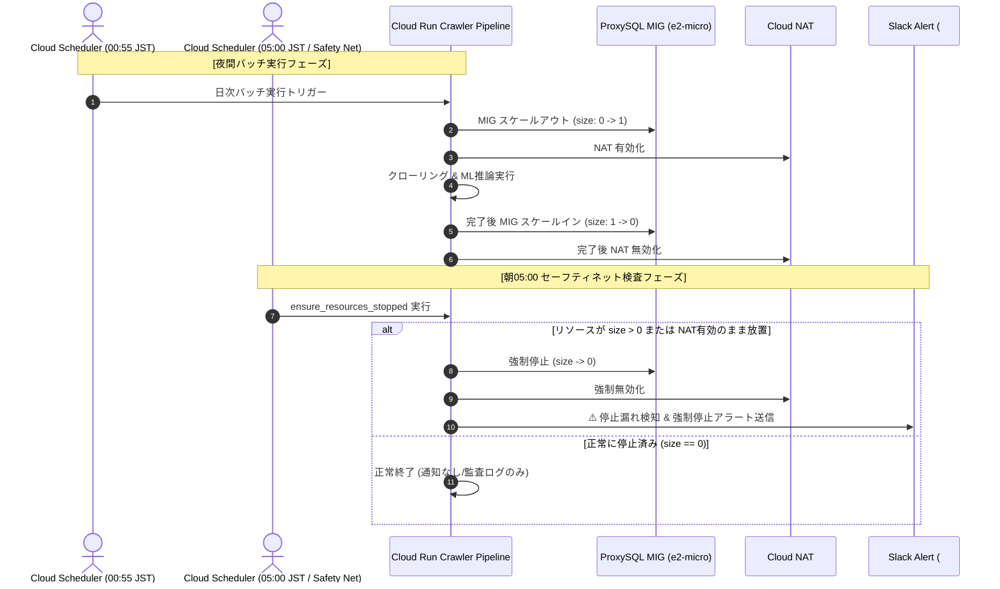

# GCP コスト最適化・オンデマンドライフサイクル制御 内部設計書 (GCP Cost Optimization Internal Design)

## 1. 目的・背景
本設計書は、Google Cloud Platform 上で稼働する不動産クローラーシステムの運用固定費を最小化（月額1万円以内）し、夜間バッチ実行時のみリソースを安全にオンデマンド稼働させ、かつゾンビ課金を物理的に防ぐセーフティネットの内部構造を定義する。

---

## 2. オンデマンド起動・安全停止ライフサイクル

### 2.1 E2E シーケンス

---

## 3. ゾンビ課金防止スクリプト (`ensure_resources_stopped.py`)

### 3.1 役割と責務
- 毎朝 05:00 JST (20:00 UTC) に Cloud Scheduler 経由でキックされる（パイプライン異常終了時のセーフティネット）。
- Compute Engine API / REST API (`instanceGroupManagers`) を介して `proxysql-mig` の `target_size` および稼働インスタンス数を取得。
- `target_size > 0` または稼働インスタンスが存在する場合：
  1. Autoscaler 管理下 MIG の GCP API 制約（直接 `resize` 禁止）に適合させるため、Autoscaler の `min_num_replicas = 0` かつ `max_num_replicas = 0` へ更新（または Autoscaler 一時停止）し、インスタンスを 0 台へ完全削除・縮小。
  2. Slack チャンネル（`#property_alert`）に警告メッセージを発報（非同期関数 `send_slack_message` を `async_to_sync` 経由で確実に同期実行・未 await 警告を防止）。
  3. 戻り値としてステータスを返し、監査ログへ記録。
- **安全側に倒すエラーハンドリング (Fail-Safe)**:
  - API 通信エラー、404 Not Found、認証エラー等が発生した場合、決して「正常停止中」と偽装せず、緊急 Slack アラート（`:rotating_light:`）を発報し非ゼロ（Exit Code 1）で終了。

### 3.2 入力引数
- `--project-id`: GCP プロジェクトID（デフォルト: 環境変数 `GCP_PROJECT` または `sumifu`）
- `--region`: リージョン（デフォルト: `asia-northeast1`）
- `--mig-name`: MIG 名（デフォルト: `proxysql-mig-prod`）
- `--dry-run`: 判定のみ行い停止しないフラグ

### 3.3 パイプライン異常時クリーンアップ (`run_pipeline.py` finally ブロック)
- パイプラインのステップ（クローリング、データ検証、ML学習等）が途中で例外終了（Exit Code != 0）した場合でも、`try ... finally` ブロックにて確実に ProxySQL MIG の縮小・リソース解放を試行し、ゾンビ残存を根本防止。
- `scale_proxysql_mig` は `compute_v1`（`google-cloud-compute`）および REST API フォールバックを採用し、コンテナ内での `gcloud` 不在による `FileNotFoundError` を防止。

### 3.4 パイプライン起動時オンデマンド起動・起動チェック (`run_pipeline.py`)
- **実行条件**: クラウド環境（`IS_CLOUD=true` 等）かつ Coordinator（または単一ジョブ実行）時、Step 0.4 (`wait_for_db.py`) の直前に実行。
- **起動シーケンス**:
  1. `scale_proxysql_mig(target_size=1)` を呼び出し、ProxySQL MIG を 0 台から 1 台へスケールアウト。
     - **Autoscaler 連携制御**: MIG が Autoscaler 管理下にある場合、GCP API 制約（直接 `resize` 禁止で HTTP 400 エラー）を自動回避し、`patch_proxysql_autoscaler` を通じて `min_replicas=1, max_replicas=2` を更新して安全にスケールアウトをトリガーする。Autoscaler が存在しない場合のみ直接 `resize` を呼び出す。
  2. `check_cloud_sql_status` により Cloud SQL インスタンスが `RUNNABLE` 稼働中であるかを事前点検。停止中や異常時は即座に警告ログを記録。
  3. `wait_for_proxysql_health(host=DB_HOST, port=DB_PORT, timeout_sec=240)` を実行し、ポート 6033 へのソケット接続確立をポーリング検証（起動チェック）。Debian VM ブート・初期パッケージ導入・ILB ヘルスチェック通過所要時間を考慮し、240 秒の安全マージンを確保。
  4. タイムアウト（240秒）内に応答が得られない場合は例外を送出し、後続の DB 接続ハングを未然に防止。
  5. Worker タスク（Task Index > 0）は Coordinator による ProxySQL 起動および DB マイグレーションの完了を待機。

### 3.5 DB 待機 Fail-Fast 制御 (`wait_for_db.py`)
- **問題**: DB ホストが未起動またはネットワーク不通の場合、Django の `connection.ensure_connection()` は OS の TCP SYN タイムアウト（約 130 秒）までブロックされ、40 回リトライで 1 時間以上ハングする。
- **設計**:
  1. `connection.ensure_connection()` 呼び出し前に、`socket.create_connection((host, port), timeout=3.0)` による軽量ソケット疎通事前チェックを実施。
  2. ソケット不通時は 3 秒で即座に検知し、短周期（例: 2秒）でリトライ。
  3. 最大リトライ時間（例: 60〜120秒）を経過しても不通の場合は、即座に Exit Code 1 で Fail-Fast 終了。Cloud Run のタスクタイムアウト（1時間）まで無駄に浪費することを防止する。

---

## 4. Terraform リソース設計

### 4.1 ProxySQL MIG および Autoscaler のオンデマンド定義 (`proxysql.tf`)
- `proxysql_min_replicas = 0`
- `proxysql_max_replicas = 2`
- 通常時の `target_size` を 0 とし、バッチ稼働時のみサイズ変更を許容する `lifecycle { ignore_changes = [target_size] }` の維持。
- Autoscaler (`google_compute_region_autoscaler.proxysql_autoscaler`) において、デプロイ時の `terraform apply` がバッチ停止時や `ensure_resources_stopped.py` で設定した縮退状態（`min=0, max=0`）を上書きして日中に不要インスタンスを自動起動することを防ぐため、`lifecycle { ignore_changes = [autoscaling_policy[0].min_replicas, autoscaling_policy[0].max_replicas] }` を明示設定。

### 4.2 Direct VPC Egress 構成 (`cloud_run_job.tf`, `cloud_run_service.tf`, `cloud_run_api_service.tf`)
- `vpc_access` の `connector` を廃止し、Direct VPC Egress (`network_interfaces`) によるサブネット直接接続への切り替え。
- 常時稼働する VPC Access Connector (e2-micro 2台) の固定費（約 \$16/月）を削減。

### 4.3 日中帯稼働監視アラート (`alerting.tf`)
- メトリクス: `compute.googleapis.com/instance_group/size`
- フィルタ: `resource.type="gce_instance_group_manager" AND resource.labels.instance_group_manager_name="proxysql-mig-prod"`
- 条件: 閾値 `size > 0`
- アラート重要度: `ERROR`
- 目的: セーフティネットをもすり抜ける異常の早期人手介入。

### 4.4 統一ラベル仕様 (`variables.tf`, `main.tf`)
すべての主要リソースに以下を付与：
- `project`: `realestate-crawler`
- `environment`: `prod` / `staging` / `dev`
- `component`: `pipeline`, `proxy`, `database`, `api`, `networking`, `storage`
- `managed_by`: `terraform`

### 4.5 Artifact Registry ライフサイクル & デプロイ時プルーニング (`artifact_registry.tf`, `deploy-production.yml`)
- **Terraform クリーンアップポリシー**:
  - `realestate-crawler-prod` リポジトリに `keep-recent-3`（最新3世代保持）および `delete-untagged`（UNTAGGED削除）ポリシーを定義。
- **デプロイ時即時プルーニング**:
  - GitHub Actions `deploy-production.yml` での Docker push 直後に、最新3世代を超過する古いイメージダイジェストを取得して一括削除。
  - イメージが push された瞬間に即時削除され、月額約 1,000 円超のストレージ課金（81.6GB）を約 5GB へ圧縮・恒久維持。

