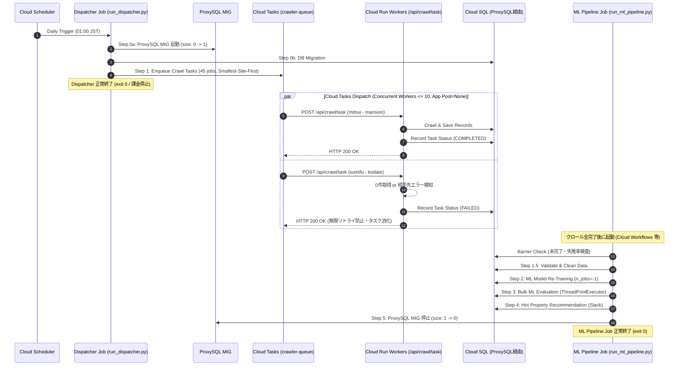

# GCP 並列分散実行 内部設計書 (Cloud Tasks + Cloud Run Architecture)

## 1. 目的
本設計書は、GCP (Cloud Tasks + Cloud Run) 上で各ポータル・仲介サイトのクローリングをレートリミット保護付きで分散並列実行し、MLパイプラインを高速化するための詳細仕様、データモデル、シーケンス、およびAPI定義を規定する。

---

## 2. アーキテクチャ概要



---

## 3. Cloud Tasks キュー定義 (Terraform)
- **キュー名**: `crawler-tasks-${var.environment}`
- **レート制御 (`rate_limits`)**:
  - `max_dispatches_per_second`: 5.0（全体ディスパッチ速度）
  - `max_concurrent_dispatches`: 10（同時実行ワーカー上限数）
- **リトライ制御 (`retry_config`)**:
  - `max_attempts`: 2
  - `min_backoff`: "10s"
  - `max_backoff`: "60s"

---

## 4. ワーカーエンドポイント (`/api/crawl/task`)
- **メソッド**: `POST`
- **リクエストボディ**:
  ```json
  {
    "company": "mitsui",
    "property_type": "mansion",
    "execution_date": "2026-09-19"
  }
  ```
- **処理内容**:
  1. `main.py` 内のディスパッチマップから対象関数を特定。
  2. クローラーを実行し、新規保存件数および所要時間を計測。
  3. `CrawlerTaskExecution` モデルへステータス（COMPLETED / FAILED）を記録。
  4. 正常終了時は `{"status": "success", "scraped_count": N}` (HTTP 200)。
  5. 異常終了時は `{"status": "failed", "error": "..."}` (HTTP 500: Cloud Tasks リトライ用)。

---

## 5. タスクディスパッチャー (`package/utils/cloud_tasks_dispatcher.py`)
- `dispatch_all_crawl_jobs(service_url, queue_path, skip_portals=False)`:
  - `CRAWL_JOBS` を走査し、Cloud Tasks API でタスクを作成・投入。
  - 各タスクに OIDC トークン（Crawler Runner Service Account）を付加。
  - ローカル実行時や GCP 外環境では、フォールバックとしてローカル並列実行（従来の `run_all_crawlers.py`）を自動起動。
