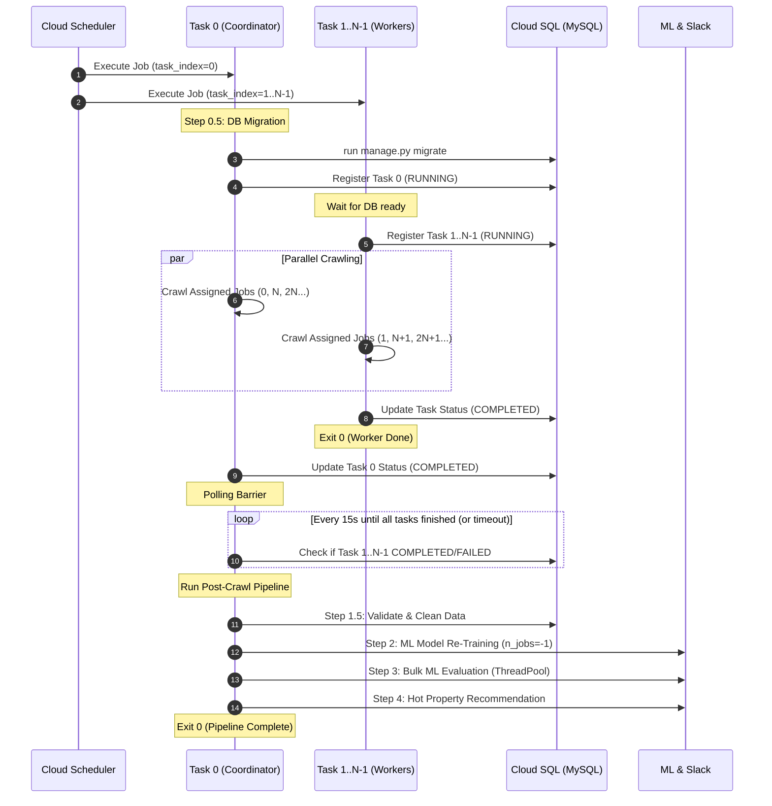

# GCP 並列分散実行 内部設計書 (GCP Parallel & Distributed Execution Internal Design)

## 1. 目的
本設計書は、GCP (Cloud Run Jobs) 上でクローラーおよびMLパイプラインを高速に分散並列実行するための詳細仕様、データモデル、シーケンス、およびアルゴリズムを定義する。

---

## 2. タスク分散アルゴリズム (`run_all_crawlers.py`)

### 2.1 環境変数の検知
- `CLOUD_RUN_TASK_INDEX`: 0 から始まるタスク番号（未設定時は None）
- `CLOUD_RUN_TASK_COUNT`: 総タスク数（未設定時は 1）

```python
task_index = os.getenv("CLOUD_RUN_TASK_INDEX")
task_count = os.getenv("CLOUD_RUN_TASK_COUNT")
```

### 2.2 ジョブ抽出ロジック
1. 対象ジョブリスト `target_jobs` を確定（Smallest-Site-First 順が維持されていること）。
2. `task_count` が 1 より大きく、かつ `task_index` が指定されている場合：
   ```python
   t_idx = int(task_index)
   t_cnt = int(task_count)
   my_jobs = [job for i, job in enumerate(target_jobs) if i % t_cnt == t_idx]
   ```
3. これにより、全タスク間で重複なく、全ジョブが過不足なく分割される。

---

## 3. タスク実行管理モデル (`CrawlerTaskExecution`)

各タスクの進行・完了状況を同期するためのデータベースモデルを定義する。

### 3.1 テーブル定義 (`crawler_task_execution`)
- `execution_date`: 実行日付 (`DateField`, db_index=True)
- `task_index`: タスク番号 (`IntegerField`)
- `task_count`: 総タスク数 (`IntegerField`)
- `status`: ステータス (`CharField`: `RUNNING`, `COMPLETED`, `FAILED`)
- `jobs_assigned`: 担当ジョブ数 (`IntegerField`)
- `jobs_success`: 成功ジョブ数 (`IntegerField`, default=0)
- `jobs_failed`: 失敗ジョブ数 (`IntegerField`, default=0)
- `created_at`: 開始日時 (`DateTimeField`, auto_now_add=True)
- `updated_at`: 更新日時 (`DateTimeField`, auto_now=True)

### 3.2 ユニーク制約
- `unique_together = ('execution_date', 'task_index')`

---

## 4. パイプライン Coordinator シーケンス (`run_pipeline.py`)



---

## 5. ML並列化設計

### 5.1 モデル学習マルチコア並列化 (`package/ml/train.py`)
- RandomForest: `n_jobs=-1`
- LightGBM: `n_jobs=-1` (または `num_threads=os.cpu_count()`)
- XGBoost: `n_jobs=-1`
- CatBoost: `thread_count=-1`

### 5.2 バルク推論スレッドプール並行化 (`run_bulk_ml_evaluation.py`)
- `concurrent.futures.ThreadPoolExecutor(max_workers=concurrency)`
- 各スレッド内でモデル単位の未評価レコード収集・推論・一括保存を実施。
- スレッド開始・終了時に `django.db.close_old_connections()` を呼び出し、コネクションリークおよびスレッド競合を防止。

### 5.3 サイト内詳細取得のGCP帯域最適化 (`package/api/api.py`)
- `_getCloudPararellLimit`:
  `return int(os.getenv("CLOUD_DETAIL_CONCURRENCY", "5"))`
