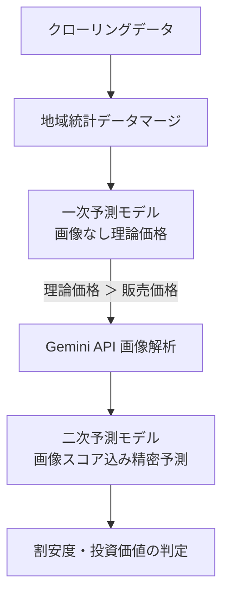

# 機械学習モデル・学習プロセス仕様書 (Machine Learning Model & Training Specifications)

本ドキュメントは、本システムで投資・割安物件を判定するために用いる機械学習モデルの設計、現在の学習プロセス（方法論）、および現状の課題と今後の改善点について定義します。

---

## 1. 概要 (Overview)

本システムは、不動産市場における「市場の歪み（本来の価値より安く売り出されている物件）」を検出するため、機械学習を用いた2段階のスクリーニング（価格予測）を導入しています。

---

## 2. 現状の学習方法論 (Current Methodology)

学習プロセスは [train.py](file:///c:/Users/weare/Documents/realestate_crawler/src/crawler/package/ml/train.py) で制御されています。主なプロセスは以下の通りです。

### 2.1 データのロードと地域統計マージ
各社（三井、住友、東急、野村、ミサワ）のマンション（Mansion）モデルから取得した全レコードに対し、以下の周辺統計データを住所や最寄り駅をキーとして結合（マージ）します。

*   **自治体ポテンシャル**: `MunicipalPotential` から「人口増加率」および「平均所得」を取得。
*   **駅ポテンシャル**: `StationPotential` から「乗降客数」を取得。
*   **平均地価**: `LandPricePotential` から該当市区町村の「住宅地平均地価」を取得。

#### データ欠損時のデフォルト補完（フォールバック）
マスタからデータが取得できない、あるいは物件に欠損値がある場合は以下の通りデフォルト値で補完されます。
*   自治体データ未検出: 人口増加率 = `0.0`、平均所得 = `3000` (万円)
*   最寄り駅データ未検出: 駅乗降客数 = `10000` (1万人)
*   平均地価未検出: 住宅地平均地価 = `350,000` (円/㎡)
*   築年数（`chikunen`）: 現在日と `chikunengetsu`（築年月）の差分日数 / 365.25。築年月が欠損の場合は `20.0` (年)
*   専有面積（`area`）: `senyuMenseki`を使用。面積が `0` 以下の物件は学習データから**除外**。
*   徒歩分数（`walk_min`）: 欠損時は `15` (分)
*   管理費/修繕費: 欠損時は `0` (円)
*   画像スコア (`interior_score`, `layout_score`): 欠損時は `3.0` (中間値)

#### 学習用ダミーデータの生成
実データ（クローリング済みDBレコード）が10件未満の場合、機械学習パイプラインの動作を担保するため、500件の擬似物件レコードを生成して学習を行います。

### 2.2 使用する特徴量 (Features)
予測フェーズに応じて2パターンの特徴量セット（データ列）を用いています。

| 特徴量名 | 説明 | 一次予測 | 二次予測 |
| :--- | :--- | :---: | :---: |
| `area` | 専有面積 (㎡) | Yes | Yes |
| `chikunen` | 築年数 (年) | Yes | Yes |
| `walk_min` | 最寄り駅からの徒歩分数 (分) | Yes | Yes |
| `kanrihi` | 管理費 (円) | Yes | Yes |
| `syuzen` | 修繕積立金 (円) | Yes | Yes |
| `pop_growth` | 自治体の人口増加率 | Yes | Yes |
| `income` | 自治体の平均所得 | Yes | Yes |
| `passenger_volume` | 最寄り駅の乗降客数 | Yes | Yes |
| `average_land_price` | 周辺の平均地価 (円/㎡) | Yes | Yes |
| `interior_score` | Gemini API による内装評価スコア (1.0〜5.0) | - | **Yes** |
| `layout_score` | Gemini API による間取り評価スコア (1.0〜5.0) | - | **Yes** |

### 2.3 モデルの比較・評価プロセス
5分割交差検証（5-Fold Cross Validation）を用いて、以下の4つのアルゴリズムを評価します。

1.  **LightGBM** (`LGBMRegressor`)
2.  **XGBoost** (`XGBRegressor`)
3.  **CatBoost** (`CatBoostRegressor`)
4.  **RandomForest** (`RandomForestRegressor`)

#### 評価指標 (Metrics)
*   **MAPE (平均絶対パーセント誤差)**: モデルの最良判定基準（これが最も低いモデルを採用）。
*   **MAE (平均絶対誤差)**: 金額ベース（万円）の平均ズレ。
*   **R² (決定係数)**: モデルの説明力。

最良と判定されたアルゴリズムのモデルを全データで再学習し、以下のパスへシリアライズ保存（`joblib.dump`）します。
*   一次モデル: `/app/src/crawler/package/ml/models/first_stage_model.joblib`
*   二次モデル: `/app/src/crawler/package/ml/models/second_stage_model.joblib`

---

## 3. 現状の方法論における改善すべき点 (Areas for Improvement)

現状の学習プロセスはパイプラインとして機能していますが、予測精度の観点から以下の課題・改善点があります。

### 3.1 欠損値補完（デフォルト補完）による強いバイアス
*   **課題**: 地価（35万円/㎡）、所得（300万円）、駅乗降客数（1万人）、画像スコア（3.0）といった固定値での一律補完は、モデルに強いバイアスを与えます。例えば、都心の高級エリアや地方の物件でも同じ地価が補完されてしまい、理論価格に歪みが生じます。
*   **対策**:
    *   地域統計データが欠損した場合は、周辺エリア（市区町村単位で取れない場合は都道府県単位の平均など）のより広域な統計データを段階的フォールバック（Backoff）として適用する。
    *   画像スコアの欠損は、画像が未解析であるのか、あるいは実際に画像がないのかを識別し、欠損であることを表すインジケータ（Mask/Flag）を追加するか、ツリーモデルの欠損値処理機能に委ねる（3.0を無理に入力しない）。

### 3.2 カテゴリカル（テキスト）データの未活用
*   **課題**: 物件の「所在都道府県」「所在市区町村」「最寄り駅名」「分譲会社（Mitsui, Sumifu等）」といった非常に重要なカテゴリカル変数が学習から除外されています。
*   **対策**:
    *   One-Hotエンコーディングや、カテゴリ数の多さに耐えられる **Target Encoding** を適用する。
    *   LightGBMやCatBoostがネイティブで提供するカテゴリカル変数対応機能を利用する。これにより「ブランド価値（三井 vs ミサワ）」や「駅ブランド（山手線沿線など）」が考慮可能になります。

### 3.3 ハイパーパラメータチューニングの欠如
*   **課題**: 各モデルをデフォルト設定のハイパーパラメータで学習させているため、ポテンシャルを最大限発揮できていません。
*   **対策**:
    *   モデル選定時に **Optuna** などの自動最適化ライブラリを組み込み、ハイパーパラメータ（木数、深度、学習率など）のチューニングを学習プロセスに導入する。

### 3.4 築年数と推論時点での時間的整合性
*   **課題**: 築年数の計算で `datetime.date.today()` を使用していますが、これは「学習を実行した日」と「推論（クロールして予測）した日」でわずかに時間差が生じます。また、長期間ストックしたデータを使う場合、古い販売データの築年数を正しく捉えられません。
*   **対策**:
    *   「データ取得日（掲載日）」または「DB保存日」を基準日として築年数を算出するように統一する。

### 3.5 モデル保存パスのハードコーディング
*   **課題**: `/app/src/crawler/package/ml/models/...` と、Dockerコンテナ上の絶対パスがハードコーディングされており、コンテナ外（ローカル環境など）や開発環境の違いによって実行時エラーとなります。
*   **対策**:
    *   `os.path` 等を利用し、実行スクリプトからの相対パス、あるいは Django の `settings` や環境変数からモデル保存先パスを動的に取得するように変更する。
