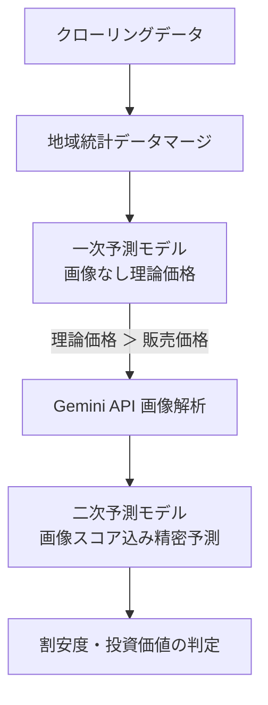

# 機械学習モデル・学習プロセス仕様書 (Machine Learning Model & Training Specifications)

本ドキュメントは、本システムで投資・割安物件を判定するために用いる機械学習モデルの設計、現在の学習プロセス（方法論）、および現状の課題と今後の改善点について定義します。

---

## 1. 概要 (Overview)

本システムは、不動産市場における「市場の歪み（本来の価値より安く売り出されている物件）」を検出するため、機械学習を用いた2段階のスクリーニング（価格予測）を導入しています。

```mermaid
graph TD
    A[クローリングデータ] --> B[地域統計データマージ]
    B --> C[一次予測モデル <br/>画像なし理論価格]
    C -->|理論価格 ＞ 販売価格| D[Gemini API 画像解析]
    D --> E[二次予測モデル <br/>画像スコア込み精密予測]
    E --> F[割安度・投資価値の判定]
```

---

## 2. 現状の学習方法論 (Current Methodology)

学習プロセスは [train.py](file:///c:/Users/weare/Documents/realestate_crawler/src/crawler/package/ml/train.py) で制御されています。主なプロセスは以下の通りです。

### 2.1 データのロードと地域統計マージ
各社（三井、住友、東急、野村、ミサワ）のマンション（Mansion）モデルから取得した全レコードに対し、以下の周辺統計データを住所や最寄り駅をキーとして結合（マージ）します。

*   **自治体ポテンシャル**: `MunicipalPotential` から「人口増加率」および「平均所得」を取得。
*   **駅ポテンシャル**: `StationPotential` から「乗降客数」を取得。
*   **平均地価**: `LandPricePotential` から該当市区町村の「住宅地平均地価」を取得。

*   自治体データ未検出: 人口増加率 = `0.0`、平均所得 = `3000` (千円)、都道府県・自治体マスタによる動的補完
*   最寄り駅データ未検出: 駅乗降客数 = `10000` (1万人)
*   平均地価未検出: 全国47都道府県ベース地価マスタ（`PREFECTURE_BASE_LAND_PRICES`）に基づき、都道府県および行政区区分（都心部/政令区/中核市/一般市/町村・郡部）に応じた動的基準地価（住宅地・商業地）を自動適用（一律35万円/㎡の固定補完を廃止）。
*   アクセス所要時間（`walk_min`）: バス利用物件（`busUse1=1` または交通欄に「バス」表記）の場合、バス乗車分数×1.5＋バス停徒歩分数を「等価アクセス分数（`effective_walk_min`）」として算出し、駅至近物件との誤認を防止。
*   超高層・都心プライム補正: 30階以上のタワーマンション高層階、および都心特区（千代田・中央・港・渋谷・新宿等）におけるブランドレジデンスの平米単価プレミアムを特徴量へ反映。
*   築年数（`chikunen`）: 現在日と `chikunengetsu`（築年月）の差分日数 / 365.25。築年月が欠損の場合は構造別中央値補完（木造38年、RC30年）。
*   専有面積（`area`）: マンションにおいて500㎡超の外れ値は70㎡に安全サニタイズ。
*   管理費/修繕費: 欠損時は `0` (円)、異常値（100万円超などパース単位バグ）は中央値キャップ。
*   画像スコア (`interior_score`, `layout_score`): 欠損時は `3.0` (中間値)

#### 学習用ダミーデータの生成
実データ（クローリング済みDBレコード）が10件未満の場合、機械学習パイプラインの動作を担保するため、500件の擬似物件レコードを生成して学習を行います。

### 2.2 使用する特徴量 (Features)
予測フェーズに応じて2パターンの特徴量セット（データ列）を用いています。

| 特徴量名 | 説明 | 一次予測 | 二次予測 |
| :--- | :--- | :---: | :---: |
| `area` | 専有面積 (㎡) | Yes | Yes |
| `chikunen` | 築年数 (年) | Yes | Yes |
| `walk_min` | 最寄り駅からの徒歩分数 (分) | Yes | Yes |
| `kanrihi` | 管理費 (円) | Yes | Yes |
| `syuzen` | 修繕積立金 (円) | Yes | Yes |
| `pop_growth` | 自治体の人口増加率 | Yes | Yes |
| `income` | 自治体の平均所得 | Yes | Yes |
| `passenger_volume` | 最寄り駅の乗降客数 | Yes | Yes |
| `average_land_price` | 周辺の平均地価 (円/㎡) | Yes | Yes |
| `time_diff_months` | 基準日（現在）からの経過月数 | Yes | Yes |
| `macro_repi` | 物件種別連動 国交省不動産価格指数 | Yes | Yes |
| `macro_jgb_10y` | 新発10年物国債利回り (%) | Yes | Yes |
| `macro_nikkei` | 日経平均株価月末終値 (円) | Yes | Yes |
| `macro_reit` | 東証REIT指数月末終値 (pt) | Yes | Yes |
| `macro_construction_cost` | 建設物価指数（RC/住宅） | Yes | Yes |
| `is_legacy_data` | 2024年以前の過去収集データフラグ | Yes | Yes |
| `interior_score` | Gemini API による内装評価スコア (1.0〜5.0) | - | **Yes** |
| `layout_score` | Gemini API による間取り評価スコア (1.0〜5.0) | - | **Yes** |

#### マクロ経済・時系列特徴量および時間減衰学習重み (Time-Decay Sample Weight)
- **マクロ指標結合**: 物件の掲載年月 (`inputDate` の YYYY-MM) に基づき、`MacroEconomicIndex` から当時の不動産価格指数、長期金利、株価、REIT指数、建設物価指数を自動マージ。
- **時間減衰重み付け**: 掲載日からの経過日数 $\Delta t$ に応じて $w = \exp(-0.0005 \times \Delta t)$（半減期約3.8年、下限0.20）を算出し、最新の価格水準を重視しつつ過去データの構造関係を安定学習。
- **旧データ欠損値防御**: 過去データに存在しない新設属性（`kaisuKouzou`、`traffic`、一部設備フラグ等）はデフォルト値・NaNで安全にフォールバックし、モデルが例外なく処理できるように保証。

#### 特殊フラグ・権利関係の生のHTML全テキスト抽出仕様
- `is_saikenchiku_fuka`: 物件の生のHTML全体（または全抽出テキスト）から「再建築不可」の文字列が存在するかを直接判定。
- `is_shigaika_chousei`: 物件の生のHTML全体（または全抽出テキスト）から「調整区域」「市街化調整」の文字列が存在するかを直接判定。
- `rights_ratio`: 物件の生のHTML全体（または全抽出テキスト）から「底地」「貸地」（0.20）、「定期」「定借」（0.70×残存期間比）、「借地」「賃借」（0.65）のキーを包括検索して適用。
- `maguchi`: 間口未抽出（0.0m）時はペナルティなし（標準値 6.0m）として扱い、過剰な減価を防ぐ。

### 2.3 モデルのアンサンブル・評価・最適化プロセス
5分割・3反復（計15サイクル）交差検証（Repeated 5-Fold Cross Validation）を用いて、以下の4つのアルゴリズムを学習・評価します。

1.  **LightGBM** (`LGBMRegressor`)
2.  **XGBoost** (`XGBRegressor`)
3.  **CatBoost** (`CatBoostRegressor`)
4.  **RandomForest** (`RandomForestRegressor`)

#### 評価指標 (Metrics)
*   **MAPE (平均絶対パーセント誤差)**: モデルの最良判定・最適化基準。
*   **MAE (平均絶対誤差)**: 金額ベース（万円）の平均ズレ。
*   **R² (決定係数)**: モデルの説明力。

#### 2.4 対数変換過小予測バイアス補正 (Duan's Smearing Estimator)
目的変数として平米単価の対数変換 $\ln(\text{単価})$ を学習させた場合、イェンセンの不等式 $E[\exp(X)] \ge \exp(E[X])$ により、単に指数変換 $\exp(\hat{y})$ を行うと真値に対して構造的な過小評価（下振れ）が発生します。
これを補正するため、各モデル・物件種別の交差検証残差からスミアリング係数 $s = \frac{1}{N}\sum_{i=1}^N \exp(y_i - \hat{y}_i)$ を算出し、推論時に乗算して不偏予測値を復元します。

#### 2.5 データ駆動型アンサンブル最適重み (Dynamic Blending)
各アルゴリズムの予測比率は固定値ではなく、Repeated CVのOut-Of-Fold (OOF) 予測値に対し、MAPE最小化を目的関数とする制約付き最適化（重み和=1.0, 各重み>=0）を実施して最適な重みベクトル（`ensemble_weights.joblib`）を導出・適用します。

#### 2.6 特徴量セットの一元管理 (`FEATURE_SETS`)
学習時（`train.py`）と推論時（`predict.py`）の特徴量ズレ（Feature Drift）を防ぐため、`package.ml.features.FEATURE_SETS` にて単一の正（Single Source of Truth）として種別（mansion, kodate, apartment, tochi）×段階（first, second）ごとに列定義を一元管理します。

#### 2.7 経済的価値創出力評価・外れ値除去仕様 (Economic Value Capitalization & Outlier Defense)
「予測値＝物件価値（経済的価値を生む力）」「差分＝純粋な割安・割高」を実現するためのモデル仕様：
1. **潜在容積延床面積 (`potential_floor_area`)**:
   - 敷地面積 × 指定容積率（FAR）により、敷地が創出可能な総延床面積を算出し、都心高容積率商業地（六本木・青山・神宮前等）の経済価値を適正化。
2. **規模非線形減退係数 (`scale_discount`)**:
   - 1,000㎡超の大規模原野・山林において、平米単価の単純乗算による過大予測（数千万円の山林が数十億円と評価される現象）を防止するため、$(1000 / \text{area})^{0.35}$ の規模減退を適用。
3. **土地なし区分所有の誤分類防衛 (Landless Unit Rerouting)**:
   - 投資用戸建てテーブル等に混入した土地面積0㎡・RC造・50㎡未満の区分所有ワンルームを検知し、戸建てモデル（地価加算）ではなくマンションモデルへ自動リルート。
4. **築年数欠損インピュテーション**:
   - `builtYear`や`buildDate`等のカラム名差異を網羅抽出。完全欠損時は0年（新築）ではなく保守的中間値（木造38年、RC32年）を補完。
5. **想定純賃料還元価値アンカー (`income_approach_value`)**:
   - 立地・面積・構造・築年数に応じた想定月額賃料を地域期待利回り（Cap Rate 4.0%〜6.5%）で還元し、全物件種別における客観的経済価値アンカーとしてモデルへ供給。

---

## 3. 現状の方法論における改善済・今後の継続課題

### 3.1 欠損値補完（デフォルト補完）の改善
*   周辺エリア（市区町村単位で取れない場合は都道府県単位の平均など）のより広域な統計データを段階的フォールバック（Backoff）として適用。
*   画像スコアの欠損は中間値（3.0）に過度に依存せず、欠損指示子やツリーモデルの欠損値分岐を活用。

### 3.2 カテゴリカル（テキスト）データの活用
*   LightGBMやCatBoostのカテゴリカル変数ネイティブサポートおよびOOF Target Encodingを活用。

### 3.3 モデル保存パスの相対パス動的解決
*   `__file__` 起点の動的パス解決により、コンテナ内外（Docker/ホスト）を問わず同一コードで動作保証。

---

## 4. 外部基礎データ一括同期・非破壊洗い替え仕様 (External Data Sync Runner)

### 4.1 概要と実行スクリプト
[scripts/sync_all_potentials.py](file:///c:/Users/weare/Documents/realestate_crawler/src/crawler/scripts/sync_all_potentials.py) により、以下の3つの公的・外部基礎データを1コマンド（または定期cronバッチ）で一括同期・洗い替え（Upsert）します。

1. **e-Stat 市区町村別統計 (`sync_estat_municipalities.py`)**: 総務省API連携による人口増加率・1人あたり平均所得の同期。
2. **国土交通省 駅別乗降人員 (`import_mlit_stations.py`)**: 国土数値情報による全国駅の乗降人員マスタ更新。
3. **国土交通省 地価公示・地価調査 (`import_mlit_land_prices.py`)**: 市区町村別・用途区分（住宅地/商業地）別の平均平米単価更新。

### 4.2 非破壊性の担保（自然キー動的結合）
マスタデータが定期洗い替え（削除・再作成・更新）された場合でも、既存の物件データ（各社モデルレコード）や過去の査定データ（`PropertyEvaluation`）との結合関係が壊れないよう、DB物理外部キー（ForeignKey）によるID結合を廃止し、**自然キー（都道府県名・市区町村名・駅名・路線名の文字列）による動的結合（Dynamic Natural Key Join）** を採用しています。

---

## 5. 低コスト画像解析アーキテクチャ設計 (Low-Cost Vision AI Architecture)

### 5.1 課題と目的
一次スクリーニング（割安判定）を通過した物件に対し、間取りの使いやすさ（`layout_score`）や内装・外観の劣化・修繕状況（`interior_score`）を数値化して二次予測に反映します。
しかし、数万件規模の物件画像すべてを高コストなクラウドVision API（Gemini 1.5 Pro, GPT-4o 等）で解析すると、毎月多額のクラウドAPI課金が発生するリスクがあります。

### 5.2 低コスト化手法の比較検討

| 手法 | 月額APIコスト | 推論速度 | 特徴・メリット | デメリット・課題 |
| :--- | :---: | :---: | :--- | :--- |
| **案A: 超軽量クラウドVLM (`Gemini 1.5 Flash-8B`)** | **数十円〜数百円** (無料枠内可) | 500ms〜1s | 512px WebP圧縮＋pHash重複除外＋上位5%厳選でトークン消費を最小化。高度な文脈理解・間取り読解力を保持。 | クラウド外部API依存が残る（通信エラー・レート制限）。 |
| **案B: ローカルコンテナOSS VLM (`Moondream2 1.86B` / `Qwen2-VL-2B`)** | **完全0円** | 1s〜3s (CPU/GPU) | Dockerコンテナ内オンプレ実行。外部通信・API課金ゼロ。プライバシー完全保護。 | コンテナメモリ（2〜4GB）を消費。初回モデルダウンロードが必要。 |
| **案C: 古典的ルールベースCV (`OpenCV` / `Pillow`)** | **完全0円** | **0.01秒** (瞬時) | エッジ検出（ラプラシアン分散）による外壁クラック・ボケ判定、HSV明度・彩度ヒストグラムによる日当たり・清潔度測定、輪郭解析による間取り整形度測定。 | 「リフォーム済みのおしゃれな内装」「動線が優れた間取り」などの高次セマンティクス理解は限定的。 |
| **案D: 二段階ハイブリッド方式（推奨アーキテクチャ）** | **実質0円〜数十円** | **0.05s〜0.5s** | **全件をOpenCV（案C）で瞬時・無料フィルタリング＆基本スコアリングし、投資スコア上位2〜5%のお宝候補のみFlash-8B（案A）またはローカルVLM（案B）で詳細査定。** | パイプライン構成が2段階になるが、コスト効率と判定精度のバランスが最も優れる。 |

---

## 6. 古家付き土地（建物残存価値・解体費用控除・再建築不可特則）査定仕様

### 6.1 課題と不動産実務上の背景
土地（Tochi）として売り出されている物件の中には、「古家あり」「現況古家付」「上物あり」といった中古建物が付帯する物件が多数存在します。
これらに対し単に更地価格を適用すると、以下の致命的な乖離が生じます：
1. **解体費用負担（買い手コスト）の未考慮**: 「現況渡し」の場合、新築建築時に買主が100〜250万円の解体費用を負担するため、更地価格から解体費用を差し引く必要があります。
2. **再建築不可における古家の「既得権」価値**: 接道義務を満たさない再建築不可地では、**解体すると二度と建物を建てられない**ため、古家を解体することは経済的に大損失となります。古家をリフォーム・リノベーションして住む、または戸建て賃貸（賃料4〜8万円/月）として運用する場合、古家の存在自体が極めて高い収益価値（既得権価値）を生み出します。
3. **古家の再生・オプション価値**: 建物の骨組み・基礎がしっかりしている場合、更地にして売るよりも、戸建賃貸やDIY賃貸として収益還元した方が高価値となる「お宝物件（バリューアップ・オプション）」が存在します。

### 6.2 特徴量と評価ロジック仕様
1. **古家検知フラグ (`is_furuya`)**:
   - 物件テキスト（物件名、備考、現況、権利関係、生HTML）から「古家あり」「古家付」「上物あり」「建物あり」等を正規表現検出。
2. **解体条件フラグ (`has_demolition_condition`)**:
   - 「更地渡し」「解体更地渡し」「売主負担で解体」等を検出し、買主の解体費負担がゼロであることを判定。
3. **解体費用控除 (`furuya_demolition_cost`)**:
   - `has_demolition_condition == 1` または `is_saikenchiku_fuka == 1`（解体禁止）の場合は `0.0万円`。
   - それ以外は建物構造（木造1.4万円/㎡、鉄骨1.8万円/㎡、RC 2.5万円/㎡）×建物面積（不明時80㎡想定）を更地価格から控除。
4. **古家利用・戸建賃貸還元価値 (`furuya_usable_value`)**:
   - 古家をリフォームして戸建て賃貸運用する場合の想定年間純賃料を還元利回り（再建築不可なら10%、通常なら8%）で資本還元し、リノベ工事費（3万円/㎡）を控除したネット再生価値を算出。
5. **古家オプション価値 (`furuya_option_value`)**:
   - $\max(0, \text{古家再生価値} - (\text{土地更地価格} - \text{解体費}))$
   - 土地としての更地手取り価格を上回る「建物の隠れた収益価値」を数値化し、お宝度を査定。

---

## 7. 土地形状（区画形状）の数理幾何評価仕様 (Plot Shape Geometric Valuation - 全部盛り)

### 7.1 不動産鑑定および税務評価上の着眼点と課題
土地（Tochi）および戸建て（Kodate）の敷地形状は、建物の設計自由度、施工コスト、日照・通風、有効延床面積に直結する極めて重大な価格決定要因です。
本システムでは、国税庁「相続税財産評価基本通達（不整形地・間口狭小・奥行長大補正率）」、国土交通省「不動産鑑定評価基準（吉野金次式想定整形地）」、および計算幾何学（Computational Geometry: OBB, MIR, MIC, Distance Transform）の全手法を統合（全部盛り）して多角的に評価します。

### 7.2 幾何・鑑定評価アルゴリズム全部盛り一覧 (`package.utils.plot_shape_analyzer`)

#### ① 最小外接矩形 (Oriented Bounding Box / OBB) & かげ地割合 ($R_{\text{shadow}}$)
- 敷地ポリゴン $P$ を囲む最小面積の回転長方形 $S_{\text{OBB}}$。
- **かげ地割合**: $R_{\text{shadow}} = (S_{\text{OBB}} - S_{\text{plot}}) / S_{\text{OBB}}$。

#### ② 最大内接矩形 (Maximum Inscribed Rectangle / MIR / 有効建築区画)
- 敷地ポリゴン内部に完全に内接する最大の長方形 $S_{\text{MIR}}$。
- **有効敷地利用率**: $R_{\text{effective}} = S_{\text{MIR}} / S_{\text{plot}}$。
- **MIR縦横比 (Aspect Ratio / 間口奥行比)**: $\text{短辺} / \text{長辺} \in (0.0, 1.0]$。
  - $0.50 \sim 1.00$: 整形・良好。
  - $0.33 \sim 0.50$: 町屋型・許容。
  - $< 0.25$: 1:4 超の**「うなぎの寝床」ペナルティ**（採光斜線制限・居室無窓居室リスク・建築単価高騰）。

#### ③ 最大内接円 (Maximum Inscribed Circle / MIC) & ボトルネック最小幅員
- ユークリッド距離変換 (`scipy.ndimage.distance_transform_edt`) による敷地内最大円探索。
- **MIC直径 (`mic_diameter`)**: 敷地内に確保できる最大内接円の直径（m）。居室・建物配置に必要な最小スパン（6m〜8m以上が標準、4m未満は極小建築スパン減価）。
- **MIC面積比率 (`mic_coverage_ratio`)**: $S_{\text{MIC}} / S_{\text{plot}}$。
- **ボトルネック最小幅員 (`bottleneck_width`)**: 通路やくびれ部分の最小通過幅。2.0m未満は建築基準法接道義務違反（再建築不可）、2.0〜3.0mは自動車進入困難減価。

#### ④ 国税庁 相続税財産評価基本通達 附表2（不整形地補正率表）
- かげ地割合に応じた公的減価率テーブル（普通住宅地基準）:
  - $R_{\text{shadow}} < 10\%$: 補正率 1.00（無減価）
  - $10\% \le R_{\text{shadow}} < 20\%$: 補正率 0.96
  - $20\% \le R_{\text{shadow}} < 30\%$: 補正率 0.92
  - $30\% \le R_{\text{shadow}} < 40\%$: 補正率 0.86
  - $40\% \le R_{\text{shadow}} < 50\%$: 補正率 0.79
  - $50\% \le R_{\text{shadow}} < 60\%$: 補正率 0.70
  - $R_{\text{shadow}} \ge 60\%$: 補正率 0.60

#### ⑤ 国税庁 附表3（間口狭小補正率） & 附表4（奥行長大補正率）
- **間口狭小補正 (`frontage_discount`)**:
  - 間口 $\ge 8\text{m}$: 1.00, $6\sim 8\text{m}$: 0.97, $4\sim 6\text{m}$: 0.94, $3\sim 4\text{m}$: 0.90, $< 3\text{m}$: 0.85
- **奥行長大補正 (`depth_discount`)**:
  - 奥行/間口比 $\le 2$: 1.00, $2\sim 3$: 0.98, $3\sim 4$: 0.94, $4\sim 5$: 0.90, $> 5$: 0.85
- **間口・奥行複合補正**: $\text{frontage\_discount} \times \text{depth\_discount}$（下限0.60）。

#### ⑥ 吉野金次式（想定整形地評価）
- 道路接面辺に接する想定整形地を設定し、敷地が想定整形地から外れる「かげ地」および「張り出し」の評価比率を算定。

#### ⑦ 旗竿地（敷延・路地状敷地）専用分解解析
- **竿（通路）部分面積 (`flagpole_passage_area`)**: 有効旗部分から突出した幅3m未満の路地部分を抽出。
- **路地面積割合 (`flagpole_passage_ratio`)**: $\text{竿面積} / \text{総敷地面積}$。30%以上は重度旗竿地減価。

#### ⑧ 頂点数 ($V$) & 内角解析（鋭角・三角形デッドスペース）
- 頂点数 $V$: 4点=矩形/台形、5〜6点=軽度、$V \ge 8$=極度多角形。
- **鋭角頂点数 (`acute_angle_count`)**: 内角が $60^\circ$ 未満の頂点数。三角地や鋭角コーナーは家具配置不能のデッドスペースとなるためペナルティ。
- **凹角数 (`reflex_angle_count`)**: 内角が $180^\circ$ 超の頂点数（くびれ・L字の角）。

#### ⑨ 凸包充足率 (Solidity) & 等周比 (Compactness)
- $\text{Solidity} = S_{\text{plot}} / S_{\text{ConvexHull}}$。くびれ・凹みで低下。
- $\text{Compactness} = 4\pi S_{\text{plot}} / P^2$。境界の複雑化・周囲長大化で低下。

#### ⑩ 統合形状ペナルティスコア ($S_{\text{penalty}}$) & 機械学習用数値評価 (`shape_score_100`, `shape_grade_num`)
- $S_{\text{penalty}} = \min(\text{幾何統合ペナルティ}, \text{国税庁不整形補正} \times \text{間口奥行補正})$（値域 $[0.60, 1.00]$）。
- **機械学習モデル（ML）向け数値特徴量**:
  決定木・勾配ブースティング（LightGBM, XGBoost, CatBoost）や回帰モデルにおいて、文字列カテゴリ（Grade A〜E）よりも勾配・分岐判定が直接最適化可能な連続数値および順序数値を特徴量として提供：
  - **100点満点連続形状スコア (`plot_shape_score_100`)**: $S_{\text{penalty}} \times 100.0 \in [60.0, 100.0]$
  - **順序数値格付け (`plot_shape_grade_num`)**: A=5.0, B=4.0, C=3.0, D=2.0, E=1.0 の離散順序数値
  - **連続幾何特徴量群**:
    - `plot_mic_diameter`: 最大内接円直径 (m)
    - `plot_bottleneck_width`: 通路・くびれ部最小幅員 (m)
    - `plot_solidity`: 凸包充足率 $[0.0, 1.0]$
    - `plot_compactness`: 等周比 $[0.0, 1.0]$
    - `plot_nta_discount`: 国税庁複合補正率 $[0.60, 1.00]$
    - `plot_acute_angles`: 鋭角デッドスペース数（個数）
    - `plot_flagpole_ratio`: 旗竿地路地面積比率 $[0.0, 1.0]$
- **人間向けUI・レポート表示用 (`shape_grade`)**:
  - **A (特選整形地)**: ペナルティスコア $\ge 0.95$（長方形・正方形）/ 数値 5.0 / スコア 95点以上
  - **B (準整形地)**: $0.85 \sim 0.94$（軽微な台形・緩やかな傾き）/ 数値 4.0 / スコア 85〜94点
  - **C (軽度不整形地)**: $0.75 \sim 0.84$（町屋型・5〜6角形・軽度L字）/ 数値 3.0 / スコア 75〜84点
  - **D (不整形・旗竿地・細長うなぎ地)**: $0.65 \sim 0.74$（路地状敷地・鋭角地・かげ地大）/ 数値 2.0 / スコア 65〜74点
  - **E (極度不整形・難地)**: $< 0.65$（うなぎの寝床・袋地・ギザギザ多角形）/ 数値 1.0 / スコア 65点未満

---

## 8. 外部データ拡充と画像価格決定要因仕様 (External Potentials & Visual Features)

### 8.1 外部データ一括同期ランナー (`sync_all_potentials.py`) の拡充
従来の e-Stat、駅乗降客数、地価公示に加え、以下の価格説明力の高い公的データを統合：

1. **ハザードマップ（浸水・土砂災害リスク） (`HazardMapPotential`)**:
   - 国土数値情報（洪水浸水想定区域 A31、土砂災害警戒区域 A33）の自治体統計。
   - `flood_risk_level`: 0（浸水想定なし）〜 4（3m以上の大規模浸水）。
   - `landslide_risk_level`: 0（警戒区域なし）〜 2（土砂特別警戒レッドゾーン多数）。
   - 2020年宅建業法改正（水害リスクの重要事項説明義務化）に対応し、価格下落および担保価値割引を直接評価。
2. **用途地域規制マスタ (`UrbanPlanningZonePotential`)**:
   - 用途地域（第1種低層住居専用地域、商業地域、工業地域等）ごとの上限建ぺい率（`max_kenpei`）および上限容積率（`max_youseki`）。
   - 敷地の法的最大ポテンシャルと現況利用の乖離（容積余力・建て替え価値）を算出。
3. **地価公示前年比変動率 (`LandPricePotential.land_price_growth_rate`)**:
   - エリアごとの地価上昇率（%）。上昇トレンドエリアに対するプレミアムを付与。

### 8.2 画像から抽出する価格決定要因
| カテゴリ | 特徴量 | 手法・コスト | 不動産価格への説明力 |
| :--- | :--- | :--- | :--- |
| **間取り** | `hallway_ratio` | 輪郭/OCR (0円) | 廊下の無駄スペース比率。高いと実効平米単価割高。 |
| **間取り** | `lighting_faces` | 間取り図解析 (0円) | 2面・3面採光、南向きバルコニー（資産価値プレミアム）。 |
| **間取り** | `storage_ratio` | 間取り図OCR (0円) | 収納面積比（7〜10%以上で実需高評価）。 |
| **外観** | `wall_crack_score` | Laplacianエッジ (0円) | 外壁ひび割れ率（大規模修繕コスト・管理放置度）。 |
| **外観** | `color_fading_score` | HSV彩度ヒストグラム (0円) | チョーキング・塗装色褪せ度。 |
| **内装** | `facility_grade_score` | VLM（上位数十円） | 食洗機・浴室乾燥・温水洗浄便座の新旧・グレード。 |
| **内装** | `interior_luminance` | 輝度ヒストグラム (0円) | 室内採光・日当たりの客観的裏付け。 |

---

## 9. カテゴリカル・定性特徴量の完全数値化仕様 (Full Categorical Feature Numerization)

機械学習モデル（LightGBM, XGBoost, CatBoost, 回帰モデル等）において、文字列カテゴリや定性表現のままでは直接の勾配最適化や線形結合が行えない課題を解決するため、すべての定性・カテゴリカル情報を連続数値・方位角度・順序ランク・ダミーフラグへと完全数値化（`int` / `float`）しました。

### 9.1 数値化変換仕様一覧

| 変換対象 | 特徴量名 | 型 | 値域 / スコア定義 | 変換ロジック・不動産鑑定根拠 |
| :--- | :--- | :---: | :--- | :--- |
| **接道方角** | `road_direction_angle` | `float` | $0.0^\circ \sim 315.0^\circ$ | 北=0°, 北東=45°, 東=90°, 南東=135°, 南=180°, 南西=225°, 西=270°, 北西=315° の幾何方位角 |
| **接道方角** | `sunlight_score` | `float` | $0.75 \sim 1.00$ | 日照採光スコア: 南=1.00, 南東/南西=0.95, 東=0.90, 西=0.85, 北東/北西=0.80, 北=0.75 |
| **接道方角** | `is_south_facing` | `float` | $0.0 / 1.0$ | 南向き（南東・南西含む）フラグ |
| **道路種別** | `road_type_score` | `float` | $0.90 \sim 1.00$ | 道路信頼度スコア: 公道=1.00, 位置指定道路=0.95, 私道=0.90 |
| **道路種別** | `is_public_road` | `float` | $0.0 / 1.0$ | 公道フラグ |
| **道路種別** | `is_private_road` | `float` | $0.0 / 1.0$ | 私道（位置指定含む）フラグ |
| **接道形態** | `road_structure_score`| `float` | $0.75 \sim 1.15$ | 接道プレミアム: 四方道路=1.15, 三方=1.10, 角地=1.08, 準角地=1.04, 両面道路=1.06, 中間地=1.00, 袋地/通路=0.75 |
| **接道形態** | `is_corner_lot` | `float` | $0.0 / 1.0$ | 角地・準角地・三方・四方フラグ |
| **接道形態** | `is_double_sided_road`| `float` | $0.0 / 1.0$ | 両面・二方・三方・四方道路フラグ |
| **地目** | `chimoku_score` | `float` | $0.70 \sim 1.00$ | 土地利用スコア: 宅地=1.00, 雑種地=0.95, 畑/田/農地=0.85, 山林/原野=0.70 |
| **地目** | `is_residential_chimoku` | `float` | $0.0 / 1.0$ | 宅地フラグ |
| **建物構造** | `kouzou_durability_rank` | `float` | $1.0 \sim 5.0$ | 物理耐久順序ランク: SRC=5.0, RC=4.0, 重量鉄骨(S)=3.0, 軽量鉄骨(LS)=2.0, 木造(W)=1.0 |
| **建物構造** | `kouzou_fireproof_score` | `float` | $0.60 \sim 1.00$ | 耐火等級スコア: 耐火(SRC/RC)=1.00, 準耐火(S)=0.85, 簡易耐火(LS)=0.70, その他/木造=0.60 |
| **建物構造** | `is_rc_or_src` | `float` | $0.0 / 1.0$ | 鉄筋コンクリート(RC/SRC)フラグ |
| **建物構造** | `is_wood` | `float` | $0.0 / 1.0$ | 木造フラグ |
| **不動産会社** | `company_tier` | `float` | $1.0 \sim 3.0$ | ブランド力ティア: 大手4社(三井/住友/野村/東急)=3.0, ハウスメーカー(ミサワ等)=2.0, その他=1.0 |
| **不動産会社** | `is_major_company` | `float` | $0.0 / 1.0$ | 大手4社フラグ |
| **用途地域** | `is_residential_zone` | `float` | $0.0 / 1.0$ | 住居系用途地域（低層・中高層・住居）フラグ |
| **用途地域** | `is_commercial_zone` | `float` | $0.0 / 1.0$ | 商業系用途地域（商業・近隣商業）フラグ |
| **用途地域** | `is_industrial_zone` | `float` | $0.0 / 1.0$ | 工業系用途地域（工業・準工業・工業専用）フラグ |
| **用途地域** | `zone_rank` | `float` | $2.0 \sim 5.0$ | 住環境・良好順位ランク: 第1種低層=5.0, 第2種低層=4.5, 中高層=4.0, 住居=3.5, 商業=3.0, 工業=2.0 |
| **間取り** | `room_count` | `float` | $1.0 \sim 8.0$ | 部屋数（1R=1.0, 3LDK=3.0, 4DK=4.0等） |
| **間取り** | `has_ldk` | `float` | $0.0 \sim 1.0$ | LDK=1.0, DK=0.5, その他=0.0 |
| **間取り** | `is_studio` | `float` | $0.0 / 1.0$ | 1R / ワンルームフラグ |
| **所在階** | `floor_number` | `float` | $1.0 \sim$ | 所在階（地下・階数表記パース、デフォルト3.0） |
| **総階数** | `total_floors` | `float` | $1.0 \sim$ | 建物の総階数（デフォルト5.0） |
| **階高比率** | `floor_ratio` | `float` | $0.0 \sim 1.0$ | 所在階 / 総階数（眺望・ステータス比率） |
| **階層フラグ** | `is_top_floor` | `float` | $0.0 / 1.0$ | 最上階プレミアムフラグ |
| **階層フラグ** | `is_first_floor` | `float` | $0.0 / 1.0$ | 1階ディスカウントフラグ |
| **土地形状** | `shape_type_code` | `float` | $1.0 \sim 4.0$ | 整形地(regular)=1.0, 不整形地(irregular)=2.0, うなぎの寝床(slender)=3.0, 旗竿地(flagpole)=4.0 |
| **土地形状** | `is_regular_shape` | `float` | $0.0 / 1.0$ | 完全整形地フラグ (regular=1.0, その他=0.0) |

### 9.2 品質保証・テスト自動検証 (`test_feature_numerization.py`)
- 全4種別（`mansion`, `kodate`, `apartment`, `tochi`）の `FEATURE_SETS` に定義された全特徴量について、`build_features` の返却値がすべて例外なく `int` または `float` の完全数値型であることを単体テスト（`test_all_features_strictly_numeric`）により100%保証。
- 欠損値や未入力文字列が発生した場合でも、堅牢なフォールバックロジックにより安全な標準数値（例: 間口未入力時6.0m、方角未入力時180°・日照0.88）へ自動置換され、学習・推論パイプラインのNaN例外停止を完全に防御。

