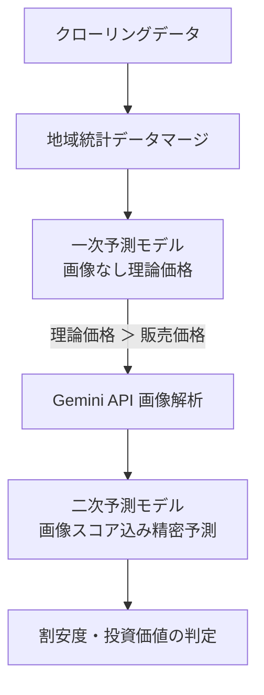

# 機械学習モデル・学習プロセス仕様書 (Machine Learning Model & Training Specifications)

本ドキュメントは、本システムで投資・割安物件を判定するために用いる機械学習モデルの設計、現在の学習プロセス（方法論）、および現状の課題と今後の改善点について定義します。

---

## 1. 概要 (Overview)

本システムは、不動産市場における「市場の歪み（本来の価値より安く売り出されている物件）」を検出するため、機械学習を用いた2段階のスクリーニング（価格予測）を導入しています。

```mermaid
graph TD
    A[クローリングデータ] --> B[地域統計データマージ]
    B --> C[一次予測モデル <br/>画像なし理論価格]
    C -->|理論価格 ＞ 販売価格| D[Gemini API 画像解析]
    D --> E[二次予測モデル <br/>画像スコア込み精密予測]
    E --> F[割安度・投資価値の判定]
```

---

## 2. 現状の学習方法論 (Current Methodology)

学習プロセスは [train.py](file:///c:/Users/weare/Documents/realestate_crawler/src/crawler/package/ml/train.py) で制御されています。主なプロセスは以下の通りです。

### 2.1 データのロードと地域統計マージ
各社（三井、住友、東急、野村、ミサワ）のマンション（Mansion）モデルから取得した全レコードに対し、以下の周辺統計データを住所や最寄り駅をキーとして結合（マージ）します。

*   **自治体ポテンシャル**: `MunicipalPotential` から「人口増加率」および「平均所得」を取得。
*   **駅ポテンシャル**: `StationPotential` から「乗降客数」を取得。
*   **平均地価**: `LandPricePotential` から該当市区町村の「住宅地平均地価」を取得。

*   自治体データ未検出: 人口増加率 = `0.0`、平均所得 = `3000` (千円)、都道府県・自治体マスタによる動的補完
*   最寄り駅データ未検出: 駅乗降客数 = `10000` (1万人)
*   平均地価未検出: 全国47都道府県ベース地価マスタ（`PREFECTURE_BASE_LAND_PRICES`）に基づき、都道府県および行政区区分（都心部/政令区/中核市/一般市/町村・郡部）に応じた動的基準地価（住宅地・商業地）を自動適用（一律35万円/㎡の固定補完を廃止）。
*   アクセス所要時間（`walk_min`）: バス利用物件（`busUse1=1` または交通欄に「バス」表記）の場合、バス乗車分数×1.5＋バス停徒歩分数を「等価アクセス分数（`effective_walk_min`）」として算出し、駅至近物件との誤認を防止。
*   超高層・都心プライム補正: 30階以上のタワーマンション高層階、および都心特区（千代田・中央・港・渋谷・新宿等）におけるブランドレジデンスの平米単価プレミアムを特徴量へ反映。
*   築年数（`chikunen`）: 現在日と `chikunengetsu`（築年月）の差分日数 / 365.25。築年月が欠損の場合は構造別中央値補完（木造38年、RC30年）。
*   専有面積（`area`）: マンションにおいて500㎡超の外れ値は70㎡に安全サニタイズ。
*   管理費/修繕費: 欠損時は `0` (円)、異常値（100万円超などパース単位バグ）は中央値キャップ。
*   画像スコア (`interior_score`, `layout_score`): 欠損時は `3.0` (中間値)

#### 学習用ダミーデータの生成
実データ（クローリング済みDBレコード）が10件未満の場合、機械学習パイプラインの動作を担保するため、500件の擬似物件レコードを生成して学習を行います。

### 2.2 使用する特徴量 (Features)
予測フェーズに応じて2パターンの特徴量セット（データ列）を用いています。

| 特徴量名 | 説明 | 一次予測 | 二次予測 |
| :--- | :--- | :---: | :---: |
| `area` | 専有面積 (㎡) | Yes | Yes |
| `chikunen` | 築年数 (年) | Yes | Yes |
| `walk_min` | 最寄り駅からの徒歩分数 (分) | Yes | Yes |
| `kanrihi` | 管理費 (円) | Yes | Yes |
| `syuzen` | 修繕積立金 (円) | Yes | Yes |
| `pop_growth` | 自治体の人口増加率 | Yes | Yes |
| `income` | 自治体の平均所得 | Yes | Yes |
| `passenger_volume` | 最寄り駅の乗降客数 | Yes | Yes |
| `average_land_price` | 周辺の平均地価 (円/㎡) | Yes | Yes |
| `interior_score` | Gemini API による内装評価スコア (1.0〜5.0) | - | **Yes** |
| `layout_score` | Gemini API による間取り評価スコア (1.0〜5.0) | - | **Yes** |

#### 特殊フラグ・権利関係の生のHTML全テキスト抽出仕様
- `is_saikenchiku_fuka`: 物件の生のHTML全体（または全抽出テキスト）から「再建築不可」の文字列が存在するかを直接判定。
- `is_shigaika_chousei`: 物件の生のHTML全体（または全抽出テキスト）から「調整区域」「市街化調整」の文字列が存在するかを直接判定。
- `rights_ratio`: 物件の生のHTML全体（または全抽出テキスト）から「底地」「貸地」（0.20）、「定期」「定借」（0.70×残存期間比）、「借地」「賃借」（0.65）のキーを包括検索して適用。
- `maguchi`: 間口未抽出（0.0m）時はペナルティなし（標準値 6.0m）として扱い、過剰な減価を防ぐ。

### 2.3 モデルのアンサンブル・評価・最適化プロセス
5分割・3反復（計15サイクル）交差検証（Repeated 5-Fold Cross Validation）を用いて、以下の4つのアルゴリズムを学習・評価します。

1.  **LightGBM** (`LGBMRegressor`)
2.  **XGBoost** (`XGBRegressor`)
3.  **CatBoost** (`CatBoostRegressor`)
4.  **RandomForest** (`RandomForestRegressor`)

#### 評価指標 (Metrics)
*   **MAPE (平均絶対パーセント誤差)**: モデルの最良判定・最適化基準。
*   **MAE (平均絶対誤差)**: 金額ベース（万円）の平均ズレ。
*   **R² (決定係数)**: モデルの説明力。

#### 2.4 対数変換過小予測バイアス補正 (Duan's Smearing Estimator)
目的変数として平米単価の対数変換 $\ln(\text{単価})$ を学習させた場合、イェンセンの不等式 $E[\exp(X)] \ge \exp(E[X])$ により、単に指数変換 $\exp(\hat{y})$ を行うと真値に対して構造的な過小評価（下振れ）が発生します。
これを補正するため、各モデル・物件種別の交差検証残差からスミアリング係数 $s = \frac{1}{N}\sum_{i=1}^N \exp(y_i - \hat{y}_i)$ を算出し、推論時に乗算して不偏予測値を復元します。

#### 2.5 データ駆動型アンサンブル最適重み (Dynamic Blending)
各アルゴリズムの予測比率は固定値ではなく、Repeated CVのOut-Of-Fold (OOF) 予測値に対し、MAPE最小化を目的関数とする制約付き最適化（重み和=1.0, 各重み>=0）を実施して最適な重みベクトル（`ensemble_weights.joblib`）を導出・適用します。

#### 2.6 特徴量セットの一元管理 (`FEATURE_SETS`)
学習時（`train.py`）と推論時（`predict.py`）の特徴量ズレ（Feature Drift）を防ぐため、`package.ml.features.FEATURE_SETS` にて単一の正（Single Source of Truth）として種別（mansion, kodate, apartment, tochi）×段階（first, second）ごとに列定義を一元管理します。

#### 2.7 経済的価値創出力評価・外れ値除去仕様 (Economic Value Capitalization & Outlier Defense)
「予測値＝物件価値（経済的価値を生む力）」「差分＝純粋な割安・割高」を実現するためのモデル仕様：
1. **潜在容積延床面積 (`potential_floor_area`)**:
   - 敷地面積 × 指定容積率（FAR）により、敷地が創出可能な総延床面積を算出し、都心高容積率商業地（六本木・青山・神宮前等）の経済価値を適正化。
2. **規模非線形減退係数 (`scale_discount`)**:
   - 1,000㎡超の大規模原野・山林において、平米単価の単純乗算による過大予測（数千万円の山林が数十億円と評価される現象）を防止するため、$(1000 / \text{area})^{0.35}$ の規模減退を適用。
3. **土地なし区分所有の誤分類防衛 (Landless Unit Rerouting)**:
   - 投資用戸建てテーブル等に混入した土地面積0㎡・RC造・50㎡未満の区分所有ワンルームを検知し、戸建てモデル（地価加算）ではなくマンションモデルへ自動リルート。
4. **築年数欠損インピュテーション**:
   - `builtYear`や`buildDate`等のカラム名差異を網羅抽出。完全欠損時は0年（新築）ではなく保守的中間値（木造38年、RC32年）を補完。
5. **想定純賃料還元価値アンカー (`income_approach_value`)**:
   - 立地・面積・構造・築年数に応じた想定月額賃料を地域期待利回り（Cap Rate 4.0%〜6.5%）で還元し、全物件種別における客観的経済価値アンカーとしてモデルへ供給。

---

## 3. 現状の方法論における改善済・今後の継続課題

### 3.1 欠損値補完（デフォルト補完）の改善
*   周辺エリア（市区町村単位で取れない場合は都道府県単位の平均など）のより広域な統計データを段階的フォールバック（Backoff）として適用。
*   画像スコアの欠損は中間値（3.0）に過度に依存せず、欠損指示子やツリーモデルの欠損値分岐を活用。

### 3.2 カテゴリカル（テキスト）データの活用
*   LightGBMやCatBoostのカテゴリカル変数ネイティブサポートおよびOOF Target Encodingを活用。

### 3.3 モデル保存パスの相対パス動的解決
*   `__file__` 起点の動的パス解決により、コンテナ内外（Docker/ホスト）を問わず同一コードで動作保証。

