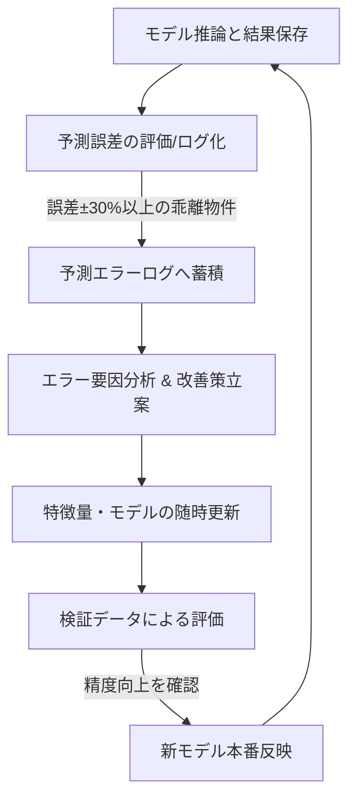

# 機械学習モデル自己改善サイクル & 不動産鑑定特徴量設計書

本ドキュメントは、不動産価格予測モデルの継続的な精度向上を実現するための「自己改善サイクル（評価・立案・改善）」の設計、機械学習の精度向上手法、および不動産鑑定理論に基づいた特徴量の拡張と物件種別ごとのモデル分離について定義します。

---

## 1. 自己改善サイクル (Self-Improvement Cycle)
推定結果の不備（実際の販売価格や査定額との乖離）をシステム自体が検知し、自律的かつ段階的に改善を繰り返すサイクル（PDCA）を確立します。



### 1.1 推定結果の評価 (Check)
*   **予測誤差のモニタリング**: クロールされた物件の「実際の販売価格」と、モデルが算出した「一次・二次理論価格」の乖離を全自動で集計します。
*   **誤差評価指標の集計**: `MAPE`（平均絶対パーセント誤差）、`MAE`（平均絶対誤差）、`R²` を物件種別・エリアごとに週次/月次で算出します。
*   **エラーログの自動蓄積**: 予測価格と販売価格の乖離率が $\pm30\%$ を超える物件を「予測エラー物件」として検出し、物件ID、特徴量、予測値、乖離率をエラー分析用DBテーブル（またはログファイル）に自動記録します。

### 1.2 評価結果に対する改善策の立案 (Plan)
*   **エラー分析**: 予測エラーログを解析し、特定の条件（例: 築40年以上の古民家、特定のマイナー駅、所在階が20階以上のタワーマンションなど）でエラーが頻発していないかを特定します。
*   **改善手法の選定**: 収集した一般的な機械学習の精度向上策、または不足している不動産鑑定要素から、該当エラーを解消するための対策を選択します。

### 1.3 改善の随時実行・反映 (Do / Action)
*   **開発・モデル更新**: 選択した改善策（特徴量の追加、ハイパーパラメータ調整、外れ値除外など）をパイプラインに実装します。
*   **Champion-Challenger方式の採用**: 新しく学習したモデル（Challenger）のテストデータに対する `MAPE` が、現在の本番モデル（Champion）より向上している場合に限り、モデルを自動/半自動で入れ替えます。

---

## 2. 一般的な機械学習の精度向上手法

一般的な機械学習タスク（テーブルデータ）において精度向上に寄与する以下の手法を収集し、改善策立案のフレームワークとします。

### 2.1 特徴量エンジニアリング
*   **多項式・交互作用特徴量**: 不動産価格に非線形な影響を与える特徴量の組み合わせを生成します。
    *   例: `専有面積 × 平均地価`（物件単体のおおよその土地相場価格）
*   **位置情報の高次元化**: 緯度経度が取得可能な場合は、駅名だけではなく、駅の座標からの距離などを特徴量として算出します。
*   **カテゴリカル変数の数値化**: `Target Encoding`（各カテゴリにおける平均価格をエンコード）や `LightGBM/CatBoost` のカテゴリカルネイティブサポートを活用し、「駅名」「市区町村名」「分譲会社名」の情報をモデルに学習させます。

### 2.2 外れ値・異常データのクレンジング
*   **入力ミス・特殊物件の除外**: クローリングエラーによる異常値（例: 面積が1㎡、価格が0円等）や、億ション等の超高級物件、事故物件などの特殊要因による外れ値を学習データから自動的にフィルタリングします（`Isolation Forest` や `IQR（四分位範囲）法` の適用）。

### 2.3 ハイパーパラメータ最適化とアンサンブル
*   **Optunaによる自動調整**: 木の深さ（`max_depth`）、学習率（`learning_rate`）、特徴量のサンプリング比率などを **Optuna** を用いて自動探索します。
*   **モデルのブレンディング/スタッキング**: 決定木ベースの LightGBM、XGBoost、CatBoost などの異なるアルゴリズムによる予測値を加重平均（ブレンディング）し、過学習を抑え、未知のデータへの頑健性を高めます。

---

## 3. 不動産鑑定理論を踏まえた特徴量の拡張

不動産の価格は、物件種別ごとの鑑定手法（取引事例比較法、原価法、収益還元法）によって決定されます。それぞれのロジックに基づき、以下の特徴量をDBおよびスクレイピングデータから積極的に抽出・算出します。

### 3.1 「最有効利用の原則」と「容積率・建ぺい率のポテンシャル」
不動産鑑定評価における「最有効利用の原則」に基づき、対象物件の土地がもつ「価値創出力」と「将来の再開発ポテンシャル」を以下の特徴量で表現します。

*   **容積率消化率 (Digest Volume Ratio)**: `延床面積（建物面積） / 土地面積`。
*   **余剰容積ポテンシャル (Surplus Volume Potential)**: `指定容積率 - 容積率消化率`。
    *   容積率制限に大きな余裕がある物件（例: 容積率上限300%に対し、現況が木造2階建てで実質消化率が80%等）は、将来的な建て替えによってより高層で高収益な建物を建築可能であるため、土地自体の価値創出力（開発余力プレミアム）がモデルに評価されます。
*   **既存不適格フラグ (Non-Conforming Flag)**: 容積率消化率が指定容積率を超過している場合、建て替え時に現状と同規模の建物が建築できないため、マイナス評価要因（デプレミアム）として扱うダミースコアを付与。

### 3.2 マンション（取引事例比較法ベース）
区分所有マンションは、近隣の取引事例との比較が重視されます。個別物件の「快適性」や「ブランド価値」が大きなプレミアムになります。

*   **所在階（階数プレミアム）**: 高層階であるほど坪単価が高くなる性質を考慮（例: `所在階 / 総階数` で階数比率を算出）。
*   **方位・日当たり補正**: 南向き ➔ 東・西向き ➔ 北向きの順に価格が下がる傾向をカテゴリ化してモデルに付与。
*   **総戸数（スケールメリット）**: 総戸数が多いほど共用施設が充実し、維持管理コストが下がるため価格にプラスの影響を与えます。
*   **デベロッパー・施工ブランド**: 「三井のパークホームズ」「住友のグランドヒルズ」など、分譲会社ブランドをテキストから抽出しエンコーディング。

### 3.3 戸建て（原価法/積算法ベース）
戸建ては、土地（所有権）と建物（減価償却資産）を分けて個別評価します。

*   **土地部分の鑑定要素**:
    *   **接道状況（道路幅員・角地・接道方向）**: 道路幅員が4m未満の場合はセットバックが必要となり減価。角地は角地緩和がありプレミアム。
    *   **画地条件（形状）**: 整形地か、不整形地（旗竿地など）かで土地単価が大きく変動します。
*   **建物部分の鑑定要素**:
    *   **構造（木造・RC・鉄骨）**: 再調達原価の基準となります。
    *   **残存耐用年数**: `法定耐用年数（木造22年、RC47年、鉄骨34年） - 経過築年数`。残存年数があるかどうかが融資期間に直結し、価値の大部分を決定します。

### 3.4 アパート・一棟物件（収益還元法ベース）
投資用・収益物件は、物件そのものが生み出すキャッシュフローと利回りが価格を支配します。

*   **年間想定賃料収入と表面利回り (`grossYield`)**: 投資家が最も重視する要素であり、価格決定の主要因。
*   **融資の受けやすさ（構造と築年数）**: 銀行が融資（アパートローン等）を出す期間は基本的に「残存耐用年数」内になります。RC造かつ残存年数が長いほど融資が付きやすく、購入者が増えるため価格が下落しにくい特徴があります。

### 3.5 複数鑑定手法のハイブリッド併用（メタ特徴量の生成）
単一の評価手法のみに依存せず、機械学習モデルのインプットとして各鑑定手法に基づく「理論的な試算価格」を数式または簡易モデルによってあらかじめ算出し、それを **メタ特徴量 (Meta/Proxy Features)** としてモデルに入力します。これにより、機械学習モデルが不動産鑑定士のような多角的な視点を考慮できるようになります。

```
[クローリングデータ]
       │
       ├─► 簡易「比準想定価格」算出 ─┐
       ├─► 簡易「積算想定価格」算出 ─┼─► [メタ特徴量として結合] ─► [機械学習モデル (XGBoost等)]
       └─► 簡易「収益想定価格」算出 ─┘
```

1.  **比準想定価格 (Market Comparison Value)**:
    *   `同一エリア（市区町村・町丁）・類似築年帯の市場平均平米単価 × 専有面積`。
    *   取引事例比較法の考え方を簡易モデル化し、市場の標準的な単価とのズレをモデルに認識させます。
2.  **積算想定価格 (Cost Approach Value)**:
    *   `土地面積 × 周辺平均公示地価 ＋ 建物面積 × 構造別再調達単価 × 残存耐用年数率`。
    *   戸建てやアパートの「担保価値」としての裏付け価格。区分マンションの場合も、土地持分割合（敷地権割合）に基づいて按分算出した積算想定価格をモデルに入力します。
3.  **収益想定価格 (Income Approach Value)**:
    *   `想定年間賃料（平米賃料相場 × 面積） / 周辺の期待還元利回り (Cap Rate)`。
    *   アパートだけでなく、マンションや戸建てに対しても「仮に賃貸に出した場合の収益価格」を算出して入力することで、実需価格と収益価格の乖離（＝割安度や投資価値）を機械学習に明示的に捉えさせます。

---

## 4. 物件種別ごとのモデル分離設計

「マンション」「戸建て」「アパート・一棟」は価格決定の力学が全く異なるため、**学習・推論モデルを物理的に分離**します。各モデルは、上記で算出したハイブリッドなメタ特徴量を共有または種別ごとに重みを変えて学習します。

### 4.1 パイプラインの分離
*   **データ分離**: `MitsuiMansion`, `MitsuiKodate`, `MitsuiInvestmentApartment` などのモデルごとにロードロジックを分離。
*   **特徴量セットの出し分け**: 
    *   Mansionモデル: `kanrihi`, `syuzen`, `interior_score`, `layout_score`, `kaisu` 等 ＋ 比準/収益メタ特徴量。
    *   Kodateモデル: `tochiMenseki`, `tatemonoMenseki`, `kouzou`, `chikunen`, 接道情報 ＋ 積算/比準メタ特徴量。
    *   Apartmentモデル: `annualRent`, `grossYield`, `kouzou`, `chikunen`, 残存耐用年数 ＋ 収益/積算メタ特徴量。
*   **保存モデルの分離化**:
    *   `/app/src/crawler/package/ml/models/mansion_first_stage_model.joblib`
    *   `/app/src/crawler/package/ml/models/kodate_first_stage_model.joblib`
    *   `/app/src/crawler/package/ml/models/apartment_first_stage_model.joblib`
    のように、モデルを物件種別ごとに完全に分離保存し、予測時に適切なモデルを読み出せるように設計します。
