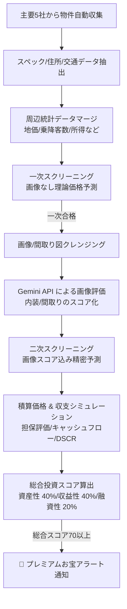

# プロジェクトのビジョン・設計意図・開発状況 (Project Vision, Design Intent & Status)

本プロジェクトが何を目指して作られているのか、どのような意図で設計されているのか、そして現在の開発状況についてまとめます。

---

## 1. プロジェクトのビジョン (Project Vision)

単なる「不動産情報のクローリング・データベース保存システム」にとどまらず、**「市場の歪みから眠っている優良な投資・割安物件を自動でスクリーニングし、資産性・融資性・収益性の3軸で多角評価するスマート不動産分析パイプライン」**を目指しています。

不動産情報サイトに散らばる非構造的なデータを集約・構造化し、機械学習モデル・先進的なAI（Gemini API）による分析・そして実務的な投資シミュレーションを組み合わせることで、プロが手作業で行っていた物件査定と融資・収支判断のプロセス全体を自動化します。

---

## 2. アーキテクチャと設計意図 (Design Intent)

本システムは、拡張性・保守性・そしてリソースの効率性を最大化するためにいくつかの重要なアーキテクチャ・設計パターンを採用しています。

### 2.1 非同期・再帰連鎖 (Fire-and-Forget パターン)
*   **設計意図**: 将来的なサーバーレス環境（GCP Cloud Functionsなど）での分散実行を容易にするため。
*   **仕組み**: 1つの大きなプロセスですべてをクロールするのではなく、`Start ➔ Region ➔ Area ➔ List ➔ Detail` のようにステップごとにAPIエンドポイントを細分化。
*   **効果**: 前のAPIは次のAPIをトリガー（非同期POST）した後、3秒のタイムアウトで即座に `200 OK` を返して終了します。これにより、個々のサーバーレス実行ユニットのタイムアウト制限を回避できます。

### 2.2 一項目一関数 (One-Item-One-Method) & フィールド名統一規約
*   **設計意図**: クローラーの可読性と、サイト改修時におけるメンテナンスコストの最小化。
*   **仕組み**: 物件スペックのパースは、各項目ごとに `_parsePrice` や `_parseMadori` のような専用メソッドに完全に分離されています（[parser_design_guidelines.md](../implementation/parser_design_guidelines.md)）。
*   **効果**: また、サイトが異なっていても同一の情報を表すフィールドは共通名（例: `chikunengetsuStr`, `tochiMenseki`）で統一され（[field_naming_standards.md](../internal_design/field_naming_standards.md)）、横断的なデータ比較が容易になっています。

### 2.3 2段階スクリーニング (Two-Stage Screening)
*   **設計意図**: AI（Gemini API）の呼び出しコストおよび時間の節約。
*   **仕組み**: 
    1.  **一次予測**: テキストスペック（面積・築年・駅徒歩）とマージした周辺統計データのみから、画像なしで理論価格を高速予測。販売価格より高ければ「一次合格」とする。
    2.  **画像解析 & 二次予測**: 一次合格した物件のみ、Gemini APIによる画像解析（内装スコア・間取りスコア）にかけ、それを加えた二次精密予測を実行する。
*   **効果**: 全物件をGemini APIに送ると莫大な費用と時間がかかりますが、この2段階フィルタによりコストを極小化しつつ高精度な判定を実現します。

### 2.4 厳格な保存 (Strict Validation & Error Capture)
*   **設計意図**: DBに入るデータ品質の担保と、パースエラーの隠蔽防止。
*   **仕組み**: 重要な項目（所在地、価格、面積、間取りなど）はモデルレベルで `null=False` とし、欠損時は保存を拒否します。
*   **効果**: 保存失敗（バリデーションエラーやパースエラー）時は、その物件の詳細HTMLとエラー理由が `src/crawler/tests/error_pages/` に自動保存されます。開発者はこれらを検証用HTMLとしてパーサーを修正でき、エラーの再発防止が容易になります。

### 2.5 資産性と融資性・収益性の多角評価（Dual-Aspect Property Valuation）
*   **設計意図**: 単なる理論上の割安度（資産の歪み）だけではなく、不動産投資の規模拡大に不可欠な「融資適合性」と「キャッシュフローの多寡」を同時に評価し、実務的に最も購入価値が高い物件を抽出するため。
*   **仕組み**: 公示地価データ・物件スペック・構造・築年数に基づき、銀行の担保評価額（積算価格）を自動算定。さらに、標準的なローン借入条件をシミュレートし、経費控除後の純収益（NOI）から年間返済額（ADS）、返済カバー率（DSCR）、自己資金配当率（CoC）を算出する。
*   **効果**: 「価格は安いが融資が引けない物件」や「利回りは高いが修繕・経費がかさみ返済比率が危険な物件」をフィルタリングし、自己資金の効率を最大化する真の「お宝物件」を優先的に検出します。

---

## 3. 現状の開発・実装状況 (Current Status)

現在、システムの主要機能はほぼすべて実装が完了しており、検証および運用のフェーズに移行しつつあります。

| 機能エリア | 実装状況 | 詳細 |
| :--- | :---: | :--- |
| **対象5社のクローラー** | **完了** | 三井、住友、東急、野村、ミサワの全サイト・全物件種別（居住用/投資用）のパース・収集ロジック実装済み。 |
| **データベース設計** | **完了** | 各社・物件種別ごとにテーブルを分離した全16-17のモデルの定義、Djangoマイグレーション設定完了。 |
| **統計データマージ** | **完了** | 自治体データ（所得・人口）、駅データ（乗降客数）、地価（公示地価）を物件住所・駅名をキーにマージする機構が完成。 |
| **一次・二次予測モデル** | **実装済み** | 機械学習モデル（joblib）のロードおよび推論ロジック（[predict.py](../package/ml/predict.py)）の実装完了。※モデルファイル自体は別途学習・配置が必要。 |
| **Gemini画像解析** | **完了** | BeautifulSoupからの画像URL抽出、クレンジング、予算キャップ（200件/日）制御、Geminiによる内装・間取り評価の実装完了。 |
| **アラート通知** | **完了** | 投資スコア60以上（理論価格に対して割安な物件）を検出した際のログ/通知出力の実装完了。 |
| **テスト・検証環境** | **完了** | `pytest` によるユニットテスト、整合性テスト、エラーHTML退避機構の実装完了。 |
| **インフラ自動化** | **完了** | Docker Compose による Python/MySQL 起動、Taskfile（`task init`, `task default`, `task crawl`）によるCLI自動化完了。 |

---

## 4. 今後の課題・ロードマップ (Roadmap)

1.  **予測モデルの再トレーニングとチューニング**
    *   現在蓄積されている実データを用いて、機械学習モデルの再学習（`src/crawler/package/ml/train.py`）を行い、予測精度を向上させる。
2.  **各社サイトの仕様変更への追従 (自動エラー監視)**
    *   定期的なクロール実行を通してパースエラー（`error_pages/` に退避されるもの）を監視し、サイト構造の変化に対応する（**`scheduler` による自動実行およびエラー監視レポート機能により自動化完了**）。
3.  **収支・キャッシュフロー・融資適合性評価（積算評価）の統合**
    *   資産性（理論価格比）だけでなく、投資用物件としての「手残り（キャッシュフロー）」や「銀行融資の出やすさ（積算評価・DSCR）」を自動評価し、総合的な投資価値スコアを算出する。
4.  **サーバーレス環境 (GCP等) への本番デプロイ**
    *   Fire-and-Forget設計を活かし、 Cloud Functions や Cloud Run 等のクラウドサービスへの配置とスケジューラー（Cloud Scheduler）による自動実行の最適化。

---
**更新日**: 2026年7月10日  
**ステータス**: 設計書・状況報告（正式版）
